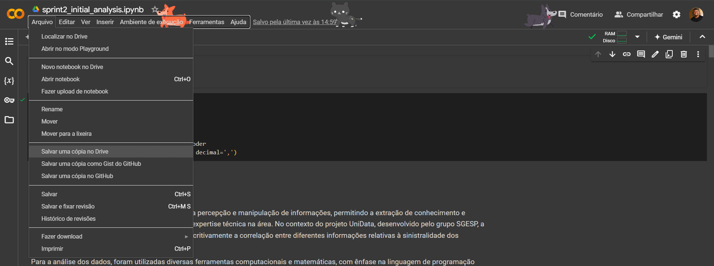
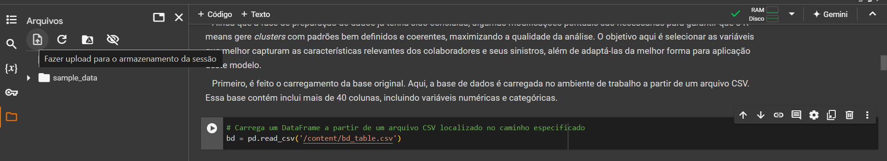
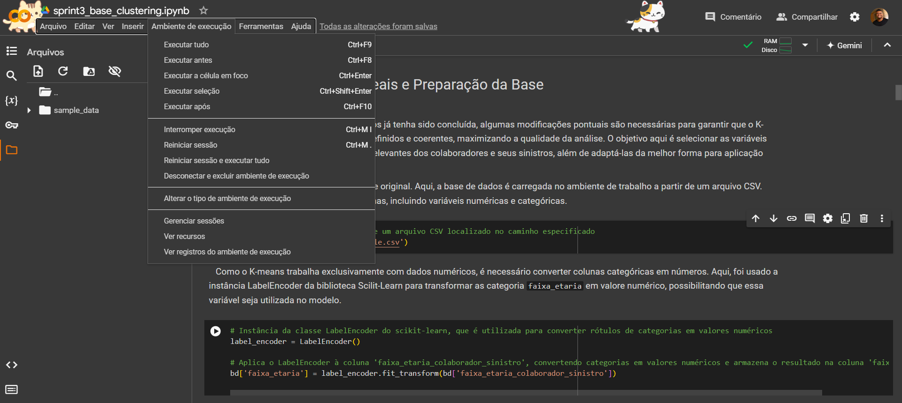
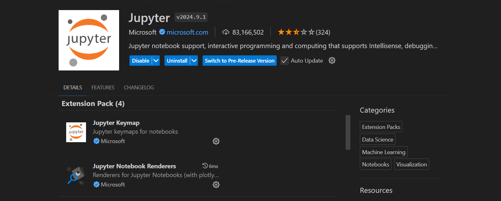
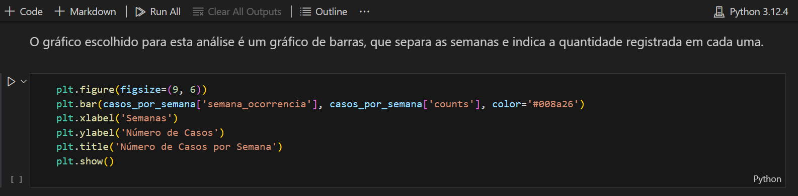

# Inteli - Instituto de Tecnologia e Liderança 

<p align="center">
<a href= "https://www.inteli.edu.br/"></a>
</p>

# UniData

## Secretaria Geral do Estado de São Paulo (SGESP)

## Integrantes: 
<div align="center">
  <table>
    <tr>
      <td align="center"><a href="https://www.linkedin.com/in/gabriela-silvaa/"><br><sub><b>Gabriela Silva</b></sub></a></td>
      <td align="center"><a href="https://www.linkedin.com/in/guilhermelopescarvalho/"><br><sub><b> Guilherme Lopes</b></sub></a></td>
      <td align="center"><a href="https://www.linkedin.com/in/isabellymaia/"><br><sub><b>Isabelly Maia</b></sub></a></td>
       <td align="center"><a href="https://www.linkedin.com/in/jonathanteoalves/"><br><sub><b>Jonathan Alves</b></sub></a></td>
      <td align="center"><a href="https://www.linkedin.com/in/lucas-nepomuceno-ismart"><br><sub><b>Lucas dos Santos</b></sub></a></td>
      <td align="center"><a href="https://www.linkedin.com/in/matheusjorgerosa/"><br><sub><b>Matheus Jorge</b></sub></a></td>
      <td align="center"><a href="https://www.linkedin.com/in/mirellaborim/"><br><sub><b>Mirella Borim</b></sub></a></td>
      <td align="center"><a href="https://www.linkedin.com/in/thiagogomesalmeida/"><br><sub><b>Thiago Gomes</b></sub></a></td>
    </tr>
  </table>
</div>

## Professores:
### Orientador(a) 
- <a href="https://www.linkedin.com/in/juliastateri/">Julia Stateri</a>
### Instrutores
- <a>Geraldo Vasconcelos</a>
- <a href="https://www.linkedin.com/in/bruna-mayer/">Bruna Mayer</a> 
- <a href="https://www.linkedin.com/in/kizzyterra/">Kizzy Terra</a> 
- <a href="https://www.linkedin.com/in/egondaxbacher/">Egon Daxbacher</a>
- <a href="https://www.linkedin.com/in/filipe-gon%C3%A7alves-08a55015b/">Filipe Gonçalves</a> 


## 📝 Descrição

&ensp;O UniData é um modelo preditivo desenvolvido pelo Grupo 4 - Secretaria Geral do Estado de São Paulo (SGESP) para atender à demanda da empresa parceira Unipar. O objetivo do UniData é identificar os perfis de colaboradores da Unipar que utilizam os serviços do convênio de saúde, facilitando a análise do ecossistema de saúde da empresa. Além disso, o modelo segmenta diferentes tipos de perfis e fornece insights para a criação de programas de saúde que atendam às necessidades dos colaboradores.<br>

&ensp;As informações geradas pelo UniData serão apresentadas por meio de gráficos, alimentados pela base de dados fornecida pela Unipar ao Inteli. Esses dados incluem informações sobre os serviços utilizados pelos colaboradores, faixa etária, gênero, entre outros fatores que contribuem para uma análise abrangente realizada pelo modelo preditivo.<br>

&ensp;Com o uso do UniData, a Unipar será capaz de compreender e analisar as segmentações e perfis apresentados, possibilitando a criação de programas de saúde personalizados que beneficiem sua rede de colaboradores, promovam o bem-estar comunitário e aumentem a produtividade de seus ecossistemas.<br>

&ensp; [Link para vídeo demonstrativo](https://drive.google.com/file/d/1v7d4gmbaV7h0iAGVnglaN4VL9UlX-hCR/view?usp=sharing)

&ensp;Para acessar o UniData é necessário entrar no seguinte link: https://unidata.streamlit.app/.


## 📁 Estrutura de pastas

Dentre os arquivos presentes na raiz do projeto, definem-se:

- <b>readme.md</b>: arquivo que serve como guia e explicação geral sobre o projeto (o mesmo que você está lendo agora);

- <b>assets</b>: todas as imagens e mídias utilizadas nos notebooks e documentação são posicionadas aqui;

- <b>documents</b>: aqui estarão todos os documentos do projeto. Há também uma pasta denominada <b>extras</b> onde estão presentes documentos complementares;

- <b>notebooks</b>: todos os Jupyter Notebooks criados para desenvolvimento do projeto.

## 💻 Execução dos projetos

&ensp; **Arquivos necessários:**

- `bd_unipar.csv`: Base de dados fornecida pelo parceiro e anonimizada pelo escritório de projetos do Inteli.

- [tuss.csv](notebooks/tuss.csv): Tabela que categoriza os tipos de consulta médica dos pacientes através do código de serviço.

### Online

&ensp; Os notebooks Jupyter podem ser executado via Google Colab, uma plataforma online voltada para notebooks Jupyter, armazenando-os na nuvem com um ambiente de trabalho totalmente virtual.

&ensp; Para acessar os notebooks, é necessário acessar os links no final da seção e fazer uma cópia em seu drive, então poderá executa-los e fazer alterações, conforme as imagens.

&ensp; **Passo a Passo:**

- Fazer a cópia do notebook em seu drive.

<div align="center">

  

</div>

- Carregar o banco de dados na aba "Arquivos" do Google Colab. Certifique-se que o arquivo carregado corresponde ao arquivo .csv utilizado no código, por exemplo na imagem, o arquivo utilizado é o `bd_table`.

<div align="center">

  

</div>

- Execute o código, utilize o botão nas células ou a opção do rodapé "Ambiente de execução" e "Executar tudo".

<div align="center">

  

</div>

&ensp; **Links para os notebooks:**

- [sprint2_initial_analysis](https://colab.research.google.com/drive/1DLcUtJw9o82n58Gl56g4bI1SLKMw05oN) (**ATENÇÃO: Este notebook gera arquivos .csv que serão utilizados nos demais, assim que executar o código faça o download dos arquivos gerados na aba "Arquivos" do Google Colab**)

- [sprint3_base_clustering](https://colab.research.google.com/drive/1mM29ylQftFfOruYFGqzlpv4nSyX2wrXr)

- [sprint4_model_comparison_and_tuning](https://colab.research.google.com/drive/1oD7xmnTsw3eT_NqaQJBzjd83EaBnVIPO) (**ATENÇÃO: Este notebook gera o arquivo .csv que será utilizado na aplicação UNIDATA, via Streamlit**)

- [UNIDATA (APLICAÇÃO STREAMLIT)](http://unidata.streamlit.app) (**É necessário utilizar o arquivo bd_para_analise.csv, gerado no `sprint4_model_comparison_and_tuning`**)

### Local (VS CODE)

&ensp; **Passo a passo:**

- Baixe os notebooks disponibilizados no repositório.

- Baixe o [Python](https://www.python.org/downloads/) 3.12.4 (não esqueça de marcar a opção "Add Python to PATH").

- Utilizando o prompt de comando (cmd) ou terminal ,dentro da pasta do projeto, cole e execute o código:

```
pip install -r /notebooks/requirements.txt
```

- Baixe o Jupyter by Microsoft nas extensões do VS CODE.

<div align="center">

  

</div>

- Salve o notebook em uma pasta junto com o banco de dados e abra a pasta no VS CODE.

- Execute o código utilizando o botão nas células ou utilizando o botão no rodapé "Run all".

- Para rodar a aplicação Unidata via streamlit, é necessário executar o seguinte código no cmd ou terminal:

```
python -m streamlit run notebooks/streamlit/main.py
```

<div align="center">

  

</div>

## 🗃 Histórico de lançamentos

* 1.0.0 - 11/10/2024
    * [sprint 5] Lançamento da primeira versão do modelo preditivo com documentação
* 0.6.0 - 27/09/2024
    * [sprint 4] Comparação de modelos preditivos
* 0.3.1 - 13/09/2024
    * [sprint 3] Preparação de dados e modelo preditivo preliminar
* 0.2.7 - 30/08/2024
    * [sprint 2] Análise exploratória e levantamento de hipóteses
* 0.1.3 - 16/08/2024
    * [sprint 1] Documentação de entendimento do negócio

## 📋 Licença/License

<p xmlns:cc="http://creativecommons.org/ns#" xmlns:dct="http://purl.org/dc/terms/"><a property="dct:title" rel="cc:attributionURL" href="https://github.com/Inteli-College/2024-2A-T13-IN03-G04">UniData</a> by <a rel="cc:attributionURL dct:creator" property="cc:attributionName" href="https://github.com/Inteli-College/2024-2A-T13-IN03-G04">Inteli, Gabriela Silva, Guilherme Lopes de Carvalho, Isabelly Maia Montalvão, Jonathan Teodoro Alves, Lucas Nepomuceno dos Santos, Matheus Jorge Rosa, Mirella Borim Lima, Thiago Gomes de Almeida</a> is licensed under <a href="https://creativecommons.org/licenses/by/4.0/?ref=chooser-v1" target="_blank" rel="license noopener noreferrer" style="display:inline-block;">Creative Commons Attribution 4.0 International</a></p>
