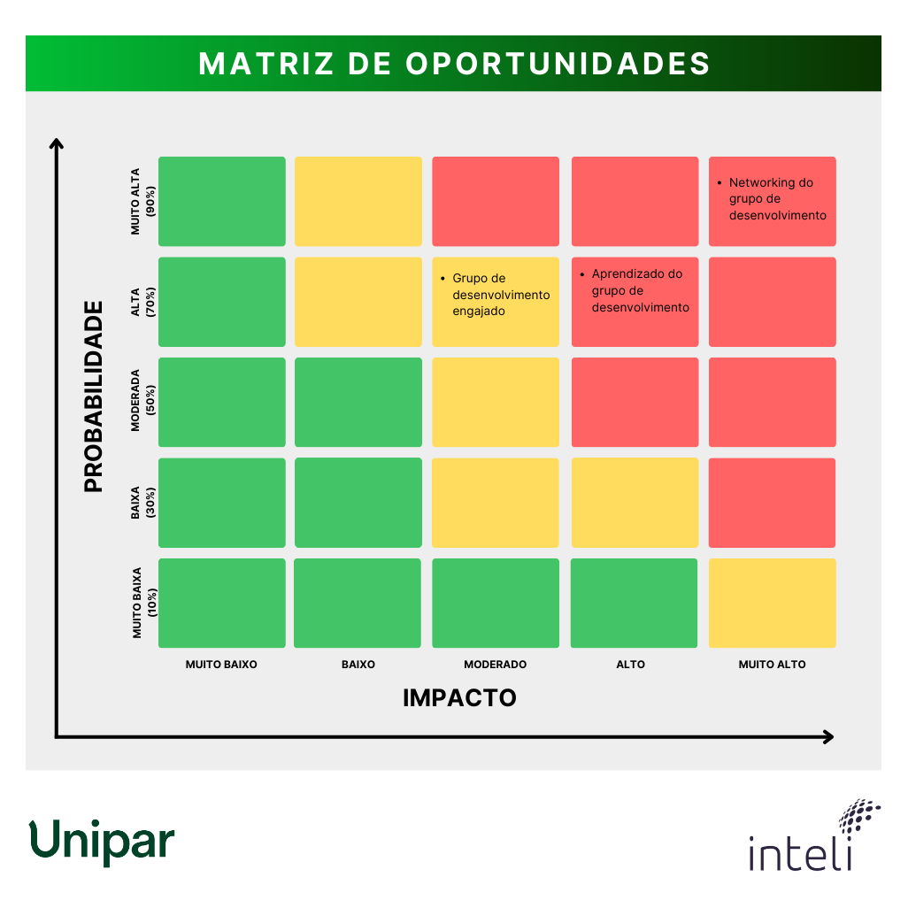
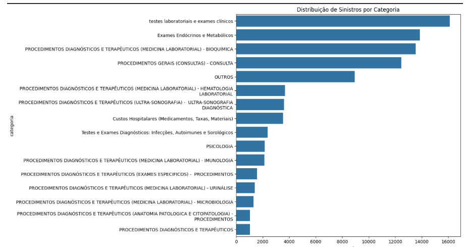
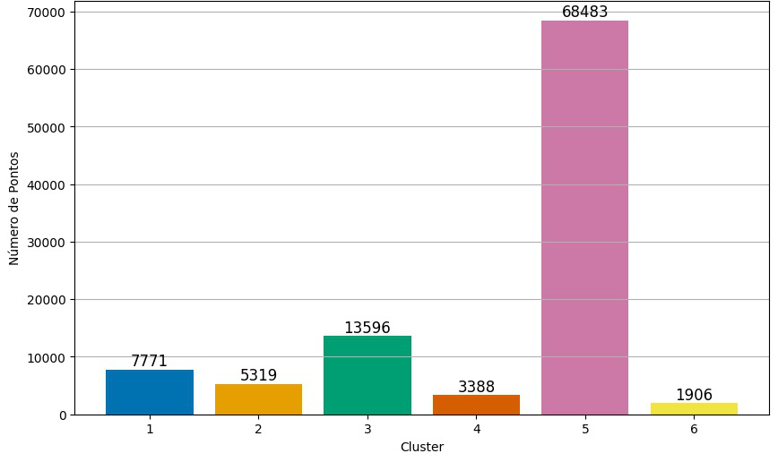
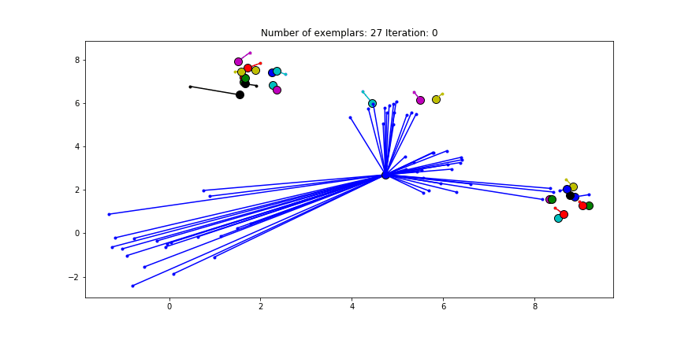

# Documentação Modelo Preditivo - Inteli

## UniData

### SGESP

<div align="center">
  <table>
    <tr>
      <td align="center"><a href="https://www.linkedin.com/in/gabriela-silvaa/"><br><sub><b>Gabriela Silva</b></sub></a></td>
      <td align="center"><a href="https://www.linkedin.com/in/guilhermelopescarvalho/"><br><sub><b> Guilherme Lopes</b></sub></a></td>
      <td align="center"><a href="https://www.linkedin.com/in/isabellymaia/"><br><sub><b>Isabelly Maia</b></sub></a></td>
       <td align="center"><a href="https://www.linkedin.com/in/jonathanteoalves/"><br><sub><b>Jonathan Alves</b></sub></a></td>
      <td align="center"><a href="https://www.linkedin.com/in/lucas-nepomuceno-ismart"><br><sub><b>Lucas dos Santos</b></sub></a></td>
      <td align="center"><a href="https://www.linkedin.com/in/matheusjorgerosa/"><br><sub><b>Matheus Jorge</b></sub></a></td>
      <td align="center"><a href="https://www.linkedin.com/in/mirellaborim/"><br><sub><b>Mirella Borim</b></sub></a></td>
      <td align="center"><a href="https://www.linkedin.com/in/thiagogomesalmeida/"><br><sub><b>Thiago Gomes</b></sub></a></td>
    </tr>
  </table>
</div>

## Sumário

[1. Introdução](#c1)

[2. Objetivos e Justificativa](#c2)

[3. Metodologia](#c3)

[4. Desenvolvimento e Resultados](#c4)

[5. Conclusões e Recomendações](#c5)

[6. Referências](#c6)

[Anexos](#attachments)

## <a name="c1"></a>1. Introdução

&ensp;A Unipar é uma renomada empresa brasileira, líder na produção de cloro e soda, e a segunda maior em PVC na América do Sul, com filiais no Nordeste e Sudeste do país, além de uma unidade na Argentina. Com o lema “Faz a química acontecer”, a Unipar se compromete com a sustentabilidade e o respeito às pessoas [(UNIPAR, 2024)](#c6).

&ensp;Em busca de melhorar a saúde de seus colaboradores, a empresa propôs aos alunos do Inteli a realização de uma análise preditiva baseada nos dados dos funcionários.

&ensp;Modelos de análise preditivos são ferramentas muito utilizadas na ciência de dados, onde se organizam os dados e realizam análises em busca de tendências e padrões.

&ensp;Esse projeto visa auxiliar a Unipar na tomada de decisões para desenvolver programas de saúde mais eficazes e eficientes, proporcionando melhorias significativas no bem-estar dos colaboradores a longo prazo.

## <a name="c2"></a>2. Objetivos e Justificativa

### 2.1 Objetivos

&ensp;**Objetivo Geral:**
Desenvolver um modelo preditivo, uma ferramenta analítica, que utiliza dados e históricos para realizar estudos e previsões sobre futuros eventos ou comportamentos [(SOARES, 2023)](#c6), que analise dados de saúde e estilo de vida dos colaboradores, permitindo a criação de programas de saúde que atendam às necessidades específicas da força de trabalho. Dada a natureza sensível dos dados envolvidos, serão implementadas medidas rigorosas para garantir a privacidade e a proteção das informações pessoais, evitando qualquer violação de direitos e preservando a integridade dos colaboradores.

&ensp;**Objetivos Específicos:**

- Análise da Sinistralidade: Realizar uma análise detalhada da sinistralidade do plano de saúde dos colaboradores, buscando identificar padrões de comportamento e utilização. Essa análise permitirá compreender quais áreas da saúde demandam mais atenção e recursos, e quais comportamentos de risco estão mais presentes entre os colaboradores.

- Modelagem Preditiva: Desenvolver e implementar modelos de previsão que sejam capazes de identificar tendências e mudanças nos padrões de saúde e bem-estar dos colaboradores ao longo do tempo. Esses modelos servirão como base para antecipar problemas potenciais e orientar a criação de estratégias preventivas.

- Segmentação de Dados: Utilizar dados demográficos, como faixa etária, gênero, e outros fatores relevantes, para segmentar as análises de saúde. Essa segmentação permitirá que os programas de saúde sejam direcionados de maneira mais eficaz, atendendo de forma personalizada as diferentes necessidades dentro da população de colaboradores.

### 2.2 Proposta de solução

&ensp;A solução proposta consiste no desenvolvimento de um modelo preditivo avançado, que utilizará dados históricos de utilização do plano de saúde dos colaboradores, disponibilizados pela corretora Mercer Marsh Benefícios, a partir da Apólice Bradesco. Reconhecendo a natureza sensível desses dados, serão adotadas rigorosas medidas de segurança e proteção dos dados para garantir a privacidade dos colaboradores e a conformidade com as normas da Lei Geral de Proteção de Dados (LGPD).

&ensp;O modelo será projetado para identificar padrões e tendências nos comportamentos de saúde dos colaboradores, permitindo a segmentação precisa da população e possibilitando a criação de programas de saúde mais eficazes e personalizados. Durante todo o processo, o manejo dos dados será realizado de forma a minimizar riscos de exposição e garantir que as informações sejam utilizadas exclusivamente para os fins previstos.

&ensp;O desenvolvimento do modelo incluirá uma análise abrangente dos dados demográficos e de saúde disponíveis, com o objetivo de identificar as áreas de maior necessidade entre os colaboradores e priorizar as ações de saúde conforme as demandas mais urgentes. A proposta enfatiza a importância de fundamentar a formulação dos programas de saúde em dados concretos e verificáveis, assegurando que as iniciativas implementadas sejam diretamente relevantes para as necessidades identificadas.

&ensp;Adicionalmente, o modelo preditivo será projetado para ser adaptável e dinâmico, permitindo a incorporação de novos dados e o ajuste das previsões conforme a evolução das condições de saúde e dos comportamentos dos colaboradores ao longo do tempo. Esse aspecto garantirá que a Unipar mantenha suas iniciativas de saúde sempre atualizadas e alinhadas com as necessidades reais dos colaboradores, promovendo uma cultura de bem-estar contínua e sustentável.

### 2.3 Justificativa

&ensp;A justificativa para a implementação desta solução está relacionada ao compromisso da Unipar com a promoção da saúde e do bem-estar de seus colaboradores. Em um ambiente corporativo cada vez mais competitivo e exigente, a saúde dos colaboradores surge não apenas como uma questão de responsabilidade social, mas também como um fator crítico para a produtividade e satisfação dos colaboradores.

&ensp;O modelo preditivo proposto representa uma oportunidade significativa para a Unipar transformar seus dados de saúde em *insights* valiosos, que orientarão a tomada de decisões estratégicas de maneira mais assertiva. Com essa ferramenta, a empresa poderá desenvolver programas de saúde que realmente atendam às necessidades específicas de sua força de trabalho, promovendo a melhoria da qualidade de vida dos colaboradores e, simultaneamente, reduzindo os custos associados à sinistralidade do plano de saúde.

&ensp;Os benefícios desta abordagem são amplos e incluem a melhoria geral da saúde dos colaboradores, a redução dos índices de absenteísmo, o aumento do engajamento e da satisfação no ambiente de trabalho, além da otimização dos recursos destinados à saúde. Ademais, a natureza preditiva do modelo assegura que as ações da Unipar possam se adaptar continuamente às novas informações e aos comportamentos emergentes dos colaboradores, mantendo os programas de saúde relevantes e eficazes ao longo do tempo.

&ensp;Essa solução não apenas se alinha com as melhores práticas de mercado, mas também reflete o compromisso da Unipar com a sustentabilidade e o desenvolvimento humano, promovendo um ambiente de trabalho mais saudável e produtivo. A abordagem proposta reforça a visão da Unipar de ser uma empresa que valoriza e cuida de seus colaboradores, reconhecendo que o bem-estar deles é fundamental para o sucesso e a longevidade da organização.

## <a name="c3">3. Metodologia</a>

&ensp;A modelagem preditiva de dados é um processo desafiador, onde as análises e a limpeza dos dados são frequentemente repetidas até que a qualidade e a relevância das informações sejam suficientes para atender aos objetivos do projeto. Isso é necessário porque, no início das análises, o conhecimento sobre o banco de dados é limitado, o que pode exigir ajustes contínuos para refinar os dados e garantir que eles estejam prontos para serem usados de maneira eficaz nos modelos preditivos.

&ensp;A metodologia utilizada para o desenvolvimento do UniData é o *Cross Industry Standard Process for Data Mining* (CRISP-DM), desenvolvido para projetos de análise, ciência e mineração de dados [(PELLEGRINO, 2020; HOTZ, 2024)](#c6).

&ensp;Este *framework* opera de maneira cíclica, o que significa que o processo não é linear, mas iterativo. Cada ciclo do CRISP-DM começa com a compreensão do problema de negócio e avança através de uma série de etapas que incluem a preparação dos dados, a modelagem, a avaliação dos resultados e a implementação das soluções. Ao final de cada ciclo, os *insights* e aprendizados obtidos permitem que o processo seja reiniciado, agora com um conhecimento mais aprofundado dos dados e dos requisitos do projeto. Essa abordagem iterativa é fundamental, pois em cada nova iteração, os dados podem ser revisados e refinados, modelos podem ser ajustados, e novas hipóteses podem ser testadas.

<div align="center">
  <sub>Figura 1 - Ciclo do CRISP-DM</sub> <br>

   <br>

  <sup>Fonte: PELLEGRINO (2020).</sup>
</div>

### 3.1. <i>Business Understanding</i> (Entendimento de negócios)

&ensp;Nesta etapa inicial, são identificados os objetivos e requisitos do projeto, estabelecendo a base para todo o processo de modelagem preditiva. Compreender o critério de sucesso do projeto é fundamental, pois a partir dessa compreensão serão determinados os tipos de análises e os resultados que trarão valor real ao parceiro de negócios. Um entendimento claro dos objetivos estratégicos garante que o projeto esteja alinhado com as metas e expectativas da organização.

&ensp; Antes de avançar para as próximas etapas, é importante definir de forma clara os objetivos do projeto, compreendendo profundamente as necessidades reais do cliente. Essa fase envolve a coleta de requisitos e também a interpretação e tradução dessas necessidades em termos técnicos que possam ser endereçados através da ciência de dados. Avaliar a situação atual com base nos objetivos do modelo permite identificar potenciais riscos, antecipar desafios e planejar contingências.

&ensp;Além disso, a definição de critérios de sucesso deve ser abrangente, incluindo tanto aspectos técnicos, como a precisão dos modelos preditivos, quanto aspectos de negócio, como o impacto financeiro ou operacional das soluções propostas. Nesse contexto, outro ponto importante é a seleção das tecnologias e ferramentas adequadas para o desenvolvimento do projeto, garantindo que a infraestrutura técnica esteja alinhada com as expectativas do cliente atingindo o critério de sucesso [(HOTZ, 2024)](#c6).

&ensp; Embora esta etapa possa ser subestimada por alguns desenvolvedores, um entendimento de negócio bem estabelecido é essencial para o sucesso do projeto. Ele serve como uma âncora para todas as decisões subsequentes, garantindo que cada escolha metodológica ou técnica contribua diretamente para o objetivo final. Ao investir tempo e esforço nesta fase, é possível minimizar o retrabalho nas etapas posteriores, aumentar a eficiência do processo e, mais importante, assegurar que as análises realizadas agreguem valor significativo e mensurável ao parceiro.

### 3.2. <i>Data Understanding</i> (Entendimento de dados)
&ensp;O entendimento de dados é uma etapa muito importante no processo de mineração de dados, que consiste em extrair padrões úteis de grandes volumes de dados [(PELLEGRINO, 2020; HOTZ, 2024)](#c6), especialmente dentro do modelo CRISP-DM. Essa fase inicial envolve uma análise detalhada dos dados disponíveis para garantir que eles sejam apropriados para a modelagem e a análise que serão realizadas a seguir. O primeiro passo é a coleta de dados iniciais, que pode incluir dados existentes, como informações transacionais e registros de pesquisas; dados adquiridos de terceiros; e dados adicionais coletados por meio de novas pesquisas ou outras formas de coleta [(IBM, 2023)](#c6).

&ensp;Após a coleta, é importante explorar os dados para compreender suas características. Isso envolve analisar tanto a quantidade quanto a qualidade dos dados. A quantidade refere-se ao tamanho dos conjuntos de dados, como o número de registros e atributos, e é necessário avaliar se um subconjunto dos dados pode ser usado para facilitar o processamento. Já a qualidade dos dados é frequentemente afetada por problemas como dados ausentes, erros de entrada, inconsistências de codificação e metadados incorretos. Identificar esses problemas é essencial, pois eles podem impactar a eficácia dos modelos que serão criados [(IBM, 2023)](#c6).

&ensp;Nessa fase, os analistas de dados utilizam várias técnicas de visualização, como gráficos e tabelas, para explorar os dados de forma mais intuitiva. Essa exploração ajuda a identificar padrões e tendências nos dados e permite a formulação de hipóteses que orientam as próximas etapas de preparação e transformação dos dados [(IBM, 2023)](#c6).

&ensp;Portanto, o entendimento de dados cria uma base sólida para as próximas etapas do CRISP-DM, facilitando uma modelagem mais precisa. Investir tempo nessa fase pode evitar problemas no futuro e resultar em modelos mais confiáveis e precisos [(IBM, 2023)](#c6).

### 3.3. <i>Data preparation</i> (Preparação dos dados)

&ensp;A fase de preparação dos dados é a terceira etapa da metodologia CRISP-DM e compreende todos os processos de limpeza, padronização e integração dos dados selecionados na etapa anterior da metodologia, que corresponde ao entendimento dos dados.

&ensp;A preparação de dados é uma etapa extensa desta metodologia e é realizada com o objetivo de criar um conjunto de dados preparado para as etapas de modelagem, avaliação e implantação. Esta preparação dos dados acontece por meio de processos de limpeza e padronização desses dados, além do tratamento de missing values, prática de *feature* engineering, verificação de *outliers*, integração entre os dados, entre outros [(ERTEL, 2023)](#6-referências).

&ensp;Esta preparação geralmente começa com a manipulação de valores ausentes, onde técnicas como imputação por média ou k-vizinhos mais próximos são utilizadas para preencher lacunas nos dados (DONATO, 2023). Após isso, os dados categóricos são codificados em formatos numéricos para serem compreendidos por algoritmos de machine learning por meio de técnicas como Label Encoding, One-Hot Encoding, Binary Encoding, entre outras técnicas existentes que podem ser úteis ao objetivo no desenvolvimento desta etapa.

&ensp;Ademais, outra preocupação que pode ser encontrada é o desequilíbrio nos conjuntos de dados, que pode ser tratado com técnicas de oversampling ou undersampling, garantindo que todas as classes estejam devidamente representadas [(DONATO, 2023)](#6-referências).

&ensp;Essas etapas dentro da preparação de dados são importantes para que o modelo final seja preciso, eficiente e capaz de fornecer *insights* confiáveis. Ao abordar cuidadosamente cada um dos aspectos citados, o conjunto de dados será limpo e estruturado para a etapa de modelagem.<br>

### 3.4. <i>Modeling</i> (Modelagem)

&ensp;A fase de modelagem no contexto da metodologia CRISP-DM (*Cross-Industry Standard Process for Data Mining*) representa um ponto de convergência onde o conhecimento adquirido nas etapas anteriores é aplicado para criar modelos que transformam dados em *insights* valiosos. Nesta fase, o foco é utilizar técnicas analíticas para construir modelos preditivos ou descritivos que atendam aos objetivos de negócio delineados na fase inicial. A importância dessa etapa reside na sua capacidade de converter dados em soluções tangíveis que impactam diretamente a tomada de decisões [(IBM, 2023)](#c6).

&ensp;A fase de modelagem segue a etapa de preparação dos dados, na qual os dados foram limpos, transformados e formatados de forma a estarem prontos para análise. Na fase de modelagem, o cientista de dados seleciona as técnicas mais adequadas, como regressão, classificação ou *clustering*, para desenvolver modelos que possam prever ou identificar padrões nos dados.

&ensp;A escolha da técnica depende não apenas das características dos dados, mas também da natureza do problema que se pretende resolver. Por exemplo, técnicas de regressão são frequentemente utilizadas para prever valores numéricos contínuos, enquanto a classificação é ideal para problemas onde o objetivo é categorizar dados em grupos distintos. O *clustering*, por sua vez, é usado para descobrir grupos naturais nos dados, especialmente quando os rótulos não estão disponíveis. A escolha das técnicas de modelagem é guiada pelos objetivos de negócio, sendo crucial escolher métodos que possam ser interpretados e que agreguem valor direto ao problema em questão [(CHAPMAN et al., 2000)](#c6).

&ensp;Uma característica fundamental desta fase é a sua natureza iterativa, que reflete a complexidade e a necessidade de adaptação contínua no desenvolvimento de modelos de dados. Iteração, refere-se ao processo cíclico e repetitivo de refinamento do modelo. Em vez de seguir um caminho linear onde o modelo é construído uma única vez, a iteração envolve a criação, teste, ajuste e reavaliação do modelo várias vezes. Esse ciclo contínuo é essencial para garantir que o modelo se torne cada vez mais preciso e alinhado com os objetivos específicos do projeto.

&ensp;Durante cada ciclo de iteração, o cientista de dados revisita as decisões anteriores, como a seleção de características, os algoritmos utilizados e os ajustes de parâmetros. Por exemplo, um modelo inicial pode ser treinado com um conjunto de dados preparado, mas, após avaliação, pode-se descobrir que o modelo não está performando bem em determinados aspectos. Nesse caso, o cientista de dados pode retornar à etapa de seleção de características para adicionar ou remover variáveis, ou ajustar os hiperparâmetros do algoritmo, com o objetivo de melhorar o desempenho do modelo.

&ensp;Esse processo de refinamento contínuo é fundamental porque os dados, por sua natureza, são complexos e muitas vezes contêm padrões que não são facilmente capturados em uma única iteração de modelagem. Isso é particularmente relevante em projetos de mineração de dados em contextos de negócios, onde a qualidade do modelo pode impactar diretamente nas decisões estratégicas.

&ensp;A fase de modelagem no CRISP-DM se conecta diretamente com as outras etapas, garantindo que os *insights* gerados sejam úteis e acionáveis. A qualidade da modelagem depende da preparação dos dados, fundamentada pelo entendimento prévio do negócio e dos dados. Os resultados da modelagem, validados e avaliados, são essenciais para as etapas seguintes, como implementação e monitoramento, onde as previsões são aplicadas na prática. Dessa forma, cada fase do CRISP-DM trabalha em conjunto, formando um ciclo contínuo que melhora a tomada de decisões com base em dados.


### 3.5. <i>Evaluation</i> (Avaliação)

&ensp;Após a fase de modelagem, a etapa de avaliação tem como objetivo analisar se os modelos gerados atendem aos critérios de sucesso do negócio e definir os próximos passos. Essa etapa é essencial para garantir que o modelo escolhido seja o mais adequado para os objetivos estabelecidos e para identificar quaisquer ajustes necessários antes da implementação.

Esta fase é composta por três tarefas principais:

- **Avaliar resultados**: Verificar se os modelos atendem aos critérios de sucesso definidos na etapa de entendimento de negócios. Isso inclui a revisão de métricas de desempenho, como precisão, recall, F1-score, entre outras, e a análise de como esses resultados impactam os objetivos do negócio. A decisão sobre quais modelos devem ser aprovados para implementação é baseada em seu desempenho, robustez e alinhamento com os objetivos estratégicos do projeto.

- **Revisar o processo**: Analisar o trabalho realizado até o momento para garantir que todas as etapas foram devidamente cumpridas e que nada foi negligenciado. Isso inclui revisar se todos os passos foram seguidos corretamente e resumir os achados, corrigindo quaisquer problemas identificados.

- **Determinar os próximos passos**: Com base nas avaliações anteriores, decidir se o projeto deve prosseguir para a fase de implantação, se é necessário fazer mais iterações para aprimorar o modelo. Em alguns casos, os resultados da avaliação podem revelar novas oportunidades ou necessidades, levando à iniciação de novos projetos ou subprojetos focados em áreas específicas que surgiram como críticas durante a análise.

&ensp;A avaliação fornece uma visão crítica e abrangente sobre o sucesso dos modelos e prepara o projeto para a fase de implementação ou para novos ciclos de análise e ajustes [(HOTZ, 2024)](#c6).

### 3.6. <i>Deployment</i>
&ensp;A fase de implementação no CRISP-DM foca na aplicação prática dos resultados obtidos durante o processo de mineração de dados. Essa etapa é crucial para garantir que as descobertas e modelos desenvolvidos sejam integrados de forma eficaz nas operações da organização, permitindo que as percepções geradas sejam utilizadas na tomada de decisões e na promoção de melhorias contínuas [(IBM, 2023)](#C6).

&ensp;Durante essa fase, os resultados da mineração de dados são implementados e monitorados, com o objetivo de assegurar que os modelos permaneçam relevantes e precisos ao longo do tempo. A comunicação dos resultados é fundamental, envolvendo a elaboração de relatórios que apresentem de maneira clara e concisa as descobertas e suas implicações para a organização. Esses relatórios são direcionados a diferentes públicos, incluindo profissionais técnicos e gerentes, para que todos compreendam os benefícios e as aplicações dos resultados [(IBM, 2023)](#C6).

&ensp;Além disso, a fase de implementação inclui a coleta de *feedback* dos usuários e a realização de entrevistas com aqueles que foram impactados pelos resultados. Essa interação permite avaliar a validade do projeto e identificar lições aprendidas que podem ser valiosas para futuras iniciativas de mineração de dados. A documentação adequada durante essa fase é essencial, pois facilita a avaliação do propósito comercial de cada projeto e a possibilidade de reutilização dos modelos em contextos semelhantes [(IBM, 2023)](#C6).

### 3.7. Conclusão

&ensp;A metodologia CRISP-DM é a mais utilizada no mercado de ciência de dados devido à sua adaptabilidade a diferentes tipos de análise de dados, especialmente por conta das relações entre suas etapas, sempre podendo retornar a outras etapas antes de reiniciar o ciclo.

**Relações:**

**Entendimento de negócio:** Após finalizar o entendimento de negócio, seguindo o modelo do CRISP-DM, o próximo passo é o entendimento dos dados, já que após entender os objetivos do projeto, é necessário verificar se os dados disponíveis realmente se relacionam com a proposta.

**Entendimento dos dados:** O entendimento dos dados vem após o entendimento de negócio na ordem do CRISP-DM. Nesta etapa o fluxo pode seguir para duas direções, pode retornar ao entendimento de negócio, o que pode acontecer em casos em que são encontrados problemas nos dados, impossibilitando a equipe de atingir os critérios de aceite do projeto; e também pode seguir em frente no ciclo, continuando para a etapa de preparação dos dados.

**Preparação dos dados:** A preparação dos dados é a etapa seguinte do entendimento, conforme explicado na seção 3.3, esta etapa prepara toda a base de dados para a modelagem do modelo preditivo, então seu único fluxo é seguir a ordem da metodologia.

**Modelagem:** Esta etapa está fortemente ligada a etapa anterior, já que sem uma boa preparação não é possível desenvolver uma boa modelagem, então o fluxo da modelagem pode retroceder à etapa de preparação dos dados, mas caso não tenha ocorrido problemas, segue-se o fluxo comum do CRISP-DM, partindo para a avaliação.

**Avaliação:** Embora simples, esta etapa pode reiniciar todo o ciclo do CRISP-DM, já que caso haja alguma rejeição nesta etapa, é necessário retornar ao entendimento de negócio, por conta da necessidade de tentar compreender de maneira assertiva qual é o objetivo do projeto. Mas, caso o projeto seja aceito, segue-se para o deploy, etapa final do CRISP-DM.

**Deployment:** Etapa final do ciclo, a partir daqui se inicia novamente o CRISP-DM, iniciando um novo ciclo com a introdução de novas funcionalidades ou análises.

&ensp;Sendo assim, a eficiência no ciclo do CRISP-DM assegura um andamento fluido e garante a qualidade das análises, o que justifica a popularidade e a ampla adoção dessa metodologia.

## <a name="c4"></a>4. Desenvolvimento e Resultados

### 4.1. Compreensão do Problema

#### 4.1.1. Contexto da indústria

&ensp; A Unipar atua no setor industrial químico, especificamente na produção de cloro-soda. Esta indústria é descrita pelo Banco Nacional de Desenvolvimento Econômico e Social (BNDES) como “fornecedora de insumos intermediários para a indústria química e vários outros setores industriais” [(ANDRADE; ZAPORSKI, 1994)](#c6). Trata-se de uma das indústrias mais importantes no ramo da química pesada, fornecendo as matérias-primas necessárias para a produção de produtos essenciais no nosso cotidiano como papel, tecidos, brinquedos, produtos do setor automotivo, etc.

&ensp; Atualmente, a indústria de cloro-soda se encontra em crescimento após se recuperar dos efeitos da pandemia de COVID-19, com a produção do setor aumentando pelo terceiro ano consecutivo em 2023 [(ABICLOR, 2023)](#c6). Além disso, a indústria de cloro-soda se beneficiou do novo Marco Legal do Saneamento, promulgado pelo Governo Federal. Portanto, uma das tendências da indústria é participar da iniciativa de universalização do saneamento, uma vez que pode intensificar sua produção de acordo com os objetivos estabelecidos pelo Marco [(CETREL, 2020)](#c6). Outra tendência do setor é a transformação sustentável, principalmente no que tange à fontes de energia. Por exemplo, a Unipar construiu diversos parques eólicos visando produzir 80% da sua energia até esse ano (2024) [(EXAME, 2022)](#c6). Concomitantemente, a Braskem investiu R$ 400 milhões para produzir energia com o uso de vapor a partir de biomassa de eucalipto [(VEOLIA, 2024)](#c6).

&ensp; Outras companhias da indústria de cloro-soda, como Braskem, Dow e Katrinum, também possuem produtos finais similares aos desenvolvidos pela Unipar, em especial a fabricação de cloro e soda cáustica. A Unipar, no entanto, se destaca no abastecimento da cadeia de produção de derivados desta indústria: setor farmacêutico, higiene, têxtil, dentre outros, e ostenta a posição de líder na produção de cloro e soda, enquanto se estabelece como a segunda maior produtora de PVC, atrás apenas em produção para a Braskem [(UNIPAR, 2024)](#c6). Em sua maioria, essas companhias trabalham de acordo com o modelo de negócios <i>business-to-business</i> (B2B), pois fornece os insumos intermediários para outros setores industriais [(ANDRADE; ZAPORSKI, 1994)](#c6). Um exemplo disso é que a maior cliente da Braskem é a Sherwin-Williams, uma produtora mundial de tintas industriais e imobiliárias [(BRASKEM, 2022)](#c6). Sendo assim, vê-se empresas do setor industrial químico competem pela fidelização de outras empresas.

&ensp; Finalmente, no âmbito industrial químico, a modelagem preditiva voltada aos dados tem como objetivo a redução de riscos e maximização da eficiência. As modelagens, nesta vertente de aplicação, traduzem informações obtidas no campo (especialmente através da coleta de dados por sensores durante o processo de fabricação) em informações valiosas para a tomada de decisões pela companhia [(SOARES, 2022)](#c6).

#### Análise 5 forças de Porter

&ensp; O <i>framework</i> “Cinco Forças de Porter”, idealizado por Michael Porter em 1970, é utilizado para a realização de uma análise setorial de uma empresa quando inserida no mercado, levando em consideração aspectos relacionados à competitividade, fornecimento de insumos, clientela, dentre outros - conforme abordado mais adiante neste documento. Desta maneira, os preços e custos médios do setor analisado são evidenciados, explicando, portanto, a lucratividade média a ser atingida [(MAGRETTA, 2002)](#c6).

<div align="center">
  <sub>Figura 2 - Modelo de 5 Forças de Porter</sub>

  

  <sup>Fonte: Material produzido pelos autores (2024).</sup>
</div>

&ensp; Como demonstrado na Figura 2, o modelo de Porter alinha expectativas quanto aos aspectos envolvendo:

- Rivalidade entre concorrentes: grau de competitividade dentre os <i>players</i> do mesmo setor;

- Ameaça de novos entrantes: probabilidade de novas empresas entrarem para competição no setor;

- Poder de barganha dos fornecedores: capacidade de barganha dos fornecedores frente aos insumos adquiridos pela empresa;

- Poder de barganha dos clientes: capacidade de barganha dos clientes quanto à compra dos produtos da empresa;

- Ameaça de produtos substitutos: probabilidade de novos produtos substituírem os atuais presentes no mercado, gerando novo valor percebido pelo cliente.

&ensp; Como explorado abaixo, realizamos uma análise do setor industrial químico em relação aos tópicos elencados:

&ensp;**Ameaça de novos entrantes (Baixa):** O setor industrial de cloro-soda mantém alta régua para entrada de novas empresas uma vez que exige alto investimento em infraestrutura, dada a necessidade da construção de plantas fabris e longo prazo de entrega, e extenso conhecimento técnico, especialmente lidando com materiais explosivos durante o processo de fabricação [(PINHEIRO, 2009)](#c6). Portanto, a ameaça de novos entrantes no setor industrial de cloro-soda é baixa.

&ensp;**Poder de barganha dos fornecedores (Alto):** A Unipar possui a missão de ter 100% dos parceiros fornecedores homologados com seus critérios de sustentabilidade em acordo com o Relatório de Sustentabilidade de 2023 [(UNIPAR, 2024)](#c6), fato que restringe a modesta gama de fornecedores disponíveis no mercado para negociação com a Unipar. Considerando o Relatório de Sustentabilidade supracitado, cerca de 66% dos gastos em compras da Unipar se direcionam aos principais elementos de produção e, haja vista o baixo número de fornecedores elegíveis de suas matérias-primas, destacam-se potenciais fornecedores globais. No Brasil, são poucos os fornecedores das matérias-primas utilizadas no processo fabril da indústria química, o que afeta tanto a Unipar quanto seus concorrentes, conforme destaca [Pinheiro (2009)](#c6). Além disso, o custo inerente da troca de fornecedores internos por estrangeiros é elevado, aumentando o poder de barganha por parte do fornecedor. Portanto, o poder de barganha dos fornecedores com a Unipar é considerado alto.


&ensp;**Poder de barganha dos clientes (Moderado):** Na indústria química, em especial de cloro-soda, os principais clientes adquirem seus produtos em larga escala, dando significativa importância aos compradores [(PINHEIRO, 2009)](#c6). Como Pinheiro ainda ressalta, o custo de mudança de um fornecedor no atual mercado é baixo, o que facilita possíveis trocas por parte dos clientes. Portanto, o poder de barganha dos clientes é considerado moderado.

&ensp;**Ameaça de produtos substitutos (Baixa):** Dada a natureza dos produtos finais fabricados pela Unipar a outros setores de produção, não existem substitutos diretos para seus produtos - a depender do emprego em que são utilizados. Dessa maneira, podemos concluir que a ameaça de produtos substitutos é baixa [(PINHEIRO, 2009)](#c6).

&ensp;**Rivalidade entre concorrentes (Moderada):** Dentre os competidores do setor industrial de cloro-soda, empresas de origem nacional e estrangeira como Chemtrade, Braskem, Dow, Katrinum e Canexus se destacam. A rivalidade abrange a competição por fatias de mercado, uma vez que o setor é solidificado e dificilmente novos players entrarão no ramo. Apesar da competição estabelecida ao longo dos anos de mercado, a Unipar segue líder na produção de cloro e soda, sendo superada apenas na produção de PVC para a Braskem. Desta maneira, apesar do amplo destaque da Unipar no setor, a rivalidade entre concorrentes é moderada.

#### 4.1.2. Análise SWOT

&ensp;A análise SWOT (_strengths_, _weaknesses_, _opportunities_, _threats_), conhecida em português como FOFA (forças, oportunidades, fraquezas, ameaças), é uma ferramenta de gestão empresarial que auxilia na compreensão de um negócio a partir da avaliação dos ambientes interno e externo, independentemente do porte da empresa. Esta análise é fundamental para o sucesso e crescimento do empreendimento, pois permite traçar um diagnóstico preciso que orienta a definição de metas, estratégias e ações. Em essência, a análise SWOT capacita os gestores a tomar decisões mais acertadas, minimizando riscos desnecessários ao oferecer uma visão clara dos fatores sob controle (internos) e daqueles fora do controle (externos).

&ensp;No ambiente interno, a análise SWOT foca na identificação das forças e fraquezas da empresa. As forças representam os diferenciais competitivos, habilidades e competências dos colaboradores, e os recursos disponíveis. Por outro lado, as fraquezas correspondem aos setores com baixo desempenho, falhas em produtos, serviços e processos, e a falta de recursos. Ao entender esses aspectos, a empresa pode capitalizar suas vantagens e desenvolver estratégias para mitigar suas deficiências.

&ensp;Já no ambiente externo, a análise SWOT busca reconhecer as oportunidades e ameaças que podem impactar o negócio. As oportunidades incluem desde aspectos político-econômicos até eventos e novas tecnologias que possam ser aproveitadas pela empresa. As ameaças, por sua vez, englobam concorrentes, mudanças nos hábitos de consumo e variações nos preços de matéria-prima. Compreender esses fatores externos permite que a empresa se posicione de maneira estratégica no mercado [(SEBRAE, 2023)](#c6). <!-- https://sebrae.com.br/sites/PortalSebrae/conheca-a-analise-swot,202f64e8feb67810VgnVCM1000001b00320aRCRD -->

&ensp;Com essa base, abaixo está apresentada a análise SWOT da Unipar Carbocloro, destacando suas forças, fraquezas, oportunidades e ameaças específicas.

<div align="center">
  <sub>Figura 3 - Análise SWOT</sub>

  

  <sup>Fonte: Material elaborado pelos autores (2024).</sup>
</div>

- **Forças (_Strengths_)**

  - **Liderança e Reputação de Mercado:** A Unipar é uma das principais produtoras de cloro e soda cáustica na América do Sul, destacando-se no mercado com uma sólida reputação construída ao longo de décadas de operação [(UNIPAR, 2024)](#c6). <!-- https://unipar.com/sobre -->
  - **Diversificação de Produtos:** Além de cloro e soda cáustica, a Unipar produz uma variedade de produtos, diversificando suas fontes de receita e reduzindo riscos associados à dependência de um único produto [(UNIPAR, 2024)](#c6). <!-- https://unipar.com/produtos -->
  - **Sustentabilidade e Responsabilidade Ambiental:** Investimentos em tecnologia limpa e processos sustentáveis ajudam a empresa a atender às demandas regulatórias e melhorar sua imagem pública [(UNIPAR, 2024)](#c6). <!-- https://unipar.com/sustentabilidade -->
  - **Infraestrutura e Posicionamento Geográfico:** Com plantas industriais modernas e bem localizadas na região sudeste, a empresa se beneficia da proximidade com o principal mercado consumidor e o porto de Santos, otimizando a logística e facilitando o transporte.

- **Fraquezas (_Weaknesses_)**

  - **Dependência de Matérias-Primas:** A produção de cloro e soda cáustica depende de matérias-primas específicas, o que representa um risco em caso de escassez ou aumento de preços.

  - **Altos Custos de Manutenção e Investimento:** A indústria química exige constante manutenção e atualização de equipamentos, gerando custos elevados que podem impactar a margem de lucro.

- **Oportunidades (_Opportunities_)**

  - **Crescimento da Indústria de Construção e Saneamento:** O aumento dos investimentos em infraestrutura no Brasil e em outros países da América Latina pode impulsionar a demanda por produtos como cloro, utilizado no saneamento. O Marco Legal do Saneamento é um exemplo significativo [(MINISTÉRIO DAS CIDADES, 2024)](#c6). <!-- https://www.gov.br/cidades/pt-br/assuntos/saneamento/marco-legal-do-saneamento -->
  - **Digitalização e Automação:** Novas tecnologias e automação podem melhorar a eficiência operacional e reduzir custos. Esses avanços otimizam a produção, mas também permitem maior competitividade no mercado ao reduzir desperdícios e aumentar a produtividade.
  - **Inovação e Sustentabilidade:** Investir em tecnologias mais sustentáveis e inovadoras pode abrir novos nichos de mercado e melhorar a imagem da empresa. Além disso, essa medida pode atrair investidores e consumidores adeptos à causa.
  - **Comércio Exterior:** A expansão do comércio internacional oferece oportunidades para diversificar receitas e acessar novos mercados, reduzindo a dependência do mercado interno. Ao fortalecer sua presença global, a Unipar pode mitigar riscos e aproveitar oportunidades em regiões com maior crescimento econômico [(INFOMONEY, 2021)](#c6). <!-- https://www.infomoney.com.br/mercados/a-estrategia-que-a-unipar-esta-adotando-para-dobrar-de-tamanho-e-ter-maior-presenca-em-mercados-externos/ -->

- **Ameaças (_Threats_)**

  - **Regulamentações Ambientais:** A indústria química está sujeita a rigorosas regulamentações ambientais, que podem aumentar os custos de conformidade.
  - **Volatilidade Econômica:** Flutuações econômicas, tanto no Brasil quanto em outros mercados, podem impactar a demanda por produtos químicos. Em tempos de recessão econômica, a demanda por produtos pode diminuir, reduzindo as receitas das empresas químicas. Além disso, mudanças nas taxas de câmbio, inflação e outras condições macroeconômicas podem aumentar os custos operacionais ou diminuir a lucratividade.
  - **Tecnologias Alternativas:** O ozônio, como alternativa ao cloro para desinfecção de água, representa uma ameaça significativa devido à sua eficiência e menor impacto ambiental. A adoção crescente dessas alternativas pode diminuir a demanda por produtos tradicionais à base de cloro, forçando a indústria química a inovar ou perder participação de mercado [(OZONE SOLUTIONS, 2021)](#c6). <!-- https://ozonesolutions.com/blog/ozone-vs-chlorine/ -->
  - **Dependência de Insumos e Energia:** A produção de cloro e soda cáustica é altamente dependente de insumos como sal e energia elétrica. Flutuações nos preços desses insumos podem impactar diretamente os custos operacionais.

&ensp;A análise acima destaca o posicionamento da Unipar como uma empresa com forte presença no mercado, beneficiando-se de liderança, reputação sólida e diversificação de produtos. É interessante também explorar as relações entre elementos do ambiente interno e externo, pois associações entre forças e ameaças demonstram como a Unipar pode ser resiliente diante de uma ameaça externa. Já a relação entre fraquezas e oportunidades ilustra como essas fraquezas podem ser mitigadas em cenários favoráveis. Por fim, a combinação de força e oportunidade revela um potencial de crescimento significativo, enquanto a junção de fraqueza e ameaça destaca os desafios que podem prejudicar a empresa. Assim, tem-se as principais relacões abaixo:

- **Diversificação de Produtos (Força) e Volatilidade Econômica (Ameaça):** A diversificação de produtos torna a Unipar mais resiliente frente à volatilidade econômica. Com um portfólio variado, a empresa pode ajustar suas operações para focar nos produtos mais rentáveis durante períodos de instabilidade, minimizando o impacto negativo e protegendo suas margens de lucro.

- **Sustentabilidade e Responsabilidade Ambiental (Força) e Regulamentações Ambientais (Ameaça):** O compromisso com a sustentabilidade coloca a Unipar em uma posição favorável para enfrentar regulamentações ambientais rigorosas. Investir em processos sustentáveis não apenas cumpre as exigências legais, mas também fortalece a imagem da empresa como líder ambientalmente consciente.

- **Liderança e Reputação de Mercado (Força) e Crescimento da Indústria de Construção e Saneamento (Oportunidade):** A posição de liderança e a sólida reputação da Unipar podem ser alavancadas para capitalizar o aumento da demanda gerado pelo crescimento da indústria de construção e saneamento, especialmente com o impulso do Marco Legal do Saneamento.

- **Dependência de Matérias-Primas (Fraqueza) e Volatilidade Econômica (Ameaça):** A dependência de matérias-primas específicas torna a Unipar vulnerável às flutuações econômicas. Estratégias para diversificação de fornecedores ou busca por alternativas mais estáveis poderiam mitigar esse risco.

- **Sustentabilidade e Responsabilidade Ambiental (Força) e Inovação e Sustentabilidade (Oportunidade):** O foco em processos sustentáveis coloca a Unipar em uma posição estratégica para investir em novas tecnologias ecológicas, abrindo caminhos para o desenvolvimento de produtos inovadores que atendam às crescentes demandas por soluções sustentáveis.

- **Diversificação de Produtos (Força) e Comércio Exterior (Oportunidade):** A diversificação da linha de produtos permite que a Unipar explore novos mercados internacionais, reduzindo a dependência do mercado interno e ampliando sua base de receita, especialmente diante das incertezas econômicas internas.

&ensp;Em suma, a Unipar Carbocloro está posicionada de maneira estratégica para enfrentar os desafios e aproveitar as oportunidades do mercado. Suas forças, como a diversificação de produtos e o compromisso com a sustentabilidade, a tornam resiliente diante das ameaças econômicas e regulatórias. Simultaneamente, suas fraquezas, como a dependência de matérias-primas e a desvalorização das ações, requerem atenção, mas podem ser mitigadas através da exploração de novas oportunidades, como o crescimento do setor de saneamento e o comércio exterior. Dessa forma, a Unipar demonstra uma capacidade adaptativa significativa, fundamental para garantir seu crescimento contínuo e sustentável no longo prazo.

#### 4.1.3. Planejamento Geral da Solução

&ensp;O Planejamento Geral da Solução diz respeito ao desenvolvimento da solução preditiva voltada à análise de sinistralidade no plano de saúde dos colaboradores da Unipar. A proposta envolve a aplicação de técnicas de ciência de dados para identificar padrões de utilização e comportamentos do plano de saúde, permitindo a criação de programas de saúde personalizados que atendam de forma eficaz às necessidades dos funcionários. A seguir, detalham-se os dados disponíveis, a solução proposta, o tipo de tarefa a ser executada, a forma de utilização da ferramenta desenvolvida e os benefícios esperados dessa iniciativa.

**a) quais os dados disponíveis.**

&ensp;As informações disponibilizadas são dados da área de Recursos Humanos da empresa descrevendo a sinistralidade do plano de saúde dos seus colaboradores.

**b) qual a solução proposta.**

&ensp;A proposta envolve o desenvolvimento de um modelo preditivo avançado, utilizando dados históricos do plano de saúde dos colaboradores, fornecidos pela Mercer Marsh Benefícios (conforme informação disponibilizada pela Unipar), para identificar padrões de saúde e segmentar a população de forma precisa. Isso permitirá a criação de programas de saúde personalizados e eficazes, baseados em dados concretos, que priorizam as necessidades mais urgentes dos colaboradores. O modelo será adaptável, incorporando novos dados para ajustar previsões à medida que as condições de saúde evoluem, assegurando que as iniciativas da Unipar permaneçam atualizadas e alinhadas com as necessidades reais, promovendo uma cultura de bem-estar contínua e sustentável.

**c) qual o tipo de tarefa.**

&ensp;Uma tarefa de _machine learning_ envolve fazer previsões ou inferências com base no problema e nos dados disponíveis, como classificar dados em categorias ou agrupar por similaridade. Essas tarefas dependem de padrões nos dados, em vez de serem explicitamente programadas [(MICROSOFT, 2023)](#c6). O projeto em questão envolve Aprendizado Não-Supervisionado, uma vez que o *dataset* disponibilizado pela Unipar não é rotulado.

&ensp;O Aprendizado Não-Supervisionado, especificamente <i>clustering</i> (agrupamento), será utilizado para segmentar a população de colaboradores com base em comportamentos de saúde e sinistralidade.

**d) como a solução proposta deverá ser utilizada.**

&ensp;A ferramenta de modelo preditivo deverá ser utilizada por gestores e responsáveis para a criação de programas de saúde que atendam às necessidades específicas da força de trabalho.

**e) quais os benefícios trazidos pela solução proposta.**

&ensp;Analisando os dados de saúde e o estilo de vida dos colaboradores, o objetivo do modelo preditivo é permitir a criação de programas de saúde que atendam às necessidades específicas dos funcionários da Unipar.

&ensp;Sendo assim, com base na proposta do projeto, os principais benefícios da solução são a melhoria na alocação de recursos, prevenção e intervenção proativa, e programas de saúde personalizados. A análise detalhada da sinistralidade do plano de saúde permite identificar áreas de maior demanda e comportamentos de risco, otimizando a alocação de recursos e direcionando a atenção para as áreas de saúde que mais necessitam. A modelagem preditiva possibilita a antecipação de tendências e problemas de saúde,

**f) qual será o critério de sucesso e qual métrica será utilizada para avaliá-lo.**

&ensp;O critério de sucesso será a capacidade da solução de identificar padrões precisos e úteis que possam ser utilizados para segmentar os colaboradores de forma significativa e prever com precisão tendências de saúde e sinistralidade. As métricas utilizadas podem incluir a *Silhouette Score* ou Inertia para avaliar a qualidade dos *clusters* no Aprendizado Não-Supervisionado. A escolha das métricas específicas dependerá do tipo de tarefa e dos objetivos finais do modelo.

&ensp;Portanto, ao utilizar Aprendizado Não-Supervisionado, a empresa poderá prever eventos de saúde, ajustar estratégias preventivas e segmentar de forma precisa a população de colaboradores, garantindo que os recursos sejam alocados de maneira eficaz. Com a adoção dessa ferramenta, a Unipar estará melhor equipada para promover um ambiente de trabalho mais saudável e sustentável, aumentando o bem-estar geral de seus colaboradores e, consequentemente, a produtividade e a satisfação no ambiente de trabalho.

#### 4.1.4. Value Proposition Canvas

&ensp;O Value Proposition Canvas é uma ferramenta estratégica que permite que as necessidades, dores, desafios e desejos dos consumidores sejam mapeados e compreendidos para que o produto possa ser desenvolvido a partir dessas informações. Por meio desta ferramenta, é possível entender o valor da solução para o cliente e, por meio disso, se diferenciar dos concorrentes do mercado [(GUSHIKEN, 2023)](#c6).<br>

&ensp;A ferramenta é dividida entre o perfil do cliente e o mapa de valor do produto. No lado direito da Figura 4, observa-se quais são os trabalhos do cliente, ou seja, as tarefas que o cliente faz sem a solução. Além disso, encontram-se as dores que afetam o cliente, que representam os problemas que o cliente enfrenta ao tentar realizar as suas tarefas. Por fim, observa-se também os ganhos, que são representados pelos benefícios e resultados desejados, quando o trabalho é realizado com sucesso.<br>

&ensp;Ademais, no lado esquerdo, observa-se o mapa de valor com os produtos e/ou serviços oferecidos pela solução, os aliviadores, que são as maneiras pela qual a solução trata a dor do cliente [(GUSHIKEN, 2023)](#6-referências) e os criadores de ganho, que representam a forma com que a solução alcança o resultado desejado.<br>

<div align="center">
  <sub>Figura 4 - Value Proposition Canvas</sub>

  

  <sup>Fonte: Material produzido pelos autores (2024).</sup>
</div>

#### <i>Customer Job</i> (Tarefa do cliente)

1. Criar iniciativas de saúde eficientes que atendam às demandas dos colaboradores: A principal tarefa da Unipar é desenvolver programas e iniciativas de saúde focados nas principais demandas e necessidades de seus colaboradores.<br>

#### <i>Pains</i> (Dores)

1. Falta de dados integrados: Sem a possibilidade de conexão entre os dados disponíveis para análise, não é possível criar *insights* valiosos e interpretá-los de forma eficiente;<br>
2. Complexidade na análise de dados: A análise dos dados disponíveis na base da Unipar enfrenta grandes desafios devido à falta de gráficos para perfis de colaboradores e padrões necessários;<br>
3. Falta de previsibilidade para tomadas de decisão: A base de dados atual não é capaz de prever tendências que possam afetar a saúde dos colaboradores, o que dificulta as tomadas de decisão por falta de parâmetros e embasamento em comportamentos anteriores.<br>

#### <i>Gains</i> (Ganhos)

1. Melhoria na saúde dos colaboradores: Espera-se que programas de saúde bem planejados impactem positivamente a saúde e o bem-estar dos colaboradores;<br>
2. Reduções de custos com saúde: Com o trabalho do modelo preditivo, os gastos com serviços de saúde e programas são menores devido ao planejamento eficiente;<br>
3. Análises para elaborar planos de ação para colaboradores: O trabalho dos gráficos e do modelo preditivo facilita o processo de análise de perfis de cada colaborador viabilizando planos de ações eficientes contra os problemas enfrentados.<br>

#### <i>Products & Services</i> (Produtos e Serviços)

1. Modelo preditivo de saúde: Ferramenta que utiliza algoritmos e estatísticas para realizar previsões de eventos futuros com base em um histórico de dados;<br>
2. Gráficos de análise: Os gráficos gerados e abastecidos com a base de dados da Unipar serão ótimos para uma análise de dados completa e que direcione as tomadas de decisões.<br>

#### <i>Gain Creators</i> (Criadores de Ganhos)

1. Decisões e planejamentos assertivos e pontuais: Com o auxílio da solução, planos de ações contra os problemas de saúde que afetam diferentes perfis de colaboradores podem ser estruturados com embasamento;<br>
2. Customização de programas/iniciativas para saúde: Com a segmentação dos perfis, programas e iniciativas específicas podem ser criados para gerar impacto significativo no ecossistema;<br>
3. Bem-estar comunitário: Com a melhoria no bem-estar da comunidade Unipar por meio dos programas criados, a produtividade e o desempenho de cada colaborador aumentariam, trazendo inúmeros benefícios para a empresa.<br>

#### <i>Pain Relievers</i> (Aliviadores)

1. Identificação precoce de problemas: Com a previsão de eventos futuros previstos pelo modelo preditivo, é possível realizar um planejamento capaz de suportar e atender as demandas existentes;<br>
2. Precisão e atualização dos dados: A precisão e atualização contínua dos dados aliviam as preocupações dos colaboradores ao garantir que as iniciativas de saúde sejam baseadas em informações precisas e atuais;<br>
3. *Insights* por meio da análise de dados: A análise de dados fornece *insights* valiosos que orientam a tomada de decisões estratégicas, permitindo a criação de programas de saúde que realmente atendam às necessidades dos colaboradores.<br>

&ensp;Ao analisar o perfil do cliente com as suas dores, ganhos e tarefas, nota-se que, para criar iniciativas de saúde eficientes que atendam às demandas dos colaboradores e atingir aos objetivos gerais e específicos explicitos na [seção 2](#c2) deste documento, é necessário que a falta de dados integrados, a complexidade na análise desses dados e a falta de previsibilidade que afetam as tomadas de decisão sejam tópicos desenvolvidos e resolvidos para que seja possível alcançar melhorias na qualidade de saúde dos colaboradores da Unipar, análises eficientes para basear novos planos de ações para a criação de programas de saúde e significativas reduções de custos nessa área.<br>

&ensp;Percebe-se, também, que o mapa de valor do produto referencia uma solução que, além de oferecer um modelo preditivo de saúde e gráficos de análise, também auxilia em decisões assertivas e específicas em relação ao desenvolvimento de programas ou iniciativas e a customização destes, além de garantir o bem-estar comunitário no ecossistema da empresa. Isso acontece, pois, com uma identificação prévia de problemas somada à precisão e relação entre os dados, as dores do cliente são acolhidas e resolvidas de forma eficiente.<br>

&ensp;Sendo assim, nota-se que o Value Proposition Canvas contribui para o sucesso do projeto em parceria com a Unipar, pois auxilia no desenvolvimento do produto com base nas dores do cliente e no destaque da forma de atuação da solução para a empresa em questão. Além disso, ao relembrar os objetivos gerais e específicos detalhados na [seção 2](#c2) deste documento e juntá-los ao objetivo do Value Proposition Canvas, é notável que os desenvolvedores se tornam capazes de priorizar a análise de sinistralidade do plano de saúde a partir de critérios bem definidos, como as verdadeiras dores que afetam o cliente e as principais formas de aliviá-las. Isso favorece a criação da modelagem preditiva, facilita a identificação de padrões de perfil, as tomadas de decisão, e a criação de novos programas capazes de atender às demandas existentes.<br>

#### 4.1.5. Matriz de Riscos

&ensp;A Matriz de Riscos é uma ferramenta essencial em diversas indústrias para avaliar e priorizar riscos com base em sua probabilidade e impacto. Consiste em uma tabela que categoriza os riscos em níveis diferentes, representados por cores ou valores numéricos [(MINETTO, 2019)](#c6). Esta ferramenta é dinâmica e requer revisões e ajustes contínuos para se manter atualizada com a mudança nos riscos e condições operacionais. É uma prática especialmente útil nos contextos em que a priorização de riscos, negativos (ameaças) ou positivos (oportunidades), é exigida, ajudando a criar planos de ação [(NAVARRO, 2012)](#c6).

&ensp;O processo iterativo da matriz de riscos considera que os riscos são mutáveis: novos riscos podem aparecer, riscos existentes podem alterar sua probabilidade ou impacto, e estratégias de mitigação podem precisar de ajustes. Uma revisão regular garante que a matriz reflita corretamente o ambiente de riscos atual.

&ensp;Além disso, a abordagem iterativa melhora a gestão de riscos ao permitir que as organizações refinem suas técnicas de avaliação de risco, melhorem os métodos de coleta e análise de dados e aprimorem a comunicação entre as partes interessadas. Este ciclo contínuo de melhoria ajuda as organizações a se adaptarem a condições voláteis e a responderem melhor aos riscos emergentes.

&ensp;Para gerenciar os riscos do nosso projeto, foram construídos gráficos (Figuras 5 e 6) que representam as ameaças e oportunidades potenciais, auxiliando na tomada de decisões estratégicas e no planejamento de ações. Com a natureza iterativa da gestão de riscos, esses gráficos são atualizados regularmente para refletir a situação corrente do projeto, incluindo ajustes na avaliação do impacto e da probabilidade dos riscos.

<div align="center">
  <sub>Figura 5 - Matriz de Riscos</sub>

  

  <sup>Fonte: Material produzido pelos autores (2024).</sup>
</div>

&ensp;Entre os riscos com maior probabilidade e impacto, destaca-se a "Má qualidade dos dados fornecidos ou ausência de dados suficientes", que pode comprometer a integridade e eficácia das análises realizadas. Outro risco crítico é a "Dependência da empresa para fornecer informação", que coloca o projeto em uma posição vulnerável em relação a atrasos e inacessibilidade de dados essenciais. O "Desconformidade com a LGPD" também é um risco considerável, pois falhas no cumprimento de normativas legais podem significar uma transgressão e levar a sanções e perda de credibilidade. A "Sobrecarga do grupo de desenvolvimento" é outro ponto de atenção, podendo resultar em _burnout_ da equipe e comprometer a qualidade e os prazos do projeto. Esses riscos demandam medidas de mitigação específicas para garantir que o projeto prossiga de maneira eficiente e em conformidade com as expectativas e requisitos legais.

<div align="center">
  <sub>Figura 6 - Matriz de Oportunidades</sub>

  

  <sup>Fonte: Material produzido pelos autores (2024).</sup>
</div>

&ensp;Na matriz de oportunidades apresentada, destaca-se o "Networking do grupo de desenvolvimento" como uma oportunidade de alto impacto e alta probabilidade. Esta condição pode abrir portas para colaborações valiosas, acesso a recursos avançados e entrada em mercados novos ou pouco explorados. Ainda, o tópico "Aprendizado do grupo de desenvolvimento" é uma chance de aprimoramento das habilidades técnicas e comportamentais da equipe. Outra oportunidade significativa é o "Grupo de desenvolvimento engajado", posicionado como de médio impacto e alta probabilidade. Um time motivado aumenta a produtividade e melhora a qualidade do trabalho, contribuindo para a eficiência do projeto. A exploração dessas oportunidades pode potencializar os resultados do desenvolvimento, de forma a otimizar o aproveitamento de recursos e maximizar o proveito sobre o projeto.

&ensp;Portanto, a matriz de riscos é uma ferramenta amplamente versátil e aplicável a uma variedade de áreas e situações, servindo para a tomada de decisões informadas e ponderadas sobre riscos e oportunidades. Sua natureza iterativa a torna essencial para a gestão eficaz de projetos, permitindo uma análise contínua para prevenir problemas e garantir o aproveitamento de oportunidades. Essa análise foi realizada com o objetivo de auxiliar o grupo a entender e lidar com possíveis ameaças e oportunidades no contexto do projeto, visando uma maior assertividade no processo decisório. Deste modo, chegamos nos seguintes planos de ação:

| \#  | Plano de ações:                                                                                                                                                                                                                                                                            |
| --- | ------------------------------------------------------------------------------------------------------------------------------------------------------------------------------------------------------------------------------------------------------------------------------------------ |
| 1   | Sobrecarga do Grupo de Desenvolvimento: Garantir a implementação da metodologia Scrum para melhorar a divisão de tarefas e a realização de Dailies produtivas e documentadas na plataforma de comunicação Slack para monitorar o progresso e redistribuir carga de trabalho se necessário. |
| 2   | Má Qualidade dos Dados Fornecidos ou Ausência de Dados Suficientes: Estabelecer parcerias com fontes de dados confiáveis e implementar processos de validação de dados. Desenvolver um plano de contingência para adquirir dados alternativos se necessário.                               |
| 3   | Má Interpretação dos Dados: Garantir o comprometimento da equipe desenvolvedora em realizar os autoestudos fornecidos pelos professores do Inteli e participar das instruções sobre análise de dados. Validar dúvidas com os instrutores de computação.                                    |
| 4   | Descumprimento dos Prazos de Entrega: Reforçar a gestão de projetos com um kanban atualizado e revisar periodicamente os cronogramas para garantir que os prazos sejam realistas e alcançáveis.                                                                                            |
| 5   | Desconformidade com a LGPD: Realizar entre a equipe auditorias regulares de conformidade sobre a legislação LGPD com todos os membros envolvidos no manuseio de dados. Participar das instruções do Inteli a respeito de LGPD.                                                             |
| 6   | Inexatidão dos Modelos Preditivos: Incrementar a revisão e o teste dos modelos preditivos com a ajuda de especialistas em dados. Ajustar os modelos conforme o *feedback* operacional e análise de resultados.                                                                               |
| 7   | Escalabilidade Inadequada: Planejar a infraestrutura para escalar de acordo com a demanda, utilizando soluções em nuvem flexíveis e escaláveis.                                                                                                                                            |
| 8   | Problemas de Infraestrutura: Realizar manutenções preventivas regulares e ter backups e serviços de contingência para garantir redundância e rápida recuperação em caso de falha.                                                                                                          |
| 9   | Dependência da Empresa para Fornecer Informação: Estabelecer acordos formais para garantir a entrega contínua e confiável de informações necessárias.                                                                                                                                      |

#### 4.1.6. Personas

&ensp;A criação de personas é uma técnica de <i>User Experience</i> voltada à promover o sentimento de empatia e memorabilidade do público-alvo nos desenvolvedores e designers de um serviço ou produto [(KAPLAN, 2022)](#c6). Para tanto, a equipe deve fornecer uma descrição fictícia, geralmente acompanhada de uma foto, dos hábitos, interesses e dia a dia de uma pessoa do seu público-alvo e de como esse usuário interagiria com a solução criada pelo grupo [(BELISIARIO, 2023)](#c6). Ademais, as personas podem se beneficiar de dados comportamentais acerca do público-alvo da ferramenta, visando-se torná-la mais efetiva [(SALAZAR, 2020)](#c6). Dessa forma, mantêm-se a equipe consciente do impacto das suas ações e do produto final no usuário, permitindo-lhe obter "uma compreensão precisa das necessidades do usuário" e priorizar características de seu produto [(BELISIARIO, 2023; KAPLAN, 2022)](#c6). 

&ensp;Em vias de decidir quem seriam as personas necessárias para o projeto, realizou-se uma análise dos *stakeholders*. 

&ensp;Os *stakeholders* são os públicos de interesse e podem ser tanto internos, como por exemplo os funcionários, quanto externos, como os consumidores. Entender estes agentes é fundamental para planejar ações preventivas ou para rápidas reações [(CARVALHO, 2023)](#c6). 

&ensp;Para tanto, listou-se, primeiro, possíveis *stakeholders* para o projeto na Unipar, com base nos resultados do projeto.

<div align="center">

<sub>Tabela 1 - Lista de *Stakeholders*</sub>

| \#  | Stakeholder             | Motivo                                                                 |
| --- | ----------------------- | ---------------------------------------------------------------------- |
| 1   | Gerente de RH           | Criará as iniciativas de saúde dentro da empresa com base nos dados.   |
| 2   | Colaborador             | Será diretamente afetado pelas iniciativas de saúde.                   |
| 3   | Analista de Dados       | Analisará os dados do modelo preditivo para repassar para o gerente.   |
| 4   | Diretor Financeiro      | Analisará a viabilidade das iniciativas de saúde criados pelo gerente. |
| 5   | Coordenadores de Equipe | Terão, provalvemente, poder de decisão sobre as iniciativas de saúde.  |

<sup>Fonte: Material produzido pelos autores (2024).</sup>

</div>

&ensp;Entretanto, esta quantidade de personas seria inviável para o projeto. Por esta razão, elaborou-se uma "Matriz de Poder x Interesse" (Figura 7), uma ferramenta de análise na qual permite priorizar os *stakeholders* com base na influência deles no projeto e no interesse do grupo neles [(CARVALHO, 2023)](#c6).

<div align="center">
  <sub>Figura 7 - Matriz de Poder x Interesse</sub>

  

  <sup>Fonte: Material produzido pelos autores (2024).</sup>
</div>

&ensp;A partir da matriz acima, compreendeu-se que, não obstante a importância dos coordenadores de equipe e dos diretores financeiros para os frutos do projeto - iniciativas de saúde na Unipar -, seu poder de influência e interesse no projeto ainda eram baixos. Por outro lado, o gerente de RH possui amplo poder de decisão sobre o projeto e a solução o tem como alvo. Ademais, o analista de dados, apesar do baixo poder decisório, tem a capacidade de auxiliar a equipe, propondo conexões inusitadas e formas inteligentes de manipular a base de dados, por isso, é necessário mantê-lo informado. Por fim, apesar de não ter impacto direto no projeto, o colaborador deve ser alguém ouvido durante o processo de decisão da equipe. Isso, pois, os *insights* gerados pelo poder preditivo influenciarão mais fortemente suas vidas os projetos. 

&ensp;A primeira persona que foi criada foi o Marcelo Gonçalves, "O facilitador". Marcelo foi pensado para representar o gerente de RH, possuindo uma personalidade prática e objetiva. Além disso, Marcelo demonstra as dores do nosso principal *stakeholder*: falta de engajamento nas iniciativas de saúde da empresa, dificuldade em implementar tais iniciativas e dificuldade de compreender os dados fornecidos atualmente por sua equipe de analistas. 

<div align="center">
  <sub>Figura 8 - Persona 1: Marcelo</sub>

  

  <sup>Fonte: Material produzido pelos autores (2024).</sup>
</div>

&ensp;A partir da criação da persona acima, espera-se que a SGESP consiga empatizar mais eficazmente com o gerente de RH. Para tanto, pode-se pensar, por exemplo, em visualizações de dados mais claras, que traduzem tabelas complicadas em informação. Além disso, a persona torna mais claro a dificuldade da parceira Unipar: iniciativas, idealizadas por pessoas reais para melhorarem o bem-estar dos colaboradores, mas que não funcionam por falta de embasamento em dados. Além disso, é cruciala transparência quanto à precisão dos dados e às limitações das previsões, garantindo que Marcelo compreenda os possíveis impactos e limitações das análises. 

&ensp;A segunda persona que foi criada foi a Viviane Nascimento, "A Observadora". Viviane foi pensada para representar a analista de dados. Dado o tamanho da Unipar, Viviane é alguém que sofre com a alta demanda de trabalho. Porém, sua função de analista, relativamente recente, também torna difícil a sua comunicação com outras pessoas que estão há mais tempo na empresa. 

<div align="center">
  <sub>Figura 9 - Persona 2: Viviane</sub>

  

  <sup>Fonte: Material produzido pelos autores (2024).</sup>
</div>

&ensp;Com base na persona acima, pode-se compreender melhor a função intermediária que a SGESP estabelece entre a analista de dados e o gerente de RH. A SGESP não pretende substituir a função de pessoas como a Viviane, mas sim, auxiliá-la fornecendo informações relevantes e detalhadas sobre seus dados. Além disso, a SGESP tem a função de tornar tais informações palatáveis e compreensíveis para pessoas com diferentes expertises.

&ensp;Por fim, desenvolveu-se a Carolina. Técnica de laboratório, a Carolina representa os colaboradores Unipar. Ela poderia ser uma das pessoas, cujos dados a SGESP opera durante esse projeto. As dores de Carolina são dores relacionadas a sua falta de atenção à saúde. Muito esforçada, Carolina não percebe a necessidade de se cuidar e isso a prejudica em seu trabalho. 

<div align="center">
  <sub>Figura 10 - Persona 3: Carolina</sub>

  

  <sup>Fonte: Material produzido pelos autores (2024).</sup>
</div>

&ensp;Ao analisar Carolina, espera-se que a SGESP compreenda os resultados das ações que fornece ao Gerente de RH. Não se trata apenas de criar programas mais interessantes. Em vez disso, o projeto é sobre cuidar da saúde e bem-estar dos esforçados colaboradores Unipar. O produto final da equipe pode, assim como os produtos desenvolvidos pela Unipar, contribuir indiretamente para o desenvolvimento de valorosos eventos para os colaboradores da companhia. Porém, o que deve mover a equipe é a possibilidade de melhorar efetivamente a vida das pessoas cujos dados estão sendo analisados. Nesse contexto, é crucial assegurar que a privacidade dos colaboradores seja rigorosamente protegida, garantindo que as informações sensíveis sejam tratadas com o máximo respeito e confidencialidade. Adicionalmente, é necessário evitar suposições e considerar a diversidade de perfis de colaboradores ao propor soluções, assegurando que as análises sejam inclusivas, eficazes e respeitem os direitos individuais

&ensp;O desenvolvimento das personas proporcionou uma visão mais profunda sobre as necessidades e desafios enfrentados pelos *stakeholders* do projeto. Marcelo precisa de dados claros e *insights* acionáveis para melhorar o engajamento nos programas de saúde. Viviane precisa de informações que possam ser facilmente integradas e analisadas para criar propostas efetivas. Carolina, por sua vez, precisa de programas que considerem suas necessidades reais e respeitem sua privacidade. 

&ensp;Esses entendimentos reforçam a necessidade de um *design* centrado no usuário e da criação de soluções que sejam não apenas tecnicamente robustas, mas também práticas e acessíveis. Espera-se que a SGESP foque na clareza das visualizações de dados, na compatibilidade das ferramentas com o ambiente de trabalho e no respeito à privacidade dos colaboradores. Além disso, é essencial a consideração dos possíveis impactos negativos e limitações das nossas análises, e sejamos transparentes quanto a essas questões.

#### 4.1.6.1 User Stories

&ensp;<i>User stories</i> ou Histórias de Usuário são ferramentas simples e poderosas da metodologia ágil [(DOMINGO, 2015)](#c6). Assim como as personas, elas servem ao propósito de manter as equipes centradas nas necessidades do usuário [(DOMINGO, 2015)](#c6). Entretanto, esta ferramenta se utiliza de um método distinto para atingir esse objetivo: uma pequena descrição [(COHN, 2019)](#c6).

&ensp;Através de uma objetiva descrição, a equipe de desenvolvimento é capaz de resumir as funcionalidades e requerimentos de um projeto na visão do usuário [(COHN, 2019; DOMINGO, 2015)](#c6). Ela traduz as necessidades do usuário com o uso de uma ou duas frases que devem conter: qual o tipo do usuário, a funcionalidade desejada e a motivação do usuário para obter essa funcionalidade [(COHN, 2019)](#c6). Para tanto, a história de usuário é formatada da seguinte forma: Eu, enquanto [tipo de usuário], quero [funcionalidade desejada] para que [razão da funcionalidade] [(DOMINGO, 2015)](#c6). Para este projeto, criou-se as seguintes <i>user stories</i> as quais estão acompanhadas de outras ferramentas da metodologia ágil para sua melhor utilização:

<div align="center">
<sup>Tabela 2 - User Story 001</sup>
</div>

Identificação | US001
--- | ---
Persona | Marcelo
User Story | Eu, enquanto gerente de RH, quero que o modelo preditivo priorize resultados relacionados aos titulares para que eu possa criar iniciativas de saúde para os meus colaboradores.
Critérios de aceite 1 | Informações relacionadas aos titulares da tabela estão em destaque nos notebooks.
Teste de Aceitação | O gerente abre um dos notebooks. T01A: Hipóteses e resultados acerca dos colaboradores aparecem primeiro do que hipóteses e resultados acerca dos dependentes. <br> T01B: Hipóteses e resultados relacionados aos dependentes aparecem antes ou no meio das informações relacionadas somente aos titulares. Errado, precisa ser corrigido.
Critério de aceite 2 | Informações relacionadas aos dependentes da tabela estão associadas aos titulares.
Teste de Aceitação | O gerente abre um dos notebooks. <br> T02A: Cada uma das informações acerca de dependentes estão adequadamente associadas a hipóteses e resultados acerca dos titulares. <br> T02B: Uma ou mais informações concedidas acerca dos dependentes não está relacionada aos titulares. Errado, precisa ser corrigido.

<div align="center">
<sub>Fonte: Material produzido pelos autores (2024).</sub>
</div>
<br>
<div align="center">
<sup>Tabela 3 - User Story 002</sup>
</div>

Identificação | US002
--- | ---
Persona | Marcelo
User Story | Eu, enquanto gerente de RH, quero poder visualizar os gráficos contidos nos notebooks para que eu possa utilizar essas informações na criação de iniciativas de saúde da empresa.
Critérios de aceite 1 | Os notebooks contém instruções para visualizar os gráficos.
Teste de Aceitação | O gerente abre um dos notebooks. T01A: na parte superior do notebook há uma sequência de instruções acerca de como rodar os códigos do notebook. <br> T01B: A sequência de instruções para rodar os códigos do notebook está incompleta, incorreta ou não está na parte superior do notebook. Errado, precisa ser corrigido.
Critério de aceite 2 | Todos os gráficos estão disponíveis.
Teste de Aceitação | O gerente tenta rodar códigos que apresentam algum gráfico após completar a sequência de instruções. <br> T02A: Todos os gráficos são apresentados dentro de no máximo um minuto.<br> T02B: Um ou mais gráficos não são apresentados ou demoram mais que um minuto para renderizar. Errado, precisa ser corrigido.
Critério de aceite 3 | Os códigos que geram gráficos estão devidamente sinalizados
Teste de Aceitação | O gerente procura um código que contenha gráfico. <br> T03A: Todos os códigos que geram gráficos estão sinalizados com a descrição "Gráfico X" seguido do assunto abordado pelo gráfico.<br> T03B: Um ou mais gráficos não contém a descrição "Gráfico X" ou não contém o assunto abordado pelo gráfico. Errado, precisa ser corrigido.

<div align="center">
<sub>Fonte: material produzido pelos autores (2024)</sub>
</div>
<br>
<div align="center">
<sup>Tabela 4 - User Story 003</sup>
</div>

Identificação | US003
--- | ---
Persona | Marcelo
User Story | Eu, enquanto gerente de RH, quero conseguir encontrar as análises de maneira fácil para que eu não perca produtividade durante o meu trabalho.
Critérios de aceite 1 | Os notebooks estão separados por tópicos e seções.
Teste de Aceitação | O gerente abre a pasta notebooks do repositório do Github. <br> T01A: Os notebooks estão separados corretamente por hipótese e assunto de análise. <br> T01B: Os notebooks não estão separados por hipótese e assunto de análise ou a separação é inconsistente com o conteúdo abordado. Errado, precisa ser corrigido.

<div align="center">
<sub>Fonte: Material produzido pelos autores (2024).</sub>
</div>
<br>
<div align="center">
<sup>Tabela 5 - User Story 004</sup>
</div>

Identificação | US004
--- | ---
Persona | Marcelo
User Story | Eu, enquanto gerente de RH, quero poder exportar os notebooks em PDF para que eu possa compartilhar a informação facilmente.
Critérios de aceite 1 | Os notebooks contém instruções de como exportar em PDF.
Teste de Aceitação | O gerente entra em um dos notebooks. <br> T01A: Na parte superior do notebook é apresentado uma sequência de instruções de como exportar o notebook usando o Jupyter e o Google Colab. <br> T01B: A sequência de instruções para exportar o notebook está incompleta, incorreta e/ou não está na parte superior do notebook. Errado, precisa ser corrigido.

<div align="center">
<sub>Fonte: Material produzido pelos autores (2024).</sub>
</div>
<br>

&ensp;Embasados pelas histórias de usuário mencionadas acima e verificando constantemente os critérios de aceitação, espera-se que a SGESP consiga dar origem a um projeto centrado no seu público-alvo. Salienta-se, também, que as <i>user stories</i> apresentadas acima dizem respeito à última fase do projeto depois de atualizações ao longo das <i>reviews</i> (parte essencial da metodologia ágil). Portanto, pode-se verificar o que guiou a equipe na construção eficaz do projeto.

#### 4.1.7. Jornadas do Usuário

&ensp; A Jornada do Usuário se refere a todo o percurso realizado pelas pessoas que utilizam um serviço ou adquirem um bem, abrangendo não apenas o momento de uso, mas também as etapas antes, durante e após essa utilização. Essa jornada é uma ferramenta valiosa para provedores de serviços pensarem com empatia, entendendo como o usuário pensa e sente durante sua experiência. Compreender essa jornada facilita a tomada de decisões, a oferta de novos serviços complementares e a melhoria contínua do serviço atual. Para entender essa jornada, porém, é necessária a criação do Mapa da Jornada do Usuário, uma representação visual que detalha os vários pontos de contato de um usuário com a empresa. Para tanto, essa representação geralmente inicia na descoberta de uma necessidade ou problema e pode ir até momentos posteriores à utilização [(MJV TEAM, 2022)](#c6).

&ensp; No contexto do presente projeto em parceria com a Unipar, o mapeamento da jornada do usuário foi realizado para duas personas principais. A primeira é Marcelo Gonçalves, gerente de RH, que percebe a necessidade de compreender melhor o perfil de saúde dos colaboradores devido ao baixo engajamento nos programas de saúde atuais. A segunda é Viviane Nascimento, analista de dados, que utilizará os modelos criados para fornecer à Unipar *insights* e propostas visando melhorar a saúde e o bem-estar dos colaboradores. Esse mapeamento busca capturar as etapas pelas quais essas personas passam, desde a identificação do problema até a adoção e refinamento das soluções propostas, oferecendo uma visão clara das interações e desafios ao longo dessa jornada.

&ensp; É importante elucidar a metodologia adotada para o mapeamento da jornada do usuário. Embora não exista um padrão rígido para essa prática, sendo que cada empresa pode customizar sua abordagem conforme necessário, certos elementos são essenciais para uma análise abrangente [(AELA, 2019)](#c6)<!-- https://medium.com/aela/jornada-do-usu%C3%A1rio-o-que-%C3%A9-e-sua-import%C3%A2ncia-em-ux-design-f8ac0cb025ca -->. Para ambas as personas, foram definidos um cenário que contextualiza a jornada e a perspectiva do usuário, e as expectativas, que representam os benefícios almejados pela persona caso a jornada ocorra conforme descrito. As etapas da jornada, que representam os pontos principais de interação antes, durante e depois do contato com o produto, foram mapeadas e divididas em nós principais que sinalizam mudanças significativas na experiência do usuário. Em cada uma dessas etapas, foram detalhadas as ações, pensamentos, sentimentos e dificuldades - aspectos críticos que oferecem uma visão holística da experiência do usuário, abrangendo tanto os elementos práticos quanto os mais subjetivos.

&ensp; Adicionalmente, foi criada uma linha de emoção, um recurso que tangibiliza visualmente as variações emocionais da persona ao longo da jornada, oferecendo uma compreensão ainda mais profunda do percurso e das reações emocionais em diferentes momentos. Por fim, dividido por etapas, foram identificadas oportunidades e ideias, que emergem da experiência da persona ao entrarem em contato com o produto, proporcionando compreensões valiosas tanto para o usuário quanto para a SGESP. 

&ensp; Abaixo, estão os mapeamentos da jornada do usuário para cada uma dessas personas, detalhando suas experiências e pontos de contato ao longo do projeto.

<div align="center">
  <sub>Figura 11 - Mapa da Jornada de Usuário: Persona Marcelo Gonçalves</sub>

  

  <sup>Fonte: Material produzido pelos autores (2024).</sup>
  
  <a href="../assets/documentation/section4/4.1.7_user_journey/marcelo_journey.pdf" target="_blank">
    Para uma análise mais detalhada da Figura 11, clique aqui para acessar o documento em formato PDF.
  </a>
</div>

<br />

<div align="center">
  <sub>Figura 12 - Mapa da Jornada de Usuário: Persona Viviane Nascimento</sub>

  

  <sup>Fonte: Material produzido pelos autores (2024).</sup>
  
  <a href="../assets/documentation/section4/4.1.7_user_journey/viviane_journey.pdf" target="_blank">
    Para uma análise mais detalhada da Figura 12, clique aqui para acessar o documento em formato PDF.
  </a>
</div>

<br />

&ensp; O mapeamento da jornada do usuário, conduzido para as personas Marcelo Gonçalves e Viviane Nascimento, proporciona uma visão minuciosa das interações e expectativas relacionadas ao presente projeto. Este processo revelou ideias valiosas sobre como o projeto pode impactar positivamente suas experiências e como a equipe pode influenciar essas jornadas de maneira eficaz.

&ensp; Para Marcelo, gerente de Recursos Humanos, o UniData representa uma oportunidade ímpar de aprimorar o bem-estar, compreender o perfil de saúde dos colaboradores e fortalecer a cultura de saúde na empresa A análise preditiva desenvolvida pela SGESP é fundamental para servir de ferramenta para o Marcelo criar programas de saúde personalizados e eficazes, atendendo às necessidades específicas da força de trabalho. Ao gerar *insights* relevantes e antecipar demandas futuras, a equipe SGESP pode auxiliar Marcelo na construção de estratégias de saúde robustas e alinhadas com as aspirações da Unipar. Essa abordagem proativa e centrada no colaborador tem o potencial de elevar o engajamento, a produtividade e a satisfação dos funcionários, contribuindo para o sucesso organizacional a longo prazo.

&ensp; Na perspectiva de Viviane, analista de dados, o UniData representa uma oportunidade de aplicar ferramentas analíticas avançadas sobre os dados recebidos para gerar *insights* acionáveis. O acesso eficiente ao UniData e a utilização adequada - dentro do ambiente Unipar - dos modelos preditivos são cruciais para a geração de propostas que impactem positivamente as ações de saúde. A colaboração contínua entre a equipe de dados da Unipar e a SGESP é essencial para garantir que os modelos sejam continuamente ajustados e integrados com outros sistemas da empresa, permitindo uma análise precisa e adaptável às necessidades emergentes. Viviane tem o papel de preencher a lacuna técnica no entendimento dos aspectos mais complexos das análises e, assim, pode fornecer subsídios valiosos para a tomada de decisões informadas e o desenvolvimento de soluções inovadoras.

&ensp; O mapeamento das jornadas de Marcelo Gonçalves e Viviane Nascimento revela oportunidades para a SGESP alinhar as expectativas do cliente com o UniData. Por exemplo, vê-se que na quarta sprint seria bom oferecer um treinamento para ensinar como utilizar a ferramenta. Isso, pois, não obstante evoluções, durante as reuniões de *review*, sejam apresentadas de forma distante do código, é essencial que, próximo à entrega do MVP, o funcionamento do notebook esteja claro. Ademais, pode-se pensar em elaborar instruções de como exportar os notebooks em diversos formatos, para que os analistas possam integrar o UniData aos existentes softwares da empresa. Ao aplicar essas descobertas, a equipe SGESP atenderá às expectativas de suas personas e promoverá um impacto significativo e positivo para a Unipar e seus colaboradores. Essa abordagem, centrada no usuário e orientada à resultados, pode consolidar a Unipar como uma empresa comprometida com o bem-estar de seus funcionários e a melhoria contínua de seus processos.

&ensp; Além disso, ao fornecer conclusões a partir dos dados, a SGESP fomenta uma cultura *data-driven*, que se refere à prática de tomar decisões baseadas em dados e análises, em vez de intuições ou suposições. Essa cultura não apenas melhora a eficácia das decisões, mas também promove a inovação e a eficiência dentro da organização. Contudo, é imperativo garantir que todos os dados dos colaboradores sejam manejados com o máximo de cuidado e responsabilidade, respeitando a privacidade e assegurando a proteção contra vazamentos ou usos indevidos. Implementar medidas rigorosas de segurança de dados e seguir a LGPD são passos essenciais para manter a confiança dos colaboradores e assegurar a integridade das informações.

#### 4.1.8 Política de Privacidade

&ensp;A Lei nº 13.709/18. Lei Geral de Proteção de Dados Pessoais (“LGPD”) de 2021 conferiu maior poder aos titulares dos dados [(ALBERTACCI, 2021; XAVIER, 2021)](#c6). Regulamentou-se, por meio de dessa, a coleta, o uso e o armazenamento de dados. A lei se destina à todas as empresas, não importando o segmento, porte, sendo inclusive aplicável a pessoa física no exercício de atividade econômica ao possuir dados de pessoas [(ALBERTACCI, 2021)](#c6). Apesar de este não ser o caso do grupo SGESP, cuja solução não se destina à fins econômicos, mas educacionais e este não ser organizado como pessoa jurídica, considerou-se que a elaboração de uma Política de Privacidade seria essencial para a entrega de qualquer trabalho de Ciência de Dados pela própria natureza do feito. Por essa razão, disponibilizou-se em anexo uma [Política de Privacidade](#a1) adequada para o uso legal da ferramenta UniData em situações além do ambiente educacional.

### 4.2. Compreensão dos Dados

#### 4.2.1. Exploração de dados

&ensp;A exploração de dados tem como objetivo facilitar a percepção e manipulação de informações, permitindo a extração de conhecimento e inferência por parte de usuários que não possuem expertise técnica na área. Além disso, por meio da exploração de dados, é possível compreender os dados com mais profundidade, transformando-os em informações relevantes e permitindo um maior conhecimento da base a ser explorada a partir do relaciomento entre dados, diferentes tipos de visualização, entre outros.

&ensp;No contexto do projeto UniData, desenvolvido pelo grupo SGESP, a exploração de dados busca apresentar visual e descritivamente a correlação entre diferentes informações relativas à sinistralidade dos colaboradores da Unipar.

&ensp;Para a análise dos dados, foram utilizadas diversas ferramentas computacionais e matemáticas, com ênfase na linguagem de programação Python. O uso de bibliotecas de manipulação, visualização e análise de dados, como Pandas, Matplotlib, e Scikit-Learn, entre outras, foi fundamental nesse processo.

#### Ferramentas para compreensão dos dados
&ensp;Python foi escolhida para o processo de exploração de dados devido à sua fácil legibilidade, ampla disponibilidade de bibliotecas, e suporte documental robusto. Essas características fazem do Python uma ferramenta poderosa para análises complexas de dados.

&ensp; Bibliotecas são coleções de código reutilizável que facilitam o trabalho dos programadores por meio de funções e códigos utilizados com frequência reduzindo a necessidade de se desenvolver soluções do zero para problemas recorrentes e, até mesmo, abrindo espaço para soluções inovadoras com uma base consolidada.

&ensp;A seguir, destacam-se algumas das bibliotecas utilizadas no projeto:

1. **Pandas**: É uma biblioteca poderosa para análise e manipulação de dados. O Pandas se destaca por seus inúmeros métodos que facilitam o tratamento e a análise de *dataframes*, permitindo operações eficientes de limpeza, filtragem, e transformação de dados.

2. **Matplotlib**: Essa biblioteca é amplamente utilizada para criar visualizações gráficas, tanto estáticas quanto dinâmicas, dos dados analisados em Python. O Matplotlib é uma ferramenta essencial para representar graficamente os padrões e tendências dos dados, ajudando a tornar as análises mais compreensíveis e intuitivas.

3. **Seaborn**: A biblioteca Seaborn é uma ferramenta utilizada para criar gráficos estatísticos em Python. Ela é construída sobre o Matplotlib e simplifica a criação de gráficos bonitos e informativos, especialmente para análise de dados.

&ensp;O uso dessas ferramentas e bibliotecas permitiu que o projeto UniData obtivesse uma análise de dados mais eficiente e profunda, possibilitando uma melhor compreensão das relações entre diferentes variáveis associadas à sinistralidade dos colaboradores da Unipar.

#### Estatística Descritiva das colunas 

&ensp;Estatísticas descritivas são ferramentas que usamos para resumir e entender os principais aspectos de um conjunto de dados. Então, ao invés de analisar cada dado por vez, a estatística descritiva fornece uma visão geral de quais são as tendências e características dos dados.

&ensp;Para realizar a estatística descritiva das colunas, utilizamos o método `.describe()` do Pandas. Este método é usado para gerar essas estatísticas resumidas de um *dataframe* ou de uma Série, sendo útil para uma análise inicial dos dados, permitindo a compreensão eficiente das distribuições e as características principais dos seus dados numéricos.


&ensp;Com a utilização do método ``.describe()``, percebe-se o retorno de algumas estatísticas descritivas interessantes, como:

- **Count:** O número de valores não nulos em cada coluna.
- **Mean:** A média (valor médio) de cada coluna numérica.
- **Std:** O desvio padrão, que indica a dispersão dos dados em relação à média.
- **Min:** O valor mínimo em cada coluna.
- **25%:** O primeiro quartil, ou o valor abaixo do qual 25% dos dados caem.
- **50%:** A mediana, ou o valor central dos dados (também conhecido como segundo quartil).
- **75%:** O terceiro quartil, ou o valor abaixo do qual 75% dos dados caem.
- **Max:** O valor máximo em cada coluna.

&ensp;Para colunas **não numéricas**, o describe pode fornecer informações sobre:

- **Contagem (count):** O número total de valores não nulos.
- **Número de valores únicos (unique):** O número de valores únicos na coluna.
- **Valor mais frequente (top):** O valor que aparece com mais frequência.
- **Contagem do valor mais frequente (freq):** O número de vezes que o valor mais frequente aparece.

&ensp;Essas estatísticas ajudam a entender a distribuição e a variabilidade dos dados em seu *dataframe*.

#### Estatística Descritiva do *Dataframe* Unipar
<br>
<div align="center">
<sup>Tabela 6 - Estatística descritiva do dataframe Unipar</sup>
</div>

|                        | Codigo Empresa Sinistro | Nome Empresa Sinistro | SEGURADO        | Codigo Especialidade Sinistro | Elegibilidade Sinistro | Sexo Sinistro | Faixa-Etária Nova Sinistro | Descricao Plano Sinistro | Codigo Servico Sinistro | Descricao Servico Sinistro                                     | Tipo Utilização Sinistro | Dt Data Sinistro | Codigo Prestador    | Nome Prestador Sinistro  | Valor Pago Sinistro | Quantidade | No Ano Mes        |
|------------------------|------------------------|-----------------------|-----------------|-----------------------------|------------------------|---------------|---------------------------|--------------------------|--------------------------|---------------------------------------------------------------|--------------------------|------------------|---------------------|-------------------------|---------------------|------------|------------------|
| count                  | 100478.000000           | 100478                | 100478.000000    | 100478.000000                | 100478                 | 100478        | 100478                    | 100478                   | 1.004780e+05             | 100478                                                       | 100478                   | 100478           | 1.004780e+05         | 100478                  | 100478.000000        | 100478     | 100478.000000    |
| unique                 | NaN                    | 2                     | NaN             | NaN                         | 2                      | 2             | 10                        | 10                       | NaN                      | 1242                                                         | 2                        | 495              | NaN                 | 1349                    | NaN                 | NaN        | NaN               |
| top                    | NaN                    | UNIPARCARBOCLORO S.A  | NaN             | NaN                         | DEPENDENTE             | F             | 0 a 18 anos               | TQN2                     | NaN                      | CONSULTA CONSULTORIO (HORARIO NORMAL OU PREESTAB)            | REDE                     | 22/2/2024        | NaN                 | HOSPITAL RIBEIRAO PIRES | NaN                 | NaN        | NaN               |
| freq                   | NaN                    | 54505                 | NaN             | NaN                         | 61085                  | 62138         | 18689                     | 72004                    | NaN                      | 11864                                                        | 92996                    | 599              | NaN                 | 9360                    | NaN                 | NaN        | NaN               |
| mean                   | 3.577410               | NaN                   | 1334.832650     | 7.903213                    | NaN                    | NaN           | NaN                       | NaN                      | 3.909392e+07             | NaN                                                           | NaN                      | NaN              | 1.147858e+07        | NaN                     | 291.347225           | 1.116274   | 202356.741018    |
| std                    | 42.475863              | NaN                   | 754.173814      | 26.214824                   | NaN                    | NaN           | NaN                       | NaN                      | 1.709267e+07             | NaN                                                           | NaN                      | NaN              | 1.580261e+08        | NaN                     | 2745.565558          | 1.217528   | 47.042704        |
| min                    | 1.000000               | NaN                   | 1.000000        | 0.000000                    | NaN                    | NaN           | NaN                       | NaN                      | 0.000000e+00             | NaN                                                           | NaN                      | NaN              | 0.000000e+00        | NaN                     | 0.010000             | 0.000000   | 202307.000000    |
| 25%                    | 1.000000               | NaN                   | 714.000000      | 0.000000                    | NaN                    | NaN           | NaN                       | NaN                      | 4.030140e+07             | NaN                                                           | NaN                      | NaN              | 1.245240e+05        | NaN                     | 9.900000             | 1.000000   | 202309.000000    |
| 50%                    | 1.000000               | NaN                   | 1321.000000     | 0.000000                    | NaN                    | NaN           | NaN                       | NaN                      | 4.030270e+07             | NaN                                                           | NaN                      | NaN              | 3.375790e+05        | NaN                     | 36.610000            | 1.000000   | 202401.000000    |
| 75%                    | 2.000000               | NaN                   | 1977.000000     | 0.000000                    | NaN                    | NaN           | NaN                       | NaN                      | 4.031649e+07             | NaN                                                           | NaN                      | NaN              | 7.661350e+05        | NaN                     | 117.000000           | 1.000000   | 202404.000000    |
| max                    | 854.000000             | NaN                   | 2701.000000     | 99.000000                   | NaN                    | NaN           | NaN                       | NaN                      | 9.014036e+07             | NaN                                                           | NaN                      | NaN              | 4.263001e+09        | NaN                     | 120030.144250        | 82.000000  | 202406.000000    |

<div align="center">
<sub>Fonte: Material produzido pelos autores (2024).</sub>
</div>
<br>
&ensp;A análise descritiva dos dados de sinistros de seguros, utilizando o método describe(), permite identificar padrões significativos nos dados

1. **Análise de Distribuição de Custos de Sinistros:** A média do "Valor Pago Sinistro" é de 295,34, enquanto o desvio padrão é bastante alto (2996,82). Isso sugere uma grande variabilidade nos valores pagos, indicando a presença de sinistros com valores pagos muito baixos e alguns com valores excepcionalmente altos. A mediana (36,9) é bem menor que a média, o que sugere uma distribuição enviesada para a direita, indicando a presença de alguns valores extremamente altos (*outliers*).

2. **Perfil Demográfico dos Sinistrados:** A coluna "Sexo Sinistro" indica que há apenas 2 categorias ("M" e "F"), e o mais frequente é o sexo feminino com 62.333 registros. A faixa etária mais frequente é "0 a 18 anos", com 18.762 registros.

#### Identificação das colunas numéricas e categóricas

&ensp;A identificação de colunas numéricas e categóricas e a diferenciação entre elas se faz extremamente importante, especialmente em termos de análise, visualização e modelagem de dados, uma vez que requerem distintas abordagens durante o tratamento dessas informações.

&ensp;A distinção entre estas duas identificações de dados pode ser definida da seguinte forma:

- **Variáveis categóricas**

&ensp;Dados categóricos possuem uma quantidade limitada de categorias ou grupos distintos, como métodos de pagamento, materiais ou códigos de produtos.

&ensp;Dentro das variáveis categóricas, existem duas principais subdivisões: variáveis nominais e variáveis ordinais. 
- **Variáveis categóricas nominais** são caracterizadas por não terem uma ordem ou hierarquia intrínseca. Exemplos incluem cor dos olhos, gênero e códigos de identificação. Por outro lado, 
- **Variáveis categóricas ordinais** são aquelas que têm uma ordem ou classificação. Exemplos incluem tamanhos de roupas (P, M, G) e classificações de risco (baixo, médio, alto). Essas variáveis permitem a comparação entre categorias com base em sua ordem.

&ensp; A partir desse resultado, nota-se que as colunas foram identificadas da seguinte maneira:

**Identificação de variáveis categóricas na base da dados**
<br>
<div align="center">
<sup>Tabela 7 - Identificação de variáveis categóricas na base da dados</sup>
</div>

| **NOME DA COLUNA**           | **DESCRIÇÃO**                                                | **VARIÁVEL** | **SUBGRUPO** |
|------------------------------|--------------------------------------------------------------|--------------|--------------|
| Nome Empresa Sinistro         | Nome da empresa relacionada ao uso do sinistro               | Categórica   | Nominal      |
| Elegibilidade Sinistro        | Indica qual é a relação do colaborador com o seguro de saúde | Categórica   | Nominal      |
| Sexo Sinistro                 | Indica qual é o gênero do segurado                           | Categórica   | Nominal      |
| Faixa-Etária Nova Sinistro    | Mostra a faixa etária do titular, dependente ou agregado     | Categórica   | Ordinal      |
| Descricao Plano Sinistro      | O tipo do plano de saúde do segurado                         | Categórica   | Nominal      |
| Descricao Servico Sinistro    | O tipo de serviço utilizado pelo segurado                    | Categórica   | Nominal      |
| Tipo Utilização Sinistro      | Política de pagamento do sinistro                            | Categórica   | Nominal      |
| Dt Data Sinistro              | Data em que o serviço foi realizado                          | Categórica   | Ordinal      |
| Nome Prestador Sinistro       | O nome do prestador do serviço foi realizado            | Categórica   | Nominal      |
| Nome Grupo Empresa            | Nome da empresa "UNIPAR CARBOCLORO S.A"                      | Categórica   | Nominal      |
| Apolice Sinistro               | Código numérico para associar a apólice ao contrato do seguro                                        | Categórica     | Nominal     |
| Codigo Empresa Sinistro        | Código da empresa associada | Categórica     | Nominal     |
| SEGURADO                       | Código que identifica quem utilizou o serviço, ou seja, o segurado                                  | Categórica     | Nominal     |
| Codigo Especialidade Sinistro  | Código referente a especialidade do serviço  | Categórica     | Nominal     |
| Codigo Servico Sinistro        | Código referente ao tipo de serviço utilizado  | Categórica     | Nominal     |
| Codigo Prestador               | Código associado ao prestador daquele serviço                                                       | Categórica     | Nominal     |
| Codigo Grupo Empresa           | Representa o grupo associado àquele sinistro                                                        | Categórica     | Nominal     |

<div align="center">
<sub>Fonte: Material produzido pelos autores (2024).</sub>
</div>
<br>

**Observações:**

- **"Nome Empresa Sinistro":** Esta coluna apresenta três tipos de dados: "UniparINDUPA DO BRASIL S.A", "UniparCARBOCLORO S.A" e uma inconsistência a ser tratada na etapa de pré-processamento, "UniparINDUPA DO BRASIL S.A." com um ponto adicional no final.

- **"Elegibilidade Sinistro":** Contém três valores distintos: TITULAR, DEPENDENTE e AGREGADO.

- **"Sexo Sinistro":** Apresenta dois valores: "F" para feminino e "M" para masculino.

- **"Faixa-Etária Nova Sinistro":** As faixas etárias estão descritas textualmente, como "0 a 18 anos" e "19 a 23 anos".

- **"Descricao Plano Sinistro":** Inclui identificadores como "TP8X", "TQN2" e "NP6X".

- **"Descricao Servico Sinistro":** Contém descrições de serviços como consulta, teste, exame e atendimento.

- **"Tipo Utilização Sinistro":** Apresenta "REDE" para serviços realizados em espaços credenciados e "REEMBOLSO" para serviços em locais não credenciados, mas reembolsáveis pelo convênio.

- **"Dt Data Sinistro":** Armazenada como texto, o que a classifica como categórica, apesar de representar uma data.

- **"Nome Prestador Sinistro":** Inclui nomes de consultórios, hospitais, laboratórios e outros prestadores de serviços.

&ensp; É importante destacar que, na base de dados fornecida pela Unipar, a maioria dos dados referem-se a códigos de identificação, e portanto, a baixa incidência de variáveis categóricas ordinais sugere que a modelagem preditiva no projeto UniData não se beneficiará de hierarquias de atributos para identificação de padrões, como árvores de decisão, por exemplo. Por outro lado, a presença de várias variáveis categóricas nominais indica alta dimensionalidade no *dataframe*, o que exige técnicas de codificação, como One Hot Encoding e Label Encoding. Isso pode aumentar significativamente a complexidade computacional e o uso de memória necessários para a análise dos dados.

- **Variáveis numéricas**

&ensp;Variáveis numéricas envolvem dados que podem ser representados por valores numéricos. Dentro das variáveis numéricas, podemos distinguir duas principais subdivisões: variáveis contínuas e variáveis discretas.

- **Variáveis numéricas contínuas** são aquelas cujos valores são representados por números reais ("float"). Elas podem assumir um intervalo infinito de valores e são usadas para medir quantidades que podem ser fracionadas, como temperatura, altura, peso e salário.

- **Variáveis numéricas discretas**, por sua vez, têm valores que são inteiros ("int") e não podem ser fracionados. Elas geralmente representam contagens ou quantidades que são finitas e não possuem partes decimais. Exemplos incluem o número de filhos, o número de produtos vendidos e a quantidade de itens em estoque.

&ensp;Como mencionado, geralmente o tipo de dados ``float`` está relacionado à variáveis contínuas, enquanto o tipo de dados ``int`` está relacionado à variáveis discreta. Usando o método ``".dtypes"`` nas colunas númericas do *dataset*, é possível, consequentemente, descobrir a que subcategoria númerica uma coluna pertence. A tabela abaixo representa o *output* deste comando na base de dados Unipar.

<div align="center">
<sup>Tabela 8 - Tipo de dado da coluna</sup>
</div>
<br>

<div align="center">

| **NOME DA COLUNA**               | **TIPO DE DADO** |
|----------------------------------|------------------|
| Apolice Sinistro                 | int64            |
| Codigo Empresa Sinistro          | int64            |
| SEGURADO                         | int64            |
| Codigo Especialidade Sinistro    | int64            |
| Codigo Servico Sinistro          | int64            |
| Codigo Prestador                 | int64            |
| Valor Pago Sinistro              | float64          |
| Valor Usuario Sinistro           | int64            |
| Quantidade                       | int64            |
| No Ano Mes                       | int64            |
| Codigo Grupo Empresa             | int64            |
</div>
<br>
<div align="center">
<sup>Fonte: Material produzido pelos autores (2024).</sup>
</div>
<br>

&ensp;A partir desse método e do seu resultado, é possível gerar uma tabela de identificação das variáveis numéricas assim como foi feito com as variáveis categóricas. Evidencia-se, porém, que os as colunas representam códigos não são consideradas para esta análise dado que, não obstante serem consideradas do tipo ``int``, são clasificadas como colunas categóricas.

**Identificação de variáveis numéricas na base da dados**

<div align="center">
<sub>Tabela 9 - Identificação de variáveis numéricas na base da dados </sub>
</div>
<br>

| **NOME DA COLUNA**            | **DESCRIÇÃO**                                                                                       | **VARIÁVEL** | **SUBGRUPO** |
|-------------------------------|-----------------------------------------------------------------------------------------------------|--------------|--------------|
| No Ano Mes                     | Representa o ano e o mês em que aquele serviço foi realizado                                        | Numérica     | Discreta     |
| Valor Pago Sinistro            | O valor pago pelo serviço acionado                                                                  | Numérica     | Contínua     |
| Valor Usuario Sinistro            | O valor pago pelo serviço acionado                                                                  | Numérica     | Contínua     |
| Quantidade                     | Quantidade de serviços prestados àquele sinistro                                                    | Numérica     | Discreta     |
| No Ano Mes                     | Ano e Mês em que a sinistralidade foi contabilizada pela empresa                                                   | Numérica     | Discreta     |

<br>
<div align="center">
<sup>Fonte: Material produzido pelos autores (2024).</sup>
</div>
<br>

&ensp;A identificação de variáveis numéricas discretas também impacta a escolha do algoritmo de modelagem para o projeto UniData. Dados discretos, que se limitam a números inteiros, podem apresentar baixa granularidade, o que pode afetar a precisão das previsões do modelo ao identificar tendências.

&ensp;Sendo assim, a compreensão dos dados apresenta uma base de dados com baixo potencial de implementação em um modelo de *machine learning*. Isso, pois existem muitas variáveis númericas discretas e muitas variáveis categóricas nominais. Isso dificulta o estabelecimento de relações entre os dados exigido para a efetividade do modelo dado que os dados não possuem evidências de hierarquia e granularidade.

&ensp;Em relação ao pré-processamento, vê-se uma diferença diferença entre variáveis categóricas e númericas. Dados numéricos devem passar por processos de normalização ou padronização. Enquanto isso, dados categóricos são codificados ou até mesmo reorganizados e agrupados em outras categorias para serem utilizados nos modelos de *machine learning*.

### Gráficos da exploração de dados

&ensp;O processo de identificação de perfis de colaboradores e de padrões no uso dos serviços de saúde pode ser facilitado com o uso de diversos gráficos que melhorem a visualização dos dados, a fim de colaborar para análises mais completas da equipe responsável pela criação dos programas e/ou iniciativas citadas anteriormente.

&ensp;A visualização de dados é a prática de representar informações e dados complexos de maneira visual, usando gráficos, mapas e outros elementos. O objetivo é tornar os dados mais acessíveis, compreensíveis e utilizáveis, permitindo que as pessoas identifiquem padrões, tendências e *insights* que não seriam tão facilmente percebidos em um formato puramente numérico [(VALUEHOST, 2023)](#c6).

&ensp;A partir disso, observa-se os seguintes gráficos que foram criados a partir da relação entre algumas das variáveis disponíveis na base de dados para que novas ideias possam ser fornecidas.

#### Número de titulares e dependentes

&ensp;Com o método ``.drop_duplicates()`` é possível retirar as linhas duplicadas de um *dataframe*. Utilizando sua função, foi possível filtrar o número de titulares e o número de dependentes para, a partir de gráficos, compreender o quanto cada uma dessas elegibilidades contribuiu para a base de dados.

&ensp;A partir desse processo, nota-se que existem ``1638 dependentes e 1053 titulares`` na base de dados. Tal fato pode ser visualizado e compreendido a partir do seguinte gráfico de contagem:

##### Quantidade de titulares e dependentes únicos

<div align="center">
  <sub>Figura 13 - Quantidade de Dependentes e Titulares</sub>

  

  <sup>Fonte: Material produzido pelos autores (2024).</sup>
</div>

&ensp;Considerando os números acima, compreende-se que o uso de sinistro também seja impactado pela participação significativa de dependentes na base dados, sendo conveniente analisar esse tópico e visualizar a grandeza de seu impacto:

##### Uso de sinistro de acordo com Elegibilidade

<div align="center">
  <sub>Figura 14 - Uso de Sinistros por Dependentes e Titulares</sub>

  

  <sup>Fonte: Material produzido pelos autores (2024).</sup>
</div>

&ensp;Com os dois gráficos acima, é possível concluir que a participação de dependentes na base de dados é maior do que a de titulares, em número de segurados e de serviços utilizados, sendo assim, é necessário atentar-se ao pedido do parceiro em focar nos titulares - que são o público-alvo principal-, principalmente na produção de novos gráficos, na limpeza de gráficos e em análises posteriores.

##### Sinistros de titulares por faixa-etária e gênero

&ensp;O gráfico abaixo foi criado com a intenção de observar qual é o engajamento dos titulares, em número de sinistros, separando-os por faixa-etária e gênero. Analisando os titulares, obtêm-se o seguinte gráfico:

<div align="center">
  <sub>Figura 15 - Distribuição de Sinistros por idade e sexo</sub>

  

  <sup>Fonte: Material produzido pelos autores (2024).</sup>
</div>

&ensp;Por meio dessas informações, é notável que:

&ensp;1. A participação de homens na quantidade de sinistros registrados pelos titulares é maioria em quase todas as faixas-etárias, principalmente na faixa de "44 a 48 anos". Sendo uma exceção apenas nas faixas de "19 a 23 anos" e "24 a 28 anos".

&ensp;2. Nota-se que os titulares pertencentes à faixa-etária de "59 anos ou mais", sendo homens ou mulheres, registraram um maior número de uso de sinistro.

&ensp;Por meio do gráfico a seguir, um gráfico de dispersão entre faixa-etária e quantidade de titulares, verifica-se a quantidade exata de titulares por faixa-etária sendo possível relacionar esse fato com o gráfico acima para classificar o engajamento dos titulares nos serviços de saúde com base em suas idades.

<div align="center">
  <sub>Figura 16 - Dispersão Entre Idade e Titulares</sub>

  

  <sup>Fonte: Material produzido pelos autores (2024).</sup>
</div>

&ensp;Nota-se que a faixa-etária com mais titulares é a de "34 a 38 anos" e, logo em seguida, observa-se a faixa-etária de "39 a 43 anos". Ao relacionar esses dados com o gráfico acima de "Sinistros de titulares por faixa-etária e gênero", é perceptível que:

&ensp;As faixas-etárias com mais titulares ("59 anos ou mais", "34 a 38 anos" e "39 a 43 anos") são as mesmas com mais casos de sinistro registrados, seguindo a lógica esperada de mais pessoas, mais utilização de serviço.

&ensp;A baixa quantidade de titulares na faixa "0 a 18 anos", além de condizer com os pré-requisitos para ser titular, também condiz com o fato de essa faixa-etária ser dominada pelos dependentes. Assim como o gráfico abaixo mostra:

<div align="center">
  <sub>Figura 17 - Distribuição de Dependente por Idade Sexo</sub>

  

  <sup>Fonte: Material produzido pelos autores (2024).</sup>
</div>

&ensp;Entre os dependentes, além de a faixa-etária mais frequente ser de "0 a 18 anos", logo acompanhado pela "49 a 53 anos", percebe-se que a participação do gênero feminino é mais significativa e impactante do que entre os titulares.

&ensp;Dessa forma, nota-se que existe uma tendência de criação e desenvolvimento de perfil entre titular e dependente que usam seus sinistros com frequência, por exemplo:

&ensp; 1. Titular: de 34 a 38 anos, homem;

&ensp; 2. Dependente: 0 a 18 anos, mulher.

&ensp;Sendo assim, entende-se que, de acordo com as variáveis trabalhadas acima, como elegibilidade de sinistro, faixa-etária e gênero, os públicos mudam consideravelmente suas características e, por consequência, os seus perfis de uso de sinistralidade também.<br>

##### Comparação do Uso dos 10 Serviços Mais Utilizados por Gênero

&ensp;Além de compreender sobre o perfil dos colaboradores em questões de gêneros, uso do sinistro e faixa-etária, também é essencial levar em consideração quais são os tipos de serviço mais utilizados pelos colaboradores para que os *insights* sejam direcionados para áreas relevantes ou de defasagem.
&ensp;Para analisar os tipos de serviço e filtrar de uma forma simples, têm-se o gráfico de quais são os dez serviços mais utilizados dividindo os seus usos pelos respectivos gêneros que fizeram o uso.<br>

<div align="center">
  <sub>Figura 18 - 10 Serviços mais Utilizados</sub>

  

  <sup>Fonte: Material produzido pelos autores (2024).</sup>
</div>

&ensp;Por meio da análise do gráfico acima, é notável que os serviços mais utilizados são consultas, hemogramas e sessão de psicoterapia.
&ensp;No geral, o uso do sinistro de todos os tipos dos serviços mais frequentes são bem divididos entre o gênero feminino e masculino, com exceção da linha de "consulta/consultorio", que conta com maior uso feminino.

#### 4.2.2. Pré-processamento dos dados 
&ensp;O pré-processamento de dados é uma etapa fundamental no desenvolvimento de modelos de machine learning. Esse processo envolve a preparação dos dados brutos para torná-los mais adequados para análise e modelagem. Dados não processados frequentemente contêm inconsistências, valores ausentes e *outliers*. *Outliers* são valores que se desviam significativamente da norma e podem causar distorções nos resultados dos algoritmos e sistemas de análise [(HOPPEN; PRATES, 2017)](#c6). Além disso, os dados podem estar em formatos inadequados para as técnicas de machine learning. A fase de pré-processamento aborda essas questões, melhorando a qualidade dos dados e, por conseguinte, a performance do modelo.

&ensp;Essa etapa inclui a limpeza de dados, onde se tratam inconsistências, valores ausentes (*missing values*) e *outliers*. Inconsistências são corrigidas para uniformizar os dados; valores ausentes são preenchidos ou removidos; e *outliers*, que podem distorcer a análise, são identificados e tratados. Após a limpeza, realiza-se a codificação das variáveis, convertendo categorias em números, e a normalização das variáveis numéricas para uma escala comum, facilitando a análise pelos algoritmos de machine learning.

**Limpeza de dados**

&ensp;A limpeza de dados é uma parte bastante importante na preparação de dados para projetos de *Data Science*. Ela é essencial para garantir a qualidade e a integridade dos dados, identificando e corrigindo problemas antes de avançar para as próximas etapas do projeto [(ESCOLA DNC, 2024)](#c6), especialmente para o treinamento de modelos de Machine Learning. O uso de conjuntos de dados de treinamento inadequados pode resultar em previsões errôneas dos modelos implantados [(AWS, 2023)](#c6).

&ensp;Após destacar a importância da limpeza para garantir a qualidade e a integridade de um projeto de *Data Science*, torna-se relevante explorar como esse processo é realizado na prática. O próximo passo é examinar os principais métodos e técnicas aplicados na limpeza de dados, abrangendo desde a identificação de valores ausentes e duplicados até o tratamento de inconsistências e *outliers*. Cada uma dessas etapas desempenha um papel fundamental para assegurar que os dados estejam em um estado ideal para análises posteriores e para o desenvolvimento de modelos de Machine Learning eficazes. A seguir, será apresentada uma abordagem detalhada de como essas técnicas são implementadas no projeto para transformar dados brutos em informações valiosas, aptas a suportar a tomada de decisões e a criação de soluções baseadas em dados.

* **1) Identificação de *Missing Values* (Valores Faltantes)**

&ensp;Uma das etapas iniciais e mais críticas na limpeza de dados é a identificação de *missing values* (valores faltantes). A presença de valores ausentes pode comprometer significativamente a qualidade das análises e dos modelos preditivos, uma vez que esses valores representam lacunas de informação que, se não tratados adequadamente, podem levar a interpretações errôneas ou à redução da precisão dos modelos.

&ensp;Para verificar a quantidade de valores faltantes no conjunto de dados, foi utilizado o método `isnull().sum()`, que permite identificar o número de valores ausentes em cada coluna do *dataframe*. A aplicação desse método revelou que não há valores faltantes no conjunto de dados analisado. O resultado obtido demonstrou que todas as colunas apresentaram uma contagem de zero valores ausentes, conforme a saída abaixo:

```
Apolice Sinistro  0
Codigo Empresa Sinistro 0
Nome Empresa Sinistro 0
SEGURADO  0
Codigo Especialidade Sinistro 0
Elegibilidade Sinistro  0
Sexo Sinistro 0
Faixa-Etária Nova Sinistro  0
Descricao Plano Sinistro  0
Codigo Servico Sinistro 0
Descricao Servico Sinistro  0
Tipo Utilização Sinistro  0
Dt Data Sinistro  0
Codigo Prestador  0
Nome Prestador Sinistro 0
Valor Pago Sinistro 0
Valor Usuario Sinistro  0
Quantidade  0
No Ano Mes  0
Codigo Grupo Empresa  0
Nome Grupo Empresa  0
```

&ensp;Esse resultado confirma que todas as colunas do *dataframe* estão completas, sem a presença de valores ausentes, possibilitando focar em outras práticas essenciais, como a identificação de duplicatas, inconsistências e *outliers*, garantindo que os dados estejam devidamente preparados para análises e modelagem subsequentes.

* **2) Remoção de duplicatas.**

&ensp;Após a verificação e tratamento de valores faltantes, o próximo passo na limpeza de dados foi a remoção de duplicatas. Linhas duplicadas podem distorcer análises e comprometer a validade dos resultados, pois representam informações redundantes que não agregam valor ao processo analítico. A eliminação dessas duplicatas é essencial para garantir que cada observação seja única e reflita com precisão a natureza dos dados.

&ensp;Com a utilização do método `bd.drop_duplicates(keep='first', inplace=True)`, foram removidas 342 linhas duplicadas do banco de dados. Esse método é eficaz para eliminar registros redundantes, mantendo apenas a primeira ocorrência de cada linha única e descartando as demais.

* **3) Tratamento de inconsistências na codificação**

&ensp;Após a remoção de duplicatas, o próximo passo adotado  na limpeza de dados foi o tratamento de inconsistências na codificação. Esse processo aborda erros de codificação, como discrepâncias entre códigos e descrições ou a presença de códigos que não possuem correspondência adequada com seus nomes. Tais inconsistências podem surgir devido a erros de entrada, falhas na padronização ou atualizações incompletas, e podem afetar a precisão e a confiabilidade dos dados. O tratamento dessas inconsistências é essencial para garantir que os dados estejam corretamente codificados e sejam compatíveis com os padrões esperados.

&ensp;No banco de dados disponibilizado, foram encontrados três erros principais na relação entre código e descrição:

**Descrições vs. Códigos:** Observou-se que há 1.242 descrições distintas, mas 1.265 códigos diferentes. Isso sugere que alguns códigos podem estar associados a descrições duplicadas ou que existem códigos sem uma descrição correspondente.
```
Codigo Servico Sinistro 1265
Descricao Servico Sinistro  1242
```

**Nomes de Prestadores vs. Códigos de Identificação:** O banco de dados apresenta 1.356 nomes de prestadores únicos e 1.642 códigos de identificação distintos. Essa discrepância pode indicar que alguns prestadores estão vinculados a mais de um código ou que há códigos que não têm um prestador correspondente.

```
Codigo Prestador  1642
Nome Prestador Sinistro 1356
```

 **Nomes de Empresas vs. Códigos Identificadores:** Encontram-se apenas 3 nomes de empresas únicos, mas 6 códigos identificadores diferentes. Isso pode indicar a existência de múltiplos códigos para uma única empresa ou a presença de códigos identificadores sem uma empresa associada.

```
Codigo Prestador  1642
Nome Prestador Sinistro 1356
```

&ensp;Para solucionar esses erros, utilizou-se da seguinte função:

``` python
def replace_codes(bd, descricao_column, codigo_column):
  repeticoes_descricoes = bd.groupby(descricao_column)[codigo_column].nunique()
  descricoes_com_multiplos_codigos = repeticoes_descricoes[repeticoes_descricoes > 1]
  print(descricoes_com_multiplos_codigos)


  codigo_mais_frequente = (
    bd.groupby(descricao_column)[codigo_column]
    .agg(lambda x: x.value_counts().idxmax())
  )
  bd[codigo_column] = bd[descricao_column].map(codigo_mais_frequente)
```

&ensp;Essa função corrige inconsistências entre descrições e códigos em um banco de dados, garantindo que cada descrição tenha um único código associado. Ela conta os códigos únicos por descrição para identificar aquelas que possuem múltiplos códigos. Em seguida, determina o código mais frequente para cada descrição e atualiza o banco de dados, substituindo os códigos pelos mais comuns, padronizando os dados e resolvendo as inconsistências. Após a execução dessa função nas colunas despadronizadas, a quantidade de códigos e nomes torna-se equivalente, assegurando a consistência do banco de dados.

```
Codigo Servico Sinistro 1242
Descricao Servico Sinistro  1242
```
```
Nome Empresa Sinistro 3
Codigo Empresa Sinistro 3
```
```
Codigo Prestador  1349
Nome Prestador Sinistro 1349
```
* **4) Tratamento de *Outliers***

&ensp;O tratamento de *outliers* envolve a identificação e o manejo de valores que se desviam significativamente dos demais no conjunto de dados. Esses valores atípicos podem resultar de erros de medição, inserções incorretas ou de uma variabilidade natural. Quando não tratados, os *outliers* podem distorcer análises estatísticas e comprometer o desempenho de modelos preditivos, como regressões e algoritmos sensíveis a distâncias.

<div align="center">
  <sub>Figura 19 - Visualização de outliers</sub>

  

  <sup>Fonte: material produzido pelos autores (2024)</sup>
</div>

&ensp;Para facilitar a identificação de *outliers*, utiliza-se o gráfico boxplot, conforme ilustrado na Figura 19. Essa ferramenta estatística resume a distribuição da variável `Valor Pago Sinistro`, destacando a mediana, os quartis e os limites interquartis, que delimitam a faixa onde a maior parte dos dados se concentra. Valores que se encontram fora desses limites são considerados potenciais *outliers*. A visualização pelo boxplot permite identificar de forma clara os pontos extremos que podem impactar negativamente as análises, direcionando para um tratamento mais adequado desses valores.

&ensp;Adicionar o boxplot como uma figura proporciona uma visualização imediata da dispersão dos dados e dos *outliers*, auxiliando na tomada de decisões sobre quais pontos devem ser tratados ou ajustados para garantir a consistência e a precisão das análises subsequentes.

&ensp;A winsorização é uma técnica estatística que ajusta valores extremos de um conjunto de dados, minimizando o impacto dos *outliers*. Essa técnica é particularmente útil quando se deseja manter a integridade dos dados sem excluí-los, mas reduzindo a distorção que valores extremos podem causar nas análises e nos modelos preditivos. No contexto do tratamento da variável `Valor Pago Sinistro`, a winsorização foi aplicada para ajustar os *outliers* e tornar a distribuição dos dados mais representativa.

&ensp;Para aplicar a winsorização, primeiramente são definidos os limites inferiores e superiores dos valores aceitáveis, com base nos percentis 0.01% e 99.99%, utilizando o método `quantile()`. Esses percentis são escolhidos para manter a maioria dos dados intactos, enquanto ajustam apenas os valores extremamente baixos e altos que distorcem a distribuição.

```
lower_quantile = bd['Valor Pago Sinistro'].quantile(0.0001)
upper_quantile = bd['Valor Pago Sinistro'].quantile(0.9999)
```

&ensp;Após a definição desses limites, utiliza-se a função clip() para ajustar os valores da coluna `Valor Pago Sinistro`. O método `clip()` limita os valores da coluna ao intervalo definido pelos quantis calculados: valores abaixo do limite inferior são substituídos pelo valor do percentil 0.01%, e valores acima do limite superior são ajustados para o valor do percentil 99.99%. Isso significa que os *outliers* são "encurtados" para os limites estabelecidos, sem que sejam removidos por completo.

```
bd['Valor Pago Sinistro'] = bd['Valor Pago Sinistro'].clip(lower=lower_quantile, upper=upper_quantile)
```

&ensp;Essa abordagem preserva a forma geral da distribuição dos dados, ao mesmo tempo que elimina o impacto desproporcional dos *outliers*. Com os valores ajustados, o range dos dados é reduzido, o que permite uma análise mais precisa, facilitando a identificação de padrões e tendências consistentes nos sinistros. O método contribui para a robustez das análises subsequentes, reduzindo a influência de dados atípicos que poderiam levar a interpretações enganosas ou a modelos preditivos menos confiáveis.

&ensp;A winsorização, ao invés de remover os dados extremos, transforma-os, permitindo uma abordagem mais equilibrada na gestão de *outliers* e assegurando que a análise dos dados reflita com mais precisão o comportamento típico dos sinistros, fortalecendo as conclusões e decisões baseadas nesse conjunto de dados.

* **5) Categorização de Sinistros**

&ensp;Durante o processo de compreensão dos dados, foi identificado um desafio significativo devido à natureza complexa e volumosa dos termos médicos presentes no banco de dados. A dificuldade principal estava em agrupar e categorizar esses termos de forma eficaz, dada a diversidade e a especificidade dos mesmos. Para enfrentar esse desafio, foi realizado um extenso processo de busca por padrões e semelhanças, com o objetivo de estabelecer uma categorização coerente.

&ensp;Neste processo, descobriu-se que as nomenclaturas e códigos presentes no banco de dados estavam alinhados com a tabela TUSS, uma ferramenta desenvolvida pela Agência Nacional de Saúde Suplementar (ANS) com o propósito de padronizar a nomenclatura dos procedimentos médicos e serviços no setor da saúde suplementar [(MV, 2024)](#c6). A tabela TUSS já apresentava categorias abrangentes que agrupavam várias nomenclaturas, o que facilitou a criação de uma nova coluna no banco de dados. Essa coluna foi projetada para atribuir a cada sinistro a categoria correspondente da TUSS.

&ensp;A implementação dessa categorização é particularmente útil, pois organiza os dados em categorias bem definidas, permitindo uma análise mais estruturada e eficaz. Ao agrupar os sinistros em categorias padronizadas, a análise torna-se mais intuitiva e consistente, facilitando a identificação de padrões e tendências dentro do vasto volume de dados. Além disso, essa categorização contribui para uma melhor comunicação e entendimento dos dados, uma vez que proporciona uma visão clara e padronizada das informações, essencial para a tomada de decisões informadas e para o desenvolvimento de estratégias analíticas precisas

&ensp;Com a criação da coluna de categoria, seguindo os subgrupos da tabela TUSS, as categorias mais predominantes distribuem-se da seguinte maneira:

<div align="center">
  <sub>Figura 20 - Gráfico das categorias da tabela TUSS</sub>

  

  <sup>Fonte: material produzido pelos autores (2024)</sup>
</div>

**Transformação de dados**

&ensp;A transformação de dados é uma etapa fundamental do processamento de dados, na qual as variáveis são ajustadas para se tornarem apropriadas para análise e modelagem. Esse processo inclui técnicas como a normalização e padronização de variáveis numéricas, que ajustam os dados para uma escala comum, facilitando a comparação entre valores e melhorando o desempenho de algoritmos que dependem da magnitude dos números. Além disso, a transformação de variáveis categóricas, como a conversão de categorias de texto em valores numéricos, é essencial para tornar esses dados legíveis para modelos estatísticos e de aprendizado de máquina, garantindo que todas as variáveis sejam tratadas de maneira adequada durante a modelagem.

* **1) Codificação das variáveis categóricas**

&ensp;Após a limpeza inicial dos dados, a codificação de variáveis categóricas é o próximo passo para preparar os dados para análise e modelagem. As variáveis categóricas representam informações qualitativas, como nomes, categorias ou rótulos, que precisam ser convertidas em formatos numéricos para serem compreendidas por algoritmos de aprendizado de máquina e estatísticas. Técnicas de codificação, como One-Hot Encoding e Label Encoding, são amplamente utilizadas para esse propósito, convertendo categorias em valores que preservam as características originais dos dados sem introduzir ordens artificiais ou relações que não existam. A escolha da técnica de codificação adequada é fundamental para garantir que o modelo interprete corretamente as informações categóricas, influenciando diretamente a precisão e a performance dos resultados.

&ensp;A escolha dos métodos seguiu as características específicas de cada variável:

&ensp;Codificação Binária: Utilizada para variáveis com duas categorias distintas, como `nome_empresa_sinistro`, `elegibilidade_sinistro` e `sexo_colaborador_sinistro`. Essa abordagem simplifica a representação, convertendo cada categoria em um valor binário (0 ou 1).

One-Hot Encoding: Aplicado a variáveis com múltiplas categorias distintas, como `faixa_etaria_colaborador_sinistro` e `descricao_plano_sinistro`. Esse método cria colunas adicionais para cada categoria, evitando a introdução de ordens incorretas entre elas.

Label Encoding: Escolhido para `nome_prestador_sinistro`, uma variável com alta cardinalidade. Essa técnica converte os valores em números inteiros, preservando a estrutura dos dados sem criar ordens artificiais.

&ensp;Separação de Data: A variável `data_ocorrencia_sinistro` foi dividida em três colunas: dia, mês e ano. Isso facilita a análise temporal e permite explorar padrões sazonais e anuais de forma mais detalhada.

&ensp;Não Codificadas: Algumas variáveis, como `codigo_servico_sinistro, descricao_servico_sinistro, codigo_prefixo e categoria`, foram mantidas em seu formato original. A codificação dessas variáveis não foi necessária pois já estavam adequadamente categorizadas com base em padrões existentes ou por suas características específicas.

* **2) Codificação das Variáveis Numéricas**

&ensp;Neste processo, foram identificadas as variáveis numéricas `codigo_empresa_sinistro`, `segurado`, `codigo_especialidade_sinistro` e `codigo_prestador`, que já estavam devidamente tratadas. Além disso, a variável `ano_mes` foi adequadamente convertida para categorias durante o tratamento das variáveis categóricas. Com essas etapas concluídas, o foco foi direcionado para a variável `valor_pago_sinistro`.

&ensp;Após o tratamento dos *outliers*, foi decidido padronizar a variável `valor_pago_sinistro` utilizando a Escala Z-score. Esse método foi escolhido devido à distribuição enviesada dos dados, onde a maioria dos valores está concentrada em uma faixa estreita e há a presença de valores extremos. A padronização ajusta os dados para terem uma média de 0 e um desvio padrão de 1, o que ajuda a uniformizar a escala dos dados, tornando-os menos sensíveis a variações extremas.

&ensp;Para realizar a padronização, foi primeiro calculada a média e o desvio padrão da coluna `valor_pago_sinistro`. Em seguida, a fórmula da Escala Z-score foi aplicada, subtraindo a média de cada valor e dividindo pelo desvio padrão. Essa transformação resultou em uma nova distribuição, onde a maioria dos dados está concentrada em uma faixa próxima de 0, com valores ajustados para uma escala mais gerenciável. 

<div align="center">
  <sub>Figura 21 - Histograma da Distribuição de Valor pago</sub><br>

  

  <sup>Fonte: material produzido pelos autores (2024)</sup>
</div>

&ensp;O histograma gerado após a padronização mostrou que, embora a frequência dos valores tenha permanecido alta, os dados agora estão distribuídos de forma mais uniforme, com valores extremos ajustados dentro de um intervalo mais controlado. Comparativamente, a normalização, que ajustaria os dados para uma faixa fixa como de 0 a 1, não teria sido adequada, pois poderia ter comprimido os valores extremos, distorcendo a análise e resultando em perda de informação. Portanto, a padronização foi a escolha mais apropriada para este conjunto de dados, melhorando a representatividade e a consistência dos mesmos para futuras análises e modelagens.

#### 4.2.3. Hipóteses

&ensp;A testagem de hipóteses é fundamental para uma análise de dados, capacitando os cientistas de dados a fazer inferências significativas sobre os dados [(BHARATHI et al., 2023)](#c6). Então, é a partir desta etapa que se faz possível extrair *insights* importantes em relação aos dados e às próximas ações.

&ensp;Após o pré-processamento, que inclui o tratamento e a limpeza dos dados, são realizadas análises exploratórias para entender melhor o comportamento dos dados. A partir dessas análises, formulam-se hipóteses que guiam investigações mais aprofundadas, envolvendo desde plotagem de gráficos a cálculos matemáticos. Esse processo permite obter conclusões e interpretações mais precisas.

&ensp;É importante ressaltar que as análises foram realizadas exclusivamente com os dados referentes a “titulares”, excluindo os dependentes, conforme solicitado pelo parceiro.

#### Hipótese 1: Mais sinistros são registrados durante o inverno (junho, julho, agosto e setembro).

&ensp;As pessoas ficam doentes com mais frequência durante o inverno [(O GLOBO, 2022)](#c6). Tendo conhecimento deste dado, é interessante interpretar como esse fenômeno se comporta dentro da população da Unipar, logo é esperado que mais sinistros sejam registrados durante o inverno.

&ensp;Para esta análise é necessário gerar um novo *dataframe* que realiza a contagem de uso de sinistro por mês/ano, utilizando as colunas `mes_ocorrencia` e `ano_ocorrencia`, dessa forma é possível realizar a plotagem de gráficos que exibirão a informação necessária para a validação da hipótese. Após esta separação, é feita uma concatenação entre o mês e o ano, afim de se tornar o indice do gráfico e a ordenação dos valores, para que estejam ordenados de acordo com o que as datas crescem.

<div align="center">
  <sub>Figura 22 - Meses e Anos das Ocorrências de Sinistro</sub>

  

  <sup>Fonte: Material produzido pelos autores (2024).</sup>
</div>

&ensp;Utilizando a ferramenta do Matplotlib para plotagem de gráficos, é possível ter um *feedback* visual de como se comportam os casos de sinistralidade através dos meses, possibilitando enxergar possíveis picos de casos, por exemplo. Foi escolhido o gráfico de linha, afim de analisar a curva de crescimento ou queda dos dados de acordo com o tempo.

<div align="center">
  <sub>Figura 23 - Número de Casos por Mês</sub>

  

  <sup>Fonte: Material produzido pelos autores (2024).</sup>
</div>

&ensp;Após analisar os dados, percebe-se que existe um pico de casos durante julho e agosto. Estes dois meses estão no meio do inverno, uma vez que existe este pico, a hipótese se mostra verdadeira.

#### Hipótese 2: A ocorrência da sinistralidade mensal possui pouca variância.

&ensp;Observando a curva do gráfico na Figura 23, nota-se que a grande parte dos dados apresenta valores bastante próximos entre si. Embora existam alguns valores significativamente mais baixos, é importante destacar que o plano foi implementado em fevereiro de 2023 e os dados disponíveis se estendem até o início de junho de 2024. Esses valores atípicos, ou *outliers*, foram desconsiderados para esta análise. Após a remoção desses *outliers*, um novo gráfico foi gerado para proporcionar uma visão mais clara do panorama atual.

<div align="center">
  <sub>Figura 24 - Número de Casos por Mês (Sem *Outliers*)</sub>

  

  <sup>Fonte: Material produzido pelos autores (2024).</sup>
</div>

&ensp;Com os dados tratados, é possível observar uma pequena variação nos valores mensais, indicando que eles não diferem significativamente de um mês para outro.

&ensp;Para validar a hipótese, o primeiro passo é calcular a média e o desvio padrão. Essas são duas medidas estatísticas bastante utilizadas para entender o comportamento de um conjunto de dados. A média representa o valor central dos acontecimentos, enquanto o desvio padrão mede a dispersão dos dados em relação à média. A variância, que é o que se deseja calcular, é obtida ao elevar o desvio padrão ao quadrado. Se o resultado da variância for maior que a média, isso indica uma alta variabilidade nos dados.

```
Média de casos por mês: 3151.25
Desvio padrão de casos por mês: 500.44745887146746
Variância de casos por mês: 250447.65909090912
```

&ensp;Neste caso, a variância é expressivamente maior que a média, o que leva à conclusão de que a hipótese é falsa. Embora a análise indique que a hipótese não se sustenta, os dados ainda apresentam uma certa normalidade, o que pode ser útil para futuras análises e gerar conclusões significativas.

&ensp;Dado o comportamento normal dos dados, foi aplicada a técnica da distribuição normal para identificar a probabilidade mais alta de ocorrência dos casos. Para isso, calculou-se o desvio padrão dos dados e os resultados foram interpretados com base na Figura 25 [(RODRIGUES, 2020)](#c6).

<div align="center">
  <sub>Figura 25 - Distribuição Normal</sub>

  

  <sup>Fonte: Rodrigues (2020).</sup>
</div>

```
Retirando um desvio padrão da média, tem-se: 2650.8025411285325
Ou seja, acima de 2650.8025411285325 equivale a 84,13% dos valores
E, retirando dois desvios padrões da média, tem-se: 2150.355082257065
Ou seja, acima de 2150.355082257065 equivale a 97,72% dos valores
```

&ensp;Sendo assim, com base no comportamento dos casos mensais, é possível concluir que se espera a ocorrência de pelo menos 2.650 casos, exceto em situações atípicas, como ocorreu em dezembro de 2023 e abril de 2024.

#### Hipótese 3: Em setembro, são registradas mais consultas em psicólogo.

&ensp;Dentre as descrições de sinistro identificadas, “sessão de psicoterapia individual por psicólogo” foi um dos tipos de sinistros mais recorrentes entre os titulares. Nesse sentido, foi desenvolvida a hipótese de que no mês de setembro, devido à campanha brasileira de prevenção ao suicídio - "Setembro Amarelo", ocorreriam mais registros de consultas em psicólogo.

&ensp;Para visualização dos dados, foi gerado um gráfico de barras horizontais (Figura 26) que representa a distribuição dos diferentes serviços de sinistro que tiveram mais de 200 ocorrências de titulares. Cada barra no gráfico corresponde a uma descrição de sinistro específica, e o comprimento da barra indica o número total de registros para aquele serviço.

<div align="center">
  <sub>Figura 26 - Distribuição de Sinistros por Serviço</sub>

  

  <sup>Fonte: Material produzido pelos autores (2024).</sup>
</div>

&ensp;Esse tipo de visualização permite identificar facilmente quais serviços foram mais frequentemente utilizados, com destaque para serviços relacionados à saúde mental, como a "sessão de psicoterapia individual por psicólogo", que aparece entre as categorias mais registradas.

&ensp;Ainda, uma segunda investigação também foi abordada. O gráfico de barras apresentado abaixo (Figura 27) mostra a quantidade de consultas com psicólogos por mês, conforme registrado nos dados de sinistros.

<div align="center">
  <sub>Figura 27 - Quantidade de Consultas com Psicólogos por Mês</sub>

  

  <sup>Fonte: Material produzido pelos autores (2024).</sup>
</div>

&ensp;Ao observar os dados, é possível perceber que, apesar das expectativas em torno do "Setembro Amarelo", o número de consultas com psicólogos não aumenta significativamente em setembro. Esse apontamento refuta a hipótese de que as consultas em psicologia aumentam no mês de conscientização sobre a importância da saúde mental.

&ensp;No entanto, o gráfico revela um ponto positivo: em outubro, há um aumento notável nas consultas com psicólogos, em relação a setembro. Isso sugere que o impacto do Setembro Amarelo pode não se manifestar imediatamente, mas pode ter um efeito retardado, incentivando as pessoas a buscarem ajuda no mês seguinte.

&ensp;Esse cenário aponta para uma oportunidade de melhoria nas campanhas de conscientização. Uma abordagem interessante seria investir em ações mais intensivas e bem consolidadas ao longo do mês de setembro, para que o impacto desejado ocorra dentro do período da campanha, além de ser sustentado nos meses subsequentes. Isso pode potencialmente aumentar a eficácia das iniciativas de promoção da saúde mental, garantindo que mais pessoas busquem o apoio necessário no momento em que a conscientização está em seu auge.

#### Hipótese 4: Os funcionários utilizam mais o plano a partir da segunda semana do mês.

&ensp;O parceiro informou que o plano utilizado pela Unipar é um plano de coparticipação. Nesse tipo de plano, os valores dos serviços são mais baixos em comparação com consultas sem convênio, e o custo é geralmente descontado diretamente na folha de pagamento [(NOTREDAME INTERMÉDICA, 2023)](#c6). Com base nisso, acredita-se que os funcionários tendem a começar a frequentar o médico apenas após a primeira semana do mês, período em que são descontadas as consultas realizadas no mês anterior, para evitar acumular custos adicionais.

&ensp;Nesta análise, as semanas foram divididas considerando intervalos de 7 dias, utilizando a data da consulta para determinar a semana específica do mês (Figura 28). Para isso, foi desenvolvida uma função que retorna qual semana aquele dia pertence com base no raciocínio anterior; ela utiliza apenas o dia como parâmetro. Então, é adicionada a coluna `semana_ocorrencia` no *dataframe* dos titulares, e, em seguida, é criada uma nova variável com um *dataframe* com as semanas e a quantidade de sinistralidade.

<div align="center">
  <sub>Figura 28 - Número de Casos por Semana</sub>

  

  <sup>Fonte: Material produzido pelos autores (2024).</sup>
</div>

&ensp;Ao observar o gráfico, conclui-se que a hipótese é falsa, pois a segunda e a terceira semanas apresentam menos casos de uso do plano do que a primeira. No entanto, é importante destacar que na última semana do mês há uma diferença significativa em relação às outras semanas, o que sugere que os funcionários da Unipar tendem a procurar atendimento médico com mais frequência durante esse período.

### 4.3. Preparação dos Dados e Modelagem

#### 4.3.1 K-means
&ensp;No que tange à parte preditiva do projeto com a Unipar, optou-se por utilizar um modelo não supervisionado. Esse tipo de abordagem permite encontrar padrões, até então desconhecidos, sem a manipulação do raciocínio humano. Ao contrário do aprendizado supervisionado, onde o modelo é treinado com exemplos de entrada e saída, o aprendizado não-supervisionado trabalha com dados brutos e procura identificar padrões, relações ou estruturas individuais [(ESCOVEDO, 2020)](#6-referências).<br>

 &ensp;Existem diversos algoritmos de modelos não supervisionados que poderiam ser testados para o UniData, como o DBSCAN e o Ward. Entretanto, dado a familiaridade do grupo SGESP para com um desses algoritmos, o K-means, este foi escolhido como primeiro algoritmo a ser utilizado para geração do primeiro modelo candidato.<br>

&ensp;O K-means é um algoritmo de clusterização que trabalha definindo conjuntos de dados em grupos (_clusters_) com base em suas características. A ideia principal é dividir um conjunto de pontos em um espaço multidimensional em k grupos. Cada grupo é formado por pontos que estão mais próximos uns dos outros em comparação com pontos de outros grupos. O algoritmo trabalha com várias iterações em que se varia o centróide dos _clusters_. Sendo assim, o K-means busca minimizar a variação dentro de cada grupo, tornando os pontos de um mesmo agrupamento o mais semelhantes possível, enquanto maximiza as diferenças entre os grupos [(HARTIGAN; WONG, 1979; MEDIUM, 2020)](#6-referências).<br>

&ensp;Entretanto, para utilizar esse modelo é necessário pré-processar a base de dados, codificando as variáveis categóricas, escolher as *features* mais significativas e, como mencionado, escolher um valor para o k. Enquanto o pré-processamento foi feito na _sprint_ passada, os passos seguintes necessários para a aplicação do modelo estão expostos abaixo.<br>

#### 4.3.2 Seleção de *Features* Ideais e Preparação da Base
&ensp;Ainda que a fase de preparação de dados já tenha sido concluída, algumas modificações pontuais são necessárias para garantir que o K-means gere _clusters_ com padrões bem definidos e coerentes, maximizando a qualidade da análise. O objetivo nesta subseção é selecionar as variáveis que melhor capturam as características relevantes dos colaboradores e seus sinistros, além de adaptá-las da melhor forma para aplicação do modelo.<br>

&ensp;A base de dados disponibilizada inclui mais de 40 colunas, desde variáveis quantitativas à variáveis qualitativas. Como o K-means trabalha exclusivamente com dados numéricos, é necessário converter colunas categóricas em números. Para isso, foi usado a instância LabelEncoder da biblioteca Scikit-Learn para transformar as categorias `faixa_etaria` e `categoria` em valores numéricos, possibilitando que essas variáveis sejam utilizadas no modelo.

```
# Instância da classe LabelEncoder do Scikit-Learn, que é utilizada para converter rótulos de categorias em valores numéricos
label_encoder = LabelEncoder()

# Aplica o LabelEncoder à coluna 'faixa_etaria_colaborador_sinistro', convertendo categorias em valores numéricos e armazena o resultado na coluna 'faixa_etaria'
bd['faixa_etaria'] = label_encoder.fit_transform(bd['faixa_etaria_colaborador_sinistro'])

# Aplica o LabelEncoder à coluna 'categoria', convertendo categorias em valores numéricos e armazena o resultado na coluna 'categoria'
bd['categoria'] = label_encoder.fit_transform(bd['categoria']) 
```
<br>

&ensp; Abaixo são selecionadas as variáveis mais relevantes para a análise com o K-means, levando em consideração diversos testes prévios e a qualidade dos *clusters* formados. As seguintes variáveis foram escolhidas: <br>

- **codigo_prefixo**: Identifica de forma única diferentes categorias ou grupos dentro da empresa, sendo fundamental para segmentar os colaboradores em _clusters_ com perfis distintos;
- **valor_pago_sinistro**: Esta variável captura o impacto financeiro dos sinistros, fornecendo uma medida direta do custo associado a cada colaborador, o que é essencial para diferenciar grupos de alto e baixo custo;
- **faixa_etaria**: A idade dos colaboradores influencia diretamente o tipo e frequência de sinistros, permitindo identificar tendências de saúde específicas para faixas etárias diferentes;
- **sexo_colaborador_sinistro**: O gênero pode ser um fator determinante em certos tipos de sinistros, ajudando a identificar padrões de sinistralidade específicos de cada sexo;
- **mes_ocorrencia**: Considerar a sazonalidade dos sinistros é crucial para capturar variações no comportamento dos colaboradores ao longo do tempo, como picos em certos meses;
- **quantidade**: Refere-se ao número de eventos associados a cada colaborador, o que é relevante para identificar padrões de uso do plano de saúde, ajudando a distinguir colaboradores com sinistros recorrentes.<br>

&ensp;Essas variáveis foram escolhidas por, juntas, fornecerem uma visão abrangente dos diferentes perfis de colaboradores da Unipar, permitindo a formação de _clusters_ significativos que refletem aspectos demográficos, comportamentais e financeiros.<br>

&ensp; A escolha adequada das _features_ foi um passo crítico para melhorar o desempenho do algoritmo K-means. Após várias iterações e testes, as variáveis selecionadas mostraram-se mais eficazes na formação de grupos significativos, permitindo uma análise mais precisa dos padrões de sinistralidade. Com essas *features* definidas, os próximos passos - desde a definição da melhor quantidade de _clusters_ (k) até o treinamento do modelo - podem ser feitos.

#### 4.3.3 Definição do k ótimo 
&ensp; O processo de agrupamento de dados, ou _clustering_, é uma parte de projetos de _machine learning_, especialmente para identificar padrões e segmentar grandes volumes de informações. Um dos métodos mais populares para essa tarefa é o K-means, que requer a definição do número ideal de _clusters_ (k). Neste contexto, o _Elbow Method_ é utilizado como uma abordagem visual para determinar a quantidade de grupos, analisando a redução na dispersão dos _clusters_ com o aumento de k. No entanto, este método pode ser complementado pelo _Silhouette Method_, que mede a coesão interna e a separação entre os grupos, oferecendo uma análise mais detalhada da qualidade dos _clusters_ formados. A seguir, são discutidos esses métodos em detalhe para se chegar à conclusão do valor ideal de k para o projeto.<br>

#### *Elbow Plot* (Método do Cotovelo)
&ensp;O _Elbow Plot_, conhecido como método do cotovelo, é uma técnica visual usada para determinar o número ideal de _clusters_ ao utilizar o algoritmo de K-means [(RUSHIRAJSINH, 2023)](#6-referências).<br>

&ensp;O método do cotovelo trabalha com o conceito de Within-Cluster Sum of Squares (WCSS), que representa a soma das distâncias quadradas entre os pontos de dados e o cetro do  ao qual pertencem. À medida que aumentamos o número de _clusters_, o WCSS tende a diminuir, pois os pontos de dados estão mais próximos dos centros de seus respectivos _clusters_.<br>

&ensp;No entanto, chega um ponto em que a diminuição no WCSS se torna menos significativa com o aumento de K. Este ponto é denominado "cotovelo" porque, graficamente, a curva formada lembra um cotovelo, onde há uma inflexão que indica a quantidade ideal de _clusters_. Matematicamente, esse é o ponto onde o equilíbrio entre a homogeneidade dentro dos _clusters_ e a diferenciação entre eles é alcançado [(TEMPORAL, 2019)](#6-referências).

<div align="center">
  <sub>Figura 29 - Ilustração do Elbow Plot</sub>
   <br>
  <sup>Fonte: Material produzido pelos autores (2024).</sup>
</div>

&ensp;Após identificar o ponto do cotovelo no gráfico, é possível determinar o número ótimo de _clusters_. Essa escolha é essencial para garantir que as observações dentro de cada agrupamento sejam o mais homogêneas possível, enquanto os grupos formados são significativamente distintos entre si. Dessa forma, o método do cotovelo ajuda a evitar tanto a subsegmentação quanto a supersegmentação dos dados, proporcionando uma base sólida para análises posteriores em projetos de _machine learning_ [(RUSHIRAJSINH, 2023; TEMPORAL, 2019)](#6-referências).<br>

&ensp;A seguir, os valores são plotados em um gráfico que mostra a dispersão dos _clusters_, permitindo visualizar o ponto de inflexão onde o aumento no número de grupos deixa de reduzir significativamente a inércia, sugerindo o número ótimo para k.<br>

<div align="center">
  <sub>Figura 30 - Visualização Elbow Plot</sub>

  
  
  <sup>Fonte: Material produzido pelos autores (2024).</sup>
</div>
<br>

&ensp;O método do cotovelo, conforme apresentado, é uma técnica para determinar o número ideal de _clusters_, o qual se expressa no gráfico acima como ```k = 3```. No entanto, em muitos conjuntos de dados do mundo real, como o que está sendo trabalhado nesse projeto, a curva do cotovelo pode não ser suficiente para identificar o número adequado de grupos. Nessas situações, é recomendado complementar a análise com o _silhouette plot_, que permite avaliar a qualidade do agrupamento, ajudando a definir o número ideal de forma mais robusta [(TOMAR, 2023)](#6-referências). A seguir, aplica-se o método da silhueta para validar o número de _clusters_ para o modelo em questão.<br>

#### *Silhouette* (Método da Silhueta)
&ensp;O método da silhueta é uma técnica utilizada para avaliar a qualidade dos _clusters_ gerados por algoritmos de aprendizado não-supervisionado, como o K-means. Seu propósito é medir o quão bem os dados foram agrupados, considerando tanto a proximidade dos pontos dentro de u mesmo  quanto a separação em relação aos demais _clusters_. No contexto deste projeto, essa análise é importante para validar a escolha do número de grupos, garantindo que os dados estejam organizados de maneira coesa e claramente segmentada.<br>

&ensp;Durante o processo de validação de _clusters_, a análise por silhueta demonstra robusta performance quando comparado aos outros métodos de validação em predições não supervisionadas [(MAMAT et al., 2018)](#6-referências). Este método aponta quais objetos se encontram dentro dos agrupamentos e quais foram erroneamente classificados pelo algoritmo.<br>

&ensp;Esta análise é fundada em dois termos principais:

- **Coesão**: diz respeito à distância média de um ponto específico a outros dentro de um mesmo _cluster_, refletindo a relação entre o ponto estudado aos demais pontos da mesma aglomeração.<br>

- **Separação**: representa a distância média entre um ponto específico e todos os pontos do _cluster_ mais próximo. Portanto, apresenta a distância média entre o ponto escolhido e a aglomeração mais próxima que não a que o próprio ponto pertence.<br>

&ensp;Em modelos K-means, a análise de silhueta é utilizada para validação do termo k de _clusters_, analisando a plotagem de um gráfico com os cálculos do coeficiente de silhueta, dado pela fórmula abaixo:

<div align="center">
  <sub>Figura 31 - Cálculo do Coeficiente da Silhueta</sub>

  
  
  <sup>Fonte: Material produzido pelos autores (2024).</sup>
</div>

&ensp;Onde:

- **S(o)**: coeficiente de silhueta;
- **a(o)**: coesão entre termos do mesmo _cluster_;
- **b(o)**: separação entre termos de diferentes _clusters_.

&ensp;A resultante S(i) é passível de assumir valores de -1 a 1. O valor de coeficiente igual a 1 indica que o ponto observado se encontra corretamente agrupado no _cluster_ em que se encontra. De maneira análoga, um ponto de coeficiente de silhueta igual a -1 indica um ponto erroneamente agrupado. Se a análise mostrar que muitos pontos têm valores baixos ou negativos, isso pode indicar que o número de _clusters_ k escolhido não é apropriado e pode precisar ser ajustado. <br>

&ensp;O gráfico a seguir aplica o _silhouette_ para avaliar a qualidade dos _clusters_ gerados pelo algoritmo K-means ao testar diferentes valores de k, variando de 2 a 10. O objetivo é identificar o número ideal de _clusters_ que proporciona a melhor separação e coesão entre os pontos, com base na pontuação média de silhueta para cada valor de k.<br>

<div align="center">
  <sub>Figura 32 - Análise de Silhueta</sub>

  
  
  <sup>Fonte: Material produzido pelos autores (2024).</sup>
</div>
<br>

&ensp;Conforme o gráfico gerado, a maior pontuação de silhueta se dá para ``k = 6``. Logo, por meio dessa visualização, o ``k = 3``, como sugerido pelo método do elbow plot, não é tido como o número ideal de *clusters*.

&ensp;Nesse sentido, para maior compreensão, serão analisados os resultados de agrupamento com K-means para dois valores de *clusters*: 3 e 6. O objetivo é gerar dois gráficos para cada valor de k - um gráfico de silhueta e outro de visualização dos *clusters* formados. Para cada valor de k, o código plota um gráfico que indica visualmente como os dados estão agrupados e, ao lado, exibe a distribuição dos pontos no espaço de características. Além disso, o gráfico marca os centros dos *clusters* e realça a linha vertical que representa a pontuação média de silhueta calculada previamente.

<div align="center">
  <sub>Figura 33 - Análise de Silhueta para k = 3</sub>

   <br>
  
  <sup>Fonte: Material produzido pelos autores (2024).</sup>
</div>
<br>

<div align="center">
  <sub>Figura 34 - Análise de silhueta para k = 6</sub>

   <br>
  
  <sup>Fonte: Material produzido pelos autores (2024).</sup>
</div>
<br>

&ensp; Dessa forma, identificou-se que o número ideal de *clusters* para o modelo K-means é ``k = 6``, por apresentar a melhor combinação de coesão e separação entre os dados. Conforme recomendado, é importante complementar a análise do _elbow plot_ com o _silhouette plot_, que avalia a qualidade do agrupamento de forma mais detalhada. Ainda, o gráfico da silhueta, por meio da avaliação de coesão interna dos grupos e separação entre eles, proporciona uma visão mais confiável do que a análise do cotovelo sozinha. Por isso, o método de silhueta é frequentemente considerado mais confiável que o _elbow plot_ para definir o número ótimo de *clusters* [(TOMAR, 2023)](#6-referências). Na análise do projeto, a silhueta comprovou que, comparativamente, ``k = 6``apresenta uma performance superior a ``k = 3``, refutando o resultado anterior.

#### Conclusão do k ótimo
&ensp;Com base na aplicação dos métodos do cotovelo e da silhueta, foi possível identificar que o número de *clusters* mais adequado para o modelo K-means neste projeto é ```k_otimo = 6```. Embora o *Elbow Plot* tenha inicialmente sugerido ``k = 3`` como uma opção viável, a análise mais detalhada pelo Silhouette Plot demonstrou que ``k = 6`` oferece uma melhor combinação de coesão e separação entre os dados. Essa escolha é importante para garantir uma segmentação mais robusta e precisa, evitando a formação de grupos subótimos e melhorando a qualidade das previsões feitas pelo modelo.

#### 4.3.4 Aplicação da base no K-means

&ensp;Após a validação dos *clusters* através das técnicas *Elbow Plot* e *Silhuette Score* na base de dados tratada, aplica-se o algoritmo K-means com parâmetro de ```k_otimo = 6```, encontrado através das validações citadas. Desta forma, o modelo será treinado para identificar agrupamentos nos dados com o objetivo de realçar padrões relevantes entre *features* de maneira eficiente.

&ensp;Com o treinamento realizado, o modelo gerou os rótulos dos *clusters* atribuídos a cada ponto do conjunto de dados, estes rótulos indicam a qual grupo ou *cluster* cada observação pertence. Após obter os rótulos dos *clusters*, uma nova coluna, nomeada "Cluster", foi adicionada ao *dataframe* e contém o número do *cluster* ao qual cada observação pertence, facilitando a análise e a interpretação dos resultados.

&ensp;Vale destacar que os rótulos gerados pelo K-means começam em 0, mas, para melhor legibilidade, a numeração foi ajustada para começar em 1. Dessa forma, são 6 *clusters*, numerados de 1 a 6.

&ensp;Em seguida, para entender a distribuição dos dados entre os *clusters*, foi realizada uma contagem de quantos pontos foram atribuídos a cada um dos *clusters*. O código responsável efetua essa contagem e ordena os *clusters* de acordo com seus índices. Para entender a distribuição dos dados entre os *clusters*, observe o gráfico abaixo: 

<div align="center">
  <sub>Figura 35 - Distribuição de Linhas por Cluster</sub>

  
  
  <sup>Fonte: Material produzido pelos autores (2024).</sup>
</div>
<br>

&ensp;Essa análise inicial é importante para garantir que o modelo não tenha criado _clusters_ muito pequenos ou mal definidos. Nesse caso, foi demonstrado acima que todos os _clusters_ têm um número satisfatório de observações, indicando uma boa segmentação dos dados. 

#### 4.3.5 Análise dos _clusters_

&ensp;&ensp; Para entender a separação dos *clusters*, diversas estratégias podem ser aplicadas. Inicialmente, optou-se por utilizar uma matriz contendo gráficos de dispersão em cada célula, que permite visualizar a diferença entre os *clusters* por meio das variações de coloração. Essa abordagem ajuda a relacionar as variáveis e compreender as relações utilizadas na clusterização. A visualização considera as seguintes dimensões: `codigo_prefixo`, `valor_pago_sinistro`, `faixa_etaria`, `sexo_colaborador_sinistro`, `mes_ocorrencia` e `quantidade`. As cores representam os diferentes *clusters*.

<div align="center">
  <sub>Figura 36 - Matriz de Gráficos de Dispersão</sub>

  
  
  <sup>Fonte: Material produzido pelos autores (2024).</sup>
</div>
<br>

&ensp; A partir da análise dos gráficos, é possível identificar quais variáveis tiveram maior e menor influência na formação dos *clusters*. A visualização revela que a categoria do sinistro foi a variável mais relevante para a clusterização, destacando-se como um fator chave na formação dos grupos. Em seguida, o valor pago pelo sinistro também desempenhou um papel significativo, embora com um impacto menor em comparação à categoria do sinistro. Além disso, a variável quantidade mostrou-se relevante na segmentação dos _clusters_, contribuindo para diferenciar ainda mais os grupos identificados.

&ensp; Com esse entendimento, decide-se aprofundar a análise nas variáveis de maior impacto: categoria do sinistro, valor pago pelo sinistro e quantidade, para explorar mais detalhadamente como cada uma contribui para a formação dos _clusters_.

<div align="center">
  <sub>Figura 37 - Gráfico 3D de Categoria, Valor Pago e Quantidade por Cluster</sub>

   

  <sup>Fonte: Material produzido pelos autores (2024).</sup>
</div>
<br>

&ensp;A partir da análise gráfica, percebe-se o papel determinante do `codigo_prefixo` (categoria) na formação dos _clusters_, pois ele indica a categoria à qual cada sinistro pertence. A visualização mostra que os _clusters_ são formados com base nos prefixos dos códigos: "1", "2", "3", "4", "5", e "8" ou maiores. Essa segmentação ocorre da seguinte maneira:

- **Cluster 1**: Representa códigos de prefixo iniciados em "8", relacionados a atendimentos emergenciais ou odontológicos;
- **Cluster 2**: Inclui códigos de prefixo iniciados em "3", que se referem a procedimentos cirúrgicos;
- **Cluster 3**: Abrange códigos de prefixo iniciados em "1", associados a procedimentos gerais e custos hospitalares;
- **Cluster 4**: Contém códigos de prefixo iniciados em "5", que correspondem a serviços agregados da medicina, como psicologia e fisioterapia;
- **Cluster 5**: Envolve códigos de prefixo iniciados em "4", ligados a procedimentos de diagnóstico;
- **Cluster 6**: Refere-se aos códigos de prefixo iniciados em "2", relacionados a procedimentos clínicos.<br>

&ensp;A análise também destaca que os Clusters 2 (procedimentos cirúrgicos) e 3 (procedimentos gerais e custos hospitalares) têm, em média, os maiores valores pagos, sugerindo que esses tipos de sinistros estão associados a custos mais elevados. Em contraste, o Cluster 6 (procedimentos clínicos) se distingue por apresentar o maior número de ocorrências, indicando que esses procedimentos são os mais frequentes entre os sinistros analisados.

&ensp;Essas observações ajudam a entender melhor como cada tipo de sinistro influencia a segmentação dos _clusters_, oferecendo uma visão mais detalhada da distribuição dos dados.

#### Comparação da Quantidade de Sexo por _Cluster_
&ensp; Após identificar a influência e o comportamento das *features* que mais impactam a formação dos *clusters*, opta-se por analisar individualmente as demais *features*. O objetivo é entender melhor como os *clusters* se distribuem em relação a essas variáveis, proporcionando uma visão mais detalhada de cada grupo em diferentes dimensões.

<div align="center">
  <sub>Figura 38 - Comparação da Quantidade de Sexo por Cluster</sub>

   
  
  <sup>Fonte: Material produzido pelos autores (2024).</sup>
</div>
<br>

&ensp; A análise do gráfico revela que o gênero do colaborador teve pouca influência na formação dos *clusters*, apresentando uma estrutura muito similar para ambos os gêneros. No entanto, apesar dessa baixa influência na segmentação dos *clusters*, a distribuição dos dados nessa *feature* proporciona um *insight* interessante: a principal diferença em termos de quantidade entre os gêneros está associada ao Cluster 4, que abrange procedimentos diagnósticos, como exames e testes.

&ensp; Essa observação indica uma tendência do gênero feminino na busca de procedimentos relacionas à saúde preventiva, o que reflete maior presença delas nesse _cluster_ específico.

#### Contagem de Sinistro em Cada *Cluster* por Mês

&ensp; Com o intuito de aprofundar a análise da distribuição dos *clusters* ao longo do ano, opta-se por investigar a sazonalidade associada à ocorrência dos sinistros. O código a seguir cria um gráfico que exibe a contagem de *clusters* distribuídos por mês, permitindo observar se há uma variação significativa na quantidade de ocorrências em função do período do ano. Essa análise busca destacar padrões sazonais nos sinistros, possibilitando entender se certos períodos têm maior concentração de eventos para determinados grupos, o que pode fornecer ideias sobre o comportamento dos *clusters* em diferentes épocas.

<div align="center">
  <sub>Figura 39 - Contagem de Sinistro em Cada Cluster por Mês</sub>

  
  
  <sup>Fonte: Material produzido pelos autores (2024).</sup>
</div>
<br>

&ensp; A análise do gráfico revela uma distribuição diversificada dos grupos ao longo dos meses, mantendo um padrão consistente mês a mês. Embora a variável `mês` tenha baixa relevância na separação dos *clusters*, o Cluster 4 se sobressai consistentemente em todos os meses. Isso indica que, independentemente do período analisado, os procedimentos diagnósticos, como exames e testes, têm uma presença marcante em relação aos outros *clusters*, demonstrando alta relevância e estabilidade em sua distribuição mensal.

#### Contagem de Ocorrência por Faixa Etária
&ensp; Para expandir a análise, o próximo passo é explorar a relação entre os grupos e as diferentes faixas etárias dos colaboradores. Abaixo, observa-se um gráfico que visa ilustrar a contagem de ocorrências de cada *cluster* em função das faixas etárias. Esta visualização permitirá observar como a distribuição dos sinistros varia de acordo com a idade dos indivíduos, oferecendo uma perspectiva sobre a prevalência de certos grupos em diferentes grupos etários.

<div align="center">
  <sub>Figura 40 - Contagem de Ocorrência por Faixa Etária</sub>

  
  
  <sup>Fonte: Material produzido pelos autores (2024).</sup>
</div>
<br>

&ensp; Assim como a variável `mês_ocorrência`, a faixa etária mostrou-se pouco significativa na formação dos *clusters*, com uma distribuição de grupos que segue um padrão consistente. No entanto, destaca-se que o maior volume de sinistros está associado à faixa etária entre 0 e 18 anos, indicando que essa faixa etária representa uma proporção significativa dos sinistros, apesar da baixa influência na separação dos *clusters*.

#### Entendimentos da Clusterização

- **Cluster 1:** Agrupa códigos de prefixo iniciados em "8", que correspondem a atendimentos emergenciais ou odontológicos. Este *cluster* se destaca de forma consistente ao longo dos meses, evidenciando uma alta presença de sinistros relacionados a emergências e cuidados dentários;

- **Cluster 2:** Inclui códigos de prefixo iniciados em "3", que se referem a procedimentos cirúrgicos. Este grupo apresenta, em média, os maiores valores pagos, refletindo que os sinistros associados a procedimentos cirúrgicos tendem a ter custos mais elevados;

- **Cluster 3:** Compreende códigos de prefixo iniciados em "1", representando procedimentos gerais e custos hospitalares. Assim como o Cluster 2, esse *cluster* também exibe altos valores pagos, indicando que os sinistros relacionados a cuidados hospitalares e procedimentos gerais são significativamente dispendiosos;

- **Cluster 4:** Contém códigos de prefixo iniciados em "5", que correspondem a serviços agregados da medicina, como psicologia e fisioterapia. Este agrupamento se sobressai ao longo dos meses, mostrando uma alta e constante presença de sinistros relacionados a serviços de saúde mental e reabilitação;

- **Cluster 5:** Refere-se aos códigos de prefixo iniciados em "4", associados a procedimentos de diagnóstico. Embora tenha uma distribuição consistente ao longo dos meses, o Cluster 5 não apresenta uma variação notável no volume de sinistros comparado a outros *clusters*. Além disso, o gênero feminino se destaca neste *cluster*, com uma maior proporção de sinistros relacionados a procedimentos diagnósticos, sugerindo uma preocupação mais significativa com a prevenção e cuidados diagnósticos entre as mulheres;

- **Cluster 6:** Abrange códigos de prefixo iniciados em "2", que estão relacionados a procedimentos clínicos. Este conjunto é notável por ter o maior número de ocorrências, indicando que procedimentos clínicos são os mais frequentes entre os sinistros analisados.

&ensp; A clusterização realizada foi predominantemente baseada nas características dos sinistros, e não nos perfis dos usuários. Essa abordagem facilita a compreensão das relações entre os diferentes tipos de sinistros, mas não é tão eficaz para entender os perfis dos segurados associados a esses sinistros.

&ensp; Para aprimorar o modelo e alcançar uma separação mais eficaz, é necessário explorar alternativas que considerem as características dos segurados. O objetivo é desenvolver uma segmentação que permita identificar e diferenciar segurados com base em condições que os relacionam, proporcionando uma visão mais detalhada e útil sobre os perfis dos segurados e suas associações com os sinistros.

### 4.3.6 Conclusão
&ensp;Conclui-se que o número ideal de _clusters_ para o modelo K-means é ``k = 6``, definido após validação com o _Elbow Plot_ e o _Silhouette Plot_, sendo este último responsável por avaliar com maior precisão a coesão e separação dos grupos. A análise de silhueta indicou que ``k = 6`` apresentou um desempenho superior a outros valores, garantindo uma divisão eficiente e bem estruturada dos dados.

&ensp;A segmentação obtida agrupou os dados em seis _clusters_ distintos, correspondendo a categorias variadas de procedimentos, como atendimentos emergenciais, cirúrgicos, gerais, diagnósticos e serviços complementares, como psicologia e fisioterapia. No entanto, para aprimorar o modelo e alcançar uma separação mais eficaz, é necessário explorar alternativas que considerem as características dos segurados, assim como foi citado anteriormente.

&ensp;Para que seja possível identificar e diferenciar segurados e, dessa forma, evidenciar os perfis de uso da sinistralidade, será necessário realizar a escolha adequada da métrica de avaliação dos modelos, com foco nos aspectos mais relevantes para medir a qualidade da segmentação, assim como indica a [seção 4.4](#44-comparação-de-modelos). Com base nessa comparação, será possível selecionar o modelo que melhor se alinha aos objetivos do projeto, oferecendo a segmentação mais precisa e informativa para identificar os perfis de segurados.

### 4.4. Comparação de Modelos

&ensp; Na seção anterior, foi apresentado o primeiro modelo candidato ao projeto da UniData: o K-means com `k = 6`. Nesta seção, serão discutidos outros cinco modelos, com o objetivo de definir diferentes perfis de sinistralidade da população Unipar. Trata-se de cinco algoritmos de agrupamento distintos (K-means, Gaussian Mixture, DBSCAN, Affinity Propagation e Spectral Clustering), cujos hiperparâmetros serão refinados por meio de Grid Search ou Random Search, a fim de se tornarem os mais adequados possível para o problema de segmentação. Por essa razão, o K-means retorna como candidato. <br>

&ensp; Ao final desta seção, espera-se definir o modelo mais apropriado para o projeto. Para tanto, após o refinamento, os modelos serão comparados utilizando três métricas quantitativas: Coeficiente de Silhueta, Índice de Calinski-Harabasz e Índice de Davies-Bouldin. Além disso, seus resultados serão avaliados quanto à capacidade de serem convertidos em informações úteis para o parceiro. <br>

#### 4.4.1. Métricas

&ensp; Em processos de aprendizado não-supervisionado e agrupamento, a qualidade dos *clusters* gerados pode ser avaliada por diferentes métricas. Estas se dividem em dois grupos: métricas de validação externa, quando há informações externas para avaliar a qualidade dos resultados de agrupamento, semelhante à análise de modelos de classificação; e as de validação interna, que são utilizadas quando não há informações externas disponíveis para auxiliar na análise de desempenho [(MENEZES; SCOTTI e SCOTTI, 2024)](#c6). Um exemplo comum de métrica de validação externa em algoritmos de classificação é a acurácia, uma vez que independe do funcionamento interno do modelo. Se os rótulos verdadeiros não forem conhecidos, a avaliação deve ser realizada usando o próprio modelo [(SCIKIT-LEARN, 2024)](#c6). No contexto do projeto com a Unipar, como não se sabe a que classes pertencem os dados - fato esperado em problemas de segmentação -, foram selecionadas métricas de validação interna para medir o desempenho dos agrupamentos, sendo elas: Coeficiente de Silhueta, Índice de Calinski-Harabasz e Índice de Davies-Bouldin. <br>

&ensp; Como explicado na seção anterior, o Coeficiente de Silhueta é uma métrica que avalia a densidade e separação dos *clusters* gerados, variando de -1 a 1, em que 1 representa *clusters* bem separados e coesos, enquanto -1 indica sobreposição de *clusters*. Uma vantagem do coeficiente de Silhueta é que ele funciona bem para *clusters* convexos e proporciona uma visão intuitiva da qualidade do agrupamento. Por outro lado, pode não ser ideal para outros conceitos de *clusters*, como os gerados por algoritmos baseados em densidade, já que utiliza como métrica a distância entre os pontos, como no caso do DBSCAN. <br>

&ensp; O Índice de Calinski-Harabasz, também conhecido como Critério de Razão de Variância, mede a relação entre a dispersão inter-*clusters* e a dispersão intra-*clusters*. Neste caso, quanto maior o valor do índice, mais bem definidos estão os *clusters* [(MEDIUM, 2023)](#c6). Uma das principais vantagens dessa métrica é a rapidez no cálculo, sendo uma das escolhas mais usadas para algoritmos que lidam com grandes volumes de dados. Contudo, assim como o coeficiente de Silhueta, o Índice de Calinski-Harabasz tende a favorecer *clusters* convexos e pode não capturar bem a qualidade de *clusters* irregulares ou com densidade variável. <br>

&ensp; Uma terceira métrica é o Índice de Davies-Bouldin, que mede a similaridade entre os grupos, comparando a distância entre *clusters* com o tamanho dos próprios *clusters*. Diferente dos outros índices, os valores ideais para o Davies-Bouldin são valores próximos à zero, o qual é também a menor pontuação possível. Baseado unicamente em quantidades e características inerentes ao conjunto de dados, a simplicidade do cálculo e o uso apenas de distâncias pontuais são pontos positivos do Davies-Bouldin, além de ser aplicável em diferentes formas de *clusters*, inclusive para alguns gerados por algoritmos de densidade. Nesse caso, por exemplo, seria uma métrica útil para avaliar o DBSCAN. No entanto, o índice é sensível a *outliers* e tende a ser mais elevado em *clusters* convexos, o que pode limitar a sua eficácia em certos cenários [(SCIKIT-LEARN, [s.d.])](#c6). O uso de distâncias centróides também restringe a métrica ao espaço euclidiano, não sendo ideal para todos os tipos de agrupamentos baseados em densidade. <br>

&ensp; Não obstante, a combinação do Coeficiente de Silhueta, do Índice de Calinski-Harabasz e do Índice de Davies-Bouldin permite uma avaliação mais adequada dos cinco algoritmos de agrupamento. Cada métrica adiciona uma perspectiva diferente à análise, garantindo uma comparação adequada da performance dos algoritmos de *clustering* escolhidos. <br>

&ensp; Ao fim dessa comparação, será feita também uma avaliação qualitativa. Nesse sentido, os modelos serão avaliados quanto à capacidade de se traduzirem em conclusões úteis para o parceiro. Para tanto, gráficos de correlação entre as features dos modelos serão utilizados para que seja possível extrair informações acerca dos perfis dos colaboradores Unipar. Definidas as métricas de comparação, cada um dos modelos será aprimorado, por meio de algoritmos de otimização de hiperparâmetros adequados. <br>


#### 4.4.2. Algoritmos para Otimização de Hiperparâmetros
&ensp; Hiperparâmetros, em aprendizado de máquina, são os parâmetros inicializados antes do treino de um modelo. Diferente dos parâmetros que são definidos com base no treinamento, como o peso de uma variável, os hiperparâmetros são definidos com base na escolha do grupo de trabalho. Nesse sentido, nota-se a significativa importância que esses aspectos têm para o modelo de aprendizagem, dado que eles “governam todo o processo de treinamento” [(RAGHAV, 2018)](#c6). <br>

&ensp; Dada a importância desses parâmetros e a natureza empírica do trabalho com *machine learning*, que requer constantes testes, foram elaborados algoritmos de otimização para eles. Entre os algoritmos implementados pela biblioteca Scikit-Learn estão Randomized Search, Grid Search e métodos com Halving. Ademais, outras bibliotecas como o Scikit-Optimize implementam outros métodos, como o Bayes Search. <br>

&ensp; Esses algoritmos funcionam testando o modelo para diversas combinações de hiperparâmetros. Para cada combinação, o modelo testa amostras do banco de dados e, então, classifica a combinação, com base na média da métrica pré-definida, como o Coeficiente de Silhueta ou o Índice de Calinski-Harabasz, das amostras. Esta é a base da maioria dos algoritmos de otimização. <br>

&ensp; Neste projeto, utilizam-se o Randomized Search e o Grid Search. Não obstante terem a mesma base, a diferença entre eles está no número de configurações testadas dentro dos valores possíveis de hiperparâmetros. Enquanto no Randomized Search, escolhe-se a quantidade máxima de configurações que o modelo deve testar, no Grid Search, também chamado de Exhaustive Grid Search, o algoritmo gera exaustivamente as configurações dentro dos valores possíveis de hiperparâmetros. Consequentemente, o tempo de processamento dos dois algoritmos é díspar, porém o próprio Scikit-Learn admite que a diferença entre os seus resultados não é drástica [(SCIKIT-LEARN, [s.d.])](#c6). Deste modo, após testar os dois algoritmos, se não houver grande diferença entre os dois resultados, a SGESP preferirá utilizar o Randomized Search. <br>

#### 4.4.3. Modelos

&ensp; Os algoritmos de agrupamento foram escolhidos visando-se à obtenção de diferentes perspectivas e comportamentos dos dados. Estes foram:
- K-means;
- DBSCAN;
- Affinity Propagation;
- Spectral Clustering;
- Gaussian Mixture. <br>

&ensp; A escolha desses algoritmos se justifica pela necessidade de explorar o espaço de solução de maneira ampla, dado que cada técnica possui suposições, abordagens e formas distintas de lidar com diferentes formas e densidades dos dados. <br>

&ensp; Sendo assim, escolhem-se algoritmos com características dissemelhantes, seja em relação às suas premissas, sua forma de lidar com ruídos e/ou com *clusters* de diferentes formas. Por exemplo, modelos como K-means e Gaussian Mixture, embora possam exibir semelhanças em certos aspectos, possuem pressupostos muito distintos em relação à forma dos *clusters* e à distribuição dos dados. Enquanto o K-means tende a identificar agrupamentos esféricos, o Gaussian Mixture trabalha com a suposição de que os dados seguem uma distribuição gaussiana [(SCIKIT-LEARN, 2019)](#c6). Já os métodos DBSCAN e Affinity Propagation se diferem radicalmente, tanto na forma como lidam com ruídos e *outliers* quanto na capacidade de definir o número de *clusters* de forma autônoma [(SCIKIT-LEARN, 2017)](#c6). Isso permite que tais algoritmos revelem estruturas complexas nos dados, as quais os modelos mais tradicionais não capturam adequadamente. <br>

<div align="center">
  <sup>Figura 41 - Comparação entre os Diferentes Modelos de Clusterização</sup>

   
  
  <sub>Fonte: SCIKIT-LEARN [s.d.].</sub> 
</div>

&ensp; A diversidade dos métodos selecionados torna-se ainda mais evidente ao observarmos o comportamento de cada algoritmo em diferentes tipos de distribuição de dados, conforme ilustrado na imagem acima, fornecida pela documentação do Scikit-Learn. Nessa imagem, cada algoritmo responde de maneira única a diferentes padrões de distribuição e densidade dos dados, destacando suas particularidades no processo de agrupamento. Esta distinção visual reforça a motivação para a escolha de modelos capazes de explorar diferentes formas de organização dos dados, seja por meio de *clusters* de tamanhos variados, padrões não lineares ou pela capacidade de ignorar ruídos. <br>

&ensp; Portanto, ao considerar a aplicação de múltiplos algoritmos de agrupamento, foram priorizadas abordagens que, de fato, oferecem diferentes representações dos dados, permitindo uma análise comparativa entre os resultados e, adicionalmente, uma maior profundidade no entendimento do perfil de saúde dos colaboradores da Unipar. <br>

##### 4.4.3.1. K-means

&ensp; Na sprint passada, o K-means já foi explicado e trabalhado para que o primeiro modelo proposto pelo grupo fosse realizado. Sendo assim, foca-se nesta seção, não em re-explicar o K-means, mas realizar um ajuste de hiperparâmetros, a fim de obter o melhor resultado possível, ou seja, alterar não apenas o K, como o `init`, o `max_iter` e outros.<br>

##### Otimização de Hiperparâmetros do K-means

&ensp; No contexto do algoritmo K-means, que é utilizado para agrupamento de dados, os hiperparâmetros podem influenciar significativamente como os *clusters* são formados. Abaixo estão explicados os hiperparâmetros deste modelo: <br>

1.   **n_clusters:**  Representa o número de *clusters* que o algoritmo K-means tentará formar. Neste caso, testa-se valores entre 3 e 9. Escolher o valor certo para `n_clusters` é essencial, pois ele define a segmentação dos dados, o que, no contexto do projeto, determina a quantidade de perfis de utilização dos convênios da empresa. <br>

2.   **init:**  Define o método de inicialização dos centróides, o que afeta o ponto de partida para o algoritmo de agrupamento. As opções são:
-  `k-means++`: Método avançado que escolhe os centróides iniciais de maneira otimizada para acelerar a convergência.
-  `random`: Inicializa os centróides aleatoriamente, o que pode resultar em soluções diferentes a cada execução.

3. **max-iter:** Define o número máximo de iterações que o algoritmo pode executar. Se o K-means não convergir antes do número de iterações especificado, ele será interrompido. Testar diferentes valores (100, 300, 500) ajuda a garantir que o algoritmo tenha tempo suficiente para encontrar a solução ideal. <br>

4. **n_init:** Refere-se ao número de vezes que o algoritmo K-means será executado com diferentes inicializações dos centróides. Como a inicialização aleatória pode resultar em diferentes agrupamentos, executar o algoritmo várias vezes e escolher o resultado com a menor inércia (erro) é uma prática comum. <br>

5. **random_state:** Define uma semente fixa para a geração de números aleatórios, garantindo que os resultados sejam reprodutíveis. No contexto do projeto, isso é importante para que os resultados sejam consistentes e possam ser replicados em execuções futuras. <br>

&ensp; No caso do K-means, optou-se por utilizar o Grid Search, que foi escolhido por abranger todas as configurações definidas. Embora sua demanda computacional seja alta, os testes mostraram que isso não foi um problema significativo, permitindo sua utilização eficaz neste contexto com o K-means. A métrica de inércia - ou soma das distâncias quadráticas dos pontos aos seus centróides - é o critério padrão para que o Grid Search avalie a qualidade dos agrupamentos quando o algoritmo utilizado é o K-means. A inércia mede o quão próximos estão os pontos dos seus centróides e, assim, ajuda a determinar a configuração que resulta em um agrupamento mais coeso. <br>

&ensp; O Grid Search, então, testa todas as combinações possíveis desses hiperparâmetros usando validação cruzada com 5 divisões (cv=5). A validação cruzada é uma técnica que divide o conjunto de dados em várias partes (ou "folds"), permitindo que o modelo seja treinado em algumas dessas partes e testado em outras. Isso garante que o melhor conjunto de parâmetros seja escolhido com base no desempenho do modelo em diferentes subconjuntos dos dados. Após treinar o modelo com cada combinação, o algoritmo exibe os melhores hiperparâmetros encontrados. <br>

&ensp;Os melhores hiperparâmetros encontrados foram:

- **init: 'k-means++'** (método de inicialização avançado que otimiza o processo de escolha dos centróides);
- **max_iter:** 100 (número máximo de iterações);
- **n_clusters:** 9 (número de *clusters* que melhor segmenta os dados);
- **n_init:** 20 (o algoritmo será rodado 20 vezes com diferentes inicializações);
- **random_state:** 42 (determinado pela equipe).

&ensp; Os parâmetros obtidos indicam que, para o objetivo do projeto - identificar perfis de utilização do convênio da empresa -, o algoritmo K-means encontrou uma segmentação ideal com 9 *clusters*. Isso sugere que os dados de utilização podem ser classificados em nove grupos distintos, o que é útil para a empresa ao possibilitar a personalização de serviços ou a análise de perfis de usuários. <br>

##### Treinamento do K-means Otimizado*

&ensp; O código apresentado abaixo treina um modelo de K-means com os melhores parâmetros previamente encontrados pelo Grid Search. Após a otimização, o código cria uma nova instância do K-means e prepara o modelo para identificar os grupos nos dados. Em seguida, o modelo é treinado com os dados escalonados (normalizados) por meio do método `.fit()`. Esse processo ajusta o modelo aos dados, encontrando os centróides que melhor representam os *clusters* identificados. <br>

```
# Criando o KMeans com os melhores parâmetros
best_kmeans = KMeans(
    n_clusters=grid_search.best_params_['n_clusters'],
    init=grid_search.best_params_['init'],
    max_iter=grid_search.best_params_['max_iter'],
    n_init=grid_search.best_params_['n_init'],
    random_state=grid_search.best_params_['random_state']
)

# Treinando o modelo com os dados escalonados
best_kmeans.fit(bd_escalonada)
```
<br>

*Esta seção foi escrita para o K-means para demonstrar o treinamento de um modelo otimizado. Entretanto, para manter a objetividade, a documentação dos outros modelos não a apresentará, indo diretamente de otimização para avaliação.

##### Avaliação

&ensp; &ensp; Após o treinamento, é possível avaliar a qualidade do agrupamento obtido. A avaliação do modelo K-means treinado gerou os seguintes resultados:

- **Coeficiente de Silhueta:** 0.3757
- **Índice de Davies-Bouldin**: 1.1783
- **Índice de Calinski-Harabasz**: 31350.4988

&ensp; Os valores indicam que o modelo foi capaz de identificar *clusters* pouco distintos nos dados. O Coeficiente de Silhueta de 0.3757 sugere uma separação ruim entre os *clusters*, assim como o alto valor do Índice de Davies-Boudldin. Entretanto, o valor do Índice Calinski-Harabasz aponta para uma boa diferenciação entre os grupos. Não obstante, estes resultados só poderão ser devidamente avaliados quando comparados com os outros grupos. <br>

&ensp; Por fim, realizou-se uma análise mais detalhada dos *clusters* visando a métrica qualitativa de potencial de informação. Para isso, gerou-se uma matriz de gráficos de dispersão em que é possível observar o comportamento das variáveis em relação umas às outras. Esse tipo de matriz permite visualizar as correlações entre as diferentes variáveis, facilitando a identificação de possíveis padrões de agrupamento entre os dados. Ao representar as combinações de pares de variáveis em gráficos de dispersão, é possível verificar se os pontos se organizam de forma a formar grupos distintos, ou seja, se as variáveis contribuíram para a formação de *clusters* bem definidos. <br>

<div align="center">
  <sup>Figura 42 - Matriz de dispersões: K-means</sup>

   <br>
  
  <sub>Fonte: Material produzido pelos autores (2024).</sub> 
</div>

&ensp; Analisando-se a imagem acima, vê-se uma distribuição predominantemente homogênea entre as várias relações de *features*. Não há uma separação muito clara de *clusters* em muitas das combinações, sugerindo que o agrupamento pode não ter identificado padrões bem  para a maioria relações. <br>

&ensp; Uma observação relevante, porém, é que há uma tendência de que alguns *clusters* se concentram em determinados nomes de empresas, enquanto outros *clusters* estão ausentes nessas empresas. Isso pode indicar que a *feature* `nome_empresa_sinistro` desempenhou um papel importante no agrupamento, influenciando o comportamento dos *clusters*. O gráfico também sugere que *clusters* específicos (como o *cluster* 8) podem estar mais concentrados em faixas etárias mais jovens, o que pode indicar uma correlação entre idade e alguns aspectos que levaram ao agrupamento. <br>

&ensp; Ademais, no gráfico entre `valor_pago_sinistro` e `nome_empresa_sinistro`, há uma clara separação por *clusters*, o que indica que algumas empresas podem estar associadas a sinistros de valores mais altos ou mais baixos. Por exemplo, o *cluster* 8 aparenta estar concentrado em empresas específicas com sinistros de valores maiores, enquanto os grupos 1, 2 e 3 parecem estar associados a sinistros de valores menores e em empresas específicas. <br>

&ensp; Novamente para o *cluster* 8, que está mais concentrado em planos específicos, a variável `descricao_plano_sinistro` parece ser um fator de separação importante, indicando diferenças nas coberturas entre os grupos de colaboradores. Por outro lado, o grupo 5 apresenta uma distribuição mais dispersa no gráfico, o que sugere que os membros desse *cluster* estão distribuídos entre diferentes tipos de cobertura. <br>

&ensp;Já no eixo `categoria` e `nome_empresa_sinistro`, alguns *clusters* dominam categorias, o que pode indicar que certas empresas estão mais propensas a ter sinistros em categorias específicas e estar relacionado ao perfil de saúde dos colaboradores ou aos planos de saúde. O *cluster* 4 retrata um grupo concentrado em determinadas categorias de sinistro, por exemplo. <br>

&ensp;No entanto, fora algumas correlações observadas, como a relação entre empresa e *clusters*, não parece haver evidências claras de que o agrupamento tenha identificado padrões visuais significativos para outras combinações de *features*. Isso sugere que o algoritmo K-means pode não ter capturado muitos dos padrões subjacentes em alguns dos dados ou que outras *features* podem ser mais determinantes. <br>

&ensp;Dessa forma, destaca-se a importância de explorar e treinar novos modelos, como DBSCAN, Gaussian Mixture, entre outras possibilidades, para que seja possível encontrar o modelo com os hiperparâmetros, algoritmo e resultados mais adequados ao que é necessário para o objetivo do projeto. <br>

##### 4.4.3.2. DBSCAN

&ensp;Após o K-means, o DBSCAN (*Density-Based Spatial Clustering of Applications with Noise*) é o algoritmo de clusterização mais comum [(MIRANDA, 2024)](#c6). Essa técnica define os *clusters* de acordo com a densidade dos dados, formando o número de grupos de maneira autônoma e identificando *outliers* [(AWAN, 2022)](#c6). Vê-se abaixo um exemplo do funcionamento do DBSCAN. <br>

<div align="center">
  <sup>Figura 43 - Exemplo do Funcionamento do DBSCAN</sup>

   
  
  <sub>Fonte: MIRANDA (2024).</sub> 
</div>

##### Otimização de Hiperparâmetros do DBSCAN

&ensp; Diferente do K-means, para que o agrupamento seja feito com DBSCAN, não é necessário informar o número de *clusters*, mas, em vez disso, são informados dois parâmetros:

- **eps (Epsilon)**: Este é o raio de busca das distâncias entre os vizinhos. Se a distância entre dois pontos for menor ou igual a `eps`, eles serão considerados vizinhos.
- **min_samples (Minimum Samples)**: É o número mínimo necessários para formar um grupo.

&ensp; Com os parâmetros informados, o algoritmo seleciona aleatoriamente um ponto. Em seguida, eps e min_samples são usados para identificar todos os pontos que podem ser alcançados pela densidade, repetindo o processo até passar por todos os pontos. <br>

&ensp; A fim de evitar o uso excessivo de memória durante a hiperparametrização, foi utilizado o Randomized Search do Scikit-Learn. Além disso, a base foi fracionada e o número de dados utilizados para teste corresponde a 35%. Essa fração não foi escolhida aleatoriamente, pois várias alternativas foram testadas até que o ambiente do Colab não se sobrecarregasse, e 35% foi a maior escolha viável. <br>

&ensp; Tanto no método Grid Search quanto no Random Search, é necessário definir um intervalo para os parâmetros que o algoritmo irá testar. Um intervalo geralmente utilizado para o `eps` é de 0.1 a 10, abrangendo desde dados muito próximos até dados mais separados. Contudo, como já foi identificado na sprint 3 que os dados geralmente não estão muito próximos, foi determinado um intervalo mais adequado ao projeto, entre 0.5 e 5. Já para o `min_samples`, devido às análises em sprints anteriores, já se tem conhecimento prévio sobre o que seriam quantidade de dados suficiente para identificar um perfil, então, o intervalo decidido foi de 100 a 5000. Embora seja possível utilizar um intervalo maior, isso exigiria muito processamento, e o requisito mínimo do SGESP foi que cada *cluster* possuísse pelo menos 100 dados [(ERFAN, 2023)](#c6). <br>

&ensp; Para a métrica do Random Search, foi escolhido o Coeficiente de Silhueta, pois essa métrica tende a ser mais precisa por utilizar diferentes aspectos para pontuar. Sendo assim, os melhores hiperparâmetros encontrados foram:

- **min_samples:** 180 (quantidade mínima de dados).
- **eps:** 0.9666667 (raio mínimo).

&ensp;Os parâmetros encontrados pelo RandomSearch não são ideais, pois pontuaram apenas 0.4172 na métrica escolhida, porém foram os melhores encontrados. <br>

##### Avaliação

&ensp; Com a clusterização feita, é possivel avaliar a pontuação do modelo utilizando-se as métricas já estabelecidas:

- **Coeficiente de Silhueta:** 0.4175
- **Índice de Davies-Bouldin**: 1.0675
- **Índice de Calinski-Harabasz**: 11753.5953

&ensp; Com base nestas métricas quantitativas, vê-se que o modelo desempenhou quando comparado com o K-means nas duas primeiras. Estes índices apontam para uma coesão e separação melhor dos *clusters* encontrados. Porém, o modelo se saiu muito pior em relação ao Índice de Calinski-Harabasz, com uma diferença de aproximadamente 20000 pontos.

&ensp; Após avaliar o modelo quantitativamente, é importante visualizar seus gráficos para uma análise qualitativa. Isso é feito a partir da matriz de dispersões abaixo. <br>

<div align="center">
  <sup>Figura 44 - Matriz de dispersões: DBSCAN</sup>
   <br>
  <sub>Fonte: Material produzido pelos autores (2024).</sub> 
</div><br>

&ensp; Analisando o *Pair Plot* acima, observa-se uma distribuição predominantemente homogênea. No entanto, algumas correlações se destacam. Na relação entre as colunas `valor_pago_sinistro` e `nome_empresa_sinistro`, os *clusters* superiores se concentram exclusivamente na empresa `UNIPAR CARBOCLORO S.A.`, enquanto os *clusters* inferiores estão restritos à empresa `UNIPAR INDUPA DO BRASIL S.A.`. Esse padrão se repete em todas as relações envolvendo a coluna que indica o nome da empresa, sugerindo que essa *feature* desempenhou um papel importante no agrupamento dos dados. Além disso, nota-se que grande parte do *cluster* 8 está concentrada na faixa etária mais jovem, até 18 anos. Todavia, fora esses *insights*, não há evidências visuais claras de que o agrupamento tenha identificado padrões significativos que aprofundem o entendimento sobre o perfil de saúde dos colaboradores. Logo, em termos qualitativos, os modelos desepenharam de forma semelhante <br>

##### Spectral Clustering

&ensp; O Spectral Clustering é uma técnica de agrupamento baseada em grafos que utiliza conceitos de álgebra linear, sendo amplamente aplicada para identificar padrões em conjuntos de dados complexos e não lineares. Diferente de métodos mais tradicionais, que assumem que os *clusters* têm formas geométricas simples (esféricas ou elípticas), o Spectral Clustering pode detectar *clusters* com formas irregulares e separações complexas entre eles. Isso o torna ideal para situações onde os dados não seguem uma distribuição clara e apresentam interconexões difíceis de modelar com abordagens convencionais [(LUXBURG, 2007)](#c6). <br>

&ensp; O funcionamento do Spectral Clustering começa com a criação de uma matriz de similaridade, que conecta os dados com base em sua proximidade. Em seguida, essa matriz é convertida em uma matriz Laplaciana, que captura tanto as similaridades locais quanto as relações globais entre os dados. A partir dessa matriz, o algoritmo realiza uma decomposição espectral, utilizando autovalores e autovetores para transformar os dados em um novo espaço. Nesse espaço transformado, um método de agrupamento tradicional, como o K-means, é aplicado para definir os *clusters* finais [(GUIMARÃES; KONG, 2021)](#6-referências). <br>

&ensp;Essa técnica pode ser bastante eficaz no contexto do projeto, visto que envolve dados de sinistros e segurados que apresentam interações complexas e padrões difíceis de segmentar com abordagens tradicionais. Isso, pois o Spectral Clustering permite capturar nuances nas relações entre as variáveis, o que pode resultar em uma segmentação mais precisa. <br>

##### Otimização de Hiperparâmetros do Spectral Clustering

&ensp; Os principais hiperparâmetros a serem considerados no contexto do Spectral Clustering são:

- **n_clusters:** Este parâmetro determina o número de *clusters* que o modelo irá formar. A escolha desse valor é crítica, pois valores inadequados podem resultar em *clusters* excessivamente grandes ou pequenos, dificultando a análise e a interpretação dos dados.

- **affinity:** Este hiperparâmetro define como a similaridade entre os pontos é calculada. No contexto do projeto em questão, foi escolhida a configuração `rbf` (função de base radial). Essa decisão se baseia na capacidade do `rbf` de capturar relações mais complexas entre os dados, permitindo ao modelo identificar semelhanças globais de maneira mais eficaz. Essa abordagem é particularmente benéfica quando se trabalha com conjuntos de dados que apresentam padrões não lineares.

&ensp; Para otimizar esses hiperparâmetros de maneira eficiente, foi utilizado o RandomizedSearchCV em vez do GridSearchCV. Essa abordagem reduz significativamente o tempo de processamento no caso do Spectral Clustering, o qual já é um método computacionalmente custoso, permitindo uma exploração mais rápida do espaço de parâmetros. Além disso, a métrica utilizada para o Randomized Search foi o Coeficiente de Silueta. <br>

&ensp; Durante o processo de otimização, um conjunto de dados reduzido foi utilizado, representando 10% do total disponível. Essa amostra facilitou a realização de testes rápidos e proporcionou resultados que refletem a estrutura global dos dados. <br>

&ensp; Segundo o Randomized Search, a melhor configuração é a que se segue:

- **n_clusters:** 9
- **affinity:** rbf 

&ensp; Porém, o resultado do Coeficiente de Silhueta de 0.383 demonstra de antemão uma separação ruim entre os *clusters*.

##### Avaliação

&ensp; Após o treinamento do modelo com os hiperparâmetros otimizados, foi possível prosseguir para a etapa de avaliação do modelo para compreender a eficácia dos grupos formados e sua separação. As métricas utilizadas oferecem uma visão clara da qualidade dos *clusters* gerados. <br>

&ensp; Em relação às métricas quantitativas, obteve-se os seguintes resultados:
- **Coeficiente de Silhueta:** 0.3827
- **Índice de Davies-Bouldin**: 1.1608
- **Índice de Calinski-Harabasz**: 3032.2036

&ensp; Em relação à todas as métricas, o Spectral Clustering foi pior que o DBSCAN testado. Em relação ao K-means, este modelo apresentou melhores resultados nas duas primeiras. Entretanto, deve-se atentar especialmente para a última métrica, que ficou, aproximadamente, 8000 pontos abaixo do DBSCAN e 28000 abaixo do K-means. Portanto, vê-se que o Spectral Clustering demonstrou os piores resultados até agora. <br>

&ensp;O valor calculado para o Índice de Davies-Bouldin foi 1.1608, o que indica que os *clusters* não estão perfeitamente separados, mas ainda assim têm uma separação razoável. Um valor de 1.1608 sugere que há alguma sobreposição entre os grupos, ou seja, os grupos de funcionários podem ter características semelhantes em alguns aspectos. No entanto, este valor está relativamente próximo de 1, o que sugere que o agrupamento ainda conseguiu capturar perfis diferenciados. <br>

&ensp;Com relação ao Índice de Calinski-Harabasz, o valor obtido foi 3032.2036, o que é um valor baixo em relação aos outros testes. O Coeficiente de Silhueta: calculado para este modelo é de 0.3827. Esse valor sugere que os *clusters* formados apresentam uma separação ruim, embora ainda haja margem para melhorias. Um Coeficiente de Silhueta entre 0.3 e 0.4 indica que os *clusters* não estão fortemente sobrepostos, mas a distinção entre eles poderia ser bem mais clara. <br>

&ensp;Dessa forma, para uma análise qualitativa, tem-se a visualização em gráfico da distribuição dos grupos entre as *features*. A seguir, uma matriz de dispersões é utilizada para avaliar o comportamento dos *clusters* com diferentes relações. <br>

<div align="center">
  <sup>Figura 45 - Matriz de dispersões: Spectral Clustering</sup>
   <br>
  <sub>Fonte: Material produzido pelos autores (2024).</sub> 
</div><br>

&ensp; Analisando o *Pair Plot* para uma avaliação qualitativa da distribuição dos *clusters* entre as diferentes relações de *features*, pode-se identificar que o `valor_pago_sinistro` foi um fator de forte impacto na separação dos *clusters*, principalmente quando se relaciona `valor_pago_sinistro` com `categoria` ou com `nome_empresa_sinistro`. No entanto, os grupos formados com base no nome da empresa ou na categoria de serviço médico não agregam muito valor, pois apenas reúnem informações relacionadas ao tipo de sinistro. O objetivo do projeto é identificar perfis de colaboradores, e não simplesmente agrupar doenças ou categorias de serviços médicos. <br>

&ensp; Ainda, para uma análise mais profunda, é possível partir para a criação de outros gráficos de dispersão para visualizar os grupos formados. Será necessário fazer o uso da técnica de t-SNE (t-Distributed Stochastic Neighbor Embedding) para reduzir a dimensionalidade dos dados e visualizar *clusters* em um gráfico de dispersão bidimensional. Inicialmente, o t-SNE transforma os dados de alta dimensionalidade, armazenados em `df_amostra`, para um espaço com apenas duas dimensões, permitindo a visualização de como os pontos se distribuem em relação aos *clusters* gerados previamente. <br>


<div align="center">
  <sup>Figura 46 - Dispersão t-SNE do Spectral Clustering </sup>
   <br>
  <sub>Fonte: Material produzido pelos autores (2024).</sub> 
</div><br>

&ensp;A visualização dos *clusters* no gráfico de dispersão mostra que os pontos estão bem distribuídos ao longo do espaço, refletindo a complexidade dos dados. No entanto, a análise revela que muitos grupos estão próximos uns dos outros, sugerindo que a separação entre alguns *clusters* não é suficientemente pronunciada. Isso pode indicar uma sobreposição entre alguns grupos, onde os pontos de diferentes *clusters* estão muito próximos, dificultando a identificação clara das fronteiras entre eles.

&ensp;Além disso, é notável que alguns pontos estão muito sobrepostos, resultando em uma densidade elevada em certas áreas do gráfico. Essa sobreposição pode ser um sinal de que as características desses pontos são semelhantes, ou que a escolha dos hiperparâmetros do modelo não capturou de maneira eficaz a estrutura subjacente dos dados. Portanto, o Spectral Clustering pode ser considerado um modelo ruim para este problema de segmentação.

##### Affinity Propagation

&ensp; O Affinity Propagation é a quarta técnica de agrupamento testada. De forma semelhante ao DBSCAN, ele identifica de forma independente a quantidade de agrupamentos de dados. Entretanto, isso ocorre através da técnica "*message-passing*". Ou seja, o Affinity Propagation não requer a estipulação do número k de *clusters* a serem identificados no banco de dados [(YENIGUN, 2023)](#c6). Pressupõe para este modelo que os dados comuniquem sua "preferência" por meio de um exemplar central ou um ponto de dados representativo [(PERES, 2024)](#c6). <br>

&ensp; Sendo assim, o Affinity Propagation baseia-se na troca de mensagens - técnica *message-passing* - entre os dados até que sejam encontrados exemplares que representam os *clusters* encontrados pelo algoritmo. As similaridades entre cada dado avaliado são inseridos no modelo, e a cada interação de agrupamento são passadas dois tipos de mensagens: responsabilidades e disponibilidades, calculadas através das características dos dados que compõem a avaliação [(BRENDAN; DELBERT, 2019)](#c6). Abaixo, é possível verificar um exemplo de funcionamento do modelo. <br>

<div align="center">
  <sup>Figura 47 - Exemplo de funcionamento do Affinity Propagation</sup>
   <br>
  <sub>Fonte: Vink (2018).</sub> 
</div><br>

&ensp; Esboça-se as matrizes utilizadas para o agrupamento via Affinity Propagation abaixo:

###### **Matriz de Similiaridade**

&ensp;A matriz de similaridade é fundamental para completude do mecanismo "*message-passing*" do método Affinity Propagation. Esta matriz contém o valor negativo da distância média euclidiana entre dois pontos selecionados e é encontrada conforme cálculo abaixo. <br>

$∀ i,k : r(i,k) = S(i,k) - max[S(i,k') + a(i,k')]$

&ensp;Esta função garante que pontos mais próximos, em termos de distância, tenham alta similaridade, uma vez que retornarão valores negativos. <br>

###### **Matriz de Responsabilidade**

&ensp;A matriz de responsabilidade, denotada como *R*, quantifica quão adequado um ponto de dados *k* é para servir como um exemplar para outro ponto de dados *i*. Ela reflete a evidência acumulada do ponto de dados *i* em relação à adequação de *k* como seu exemplar, levando em conta as preferências de outros pontos de dados por *k*. A regra de atualização para a matriz de responsabilidade é dada por:

$r(i,k)=s(i,k) - max(a(i,k')+s(i,k'))$

Sendo que:

- $s(i,k)$ representa a similaridade entre os pontos $i$ e $k$;

- $a(i,k′)$ é a disponibilidade do ponto $k′$ para ser escolhido como um exemplar para o ponto $i$;

- $k'$ deve ser diferente $k$.

&ensp;Isso significa que a responsabilidade reflete quão melhor o ponto $k$ é em comparação com outros exemplares candidatos para o ponto $i$. <br>

###### **Matriz de Disponibilidade**

&ensp;A matriz de disponibilidade, denotada como A, indica quão apropriado é para o ponto de dados $i$ escolher o ponto de dados $k$ como seu exemplar. Ela considera não apenas a responsabilidade do ponto $k$, mas também quantos outros pontos o preferem como um exemplar. <br>

&ensp;A regra de atualização para a matriz de disponibilidade segue dois casos:

###### **Sendo $i = k$**

&ensp;Em situações em que o ponto $i$ seja igual $k$, a fórmula de atualização da matriz de disponibilidade segue:

$a(i,k)=\sum_{i'\neq k}max(0,r(i',k))$

###### **Sendo $i \neq k $**

&ensp;Em situações em que o ponto $i$ **não** seja igual $k$, a fórmula de atualização da matriz de disponibilidade segue:

$a(i,k)=min(0,r(k,k)+\sum_{i'\neq i,k}max(0,r(i',k)))$

&ensp;Portanto, a matriz de disponibilidade explicita a preferência de um ponto $k$ de ser seu próprio exemplar, além de compreender sua interação com outros pontos. <br>

###### **Exemplares**

&ensp; Os pontos destacados como exemplares são dados identificados como centrais ou representantes do *cluster* em que fazem parte. Após iterar por atualizações de responsabilidades e disponibilidades até a convergência, os exemplares são determinados com base nos valores finais nessas matrizes. Um ponto de dados é considerado um exemplar se a soma de sua responsabilidade e disponibilidade líquidas (ou seja, $r(i,i)+a(i,i)>0$) for positiva. <br>

&ensp; Desta forma, os exemplares servem efetivamente como os centros em torno dos quais os *clusters* são formados. Ao contrário dos métodos tradicionais de agrupamento que calculam centróides, o Affinity Propagation identifica diretamente pontos de dados reais como exemplares. <br>

##### Otimização de Hiperparâmetros do Affinity Propagation

&ensp; Para a otimização deste algoritmo, utiliza-se dois parâmetros principais:

- **preference**: representa a probabilidade de um dado se tornar um exemplar e, consequentemente, influencia diretamente na quantidade de *clusters* gerados pelo algoritmo [(GEEKS FOR GEEKS, 2024)](#c6).

- **damping**: define a velocidade de convergência do algoritmo (valores próximos de 1 indicam convergência mais lenta); influencia na precisão e estabilidade dos *clusters* gerados [(GEEKS FOR GEEKS, 2024)](#c6).

&ensp; Assim como no caso do Spectral Clustering, fracionou-se 10% do conjunto de dados para a otimização dos parâmetros supracitados. Além disso, utilizou-se o método *Random Search* com o Coeficiente de Silhueta como métrica.

&ensp;Em uma primeira otimização dos hiperparâmetros, os melhores valores encontrados para os parâmetros a partir deste método foram

- **preference:** -3.3333333333333286

- **damping:** 0.9

&ensp; Neste caso, o Coeficiente de Silhueta resultou em 0.51, melhor resultado até este modelo. Todavia, os resultados desta otimização levantaram uma configuração do algoritmo que não oferece resultados satisfatórios qualitativamente, em especial considerando o número de 87 *clusters* gerados. <br>

&ensp; Considerando o agrupamento, conclui-se que o resultado do processo de clusterização a partir dos parâmetros encontrados na aplicação do _Random Search_ não auxilia efetivamente na identificação dos perfis de colaboradores da Unipar, além de que uma exploração individual destes *clusters* seria inviável. <br>

&ensp; Portanto, partiu-se para uma estimativa manual em busca de um valor do parâmetro `preference`. Aqui, é importante destacar que um valor menor indica diminuição na quantidade de *clusters* gerados, sendo o inverso verdadeiro. Desta forma, diversos valores de `preference` foram testados manualmente em busca de um número satisfatório de agrupamentos. <br>

&ensp;Decidiu-se, em conclusão, assumir o parâmetro de `preference = -450` para clusterização de nossa base de dados. <br>

##### Avaliação

&ensp; Após encontrar os melhores hiperparâmetros manualmente, treinou-se o modelo. Subsequentemente, foi possível gerar os resultados através das métricas tais a fim de aferir a eficácia do modelo. <br>

&ensp; Os resultados obtidos são visualizados abaixo:

- **Coeficiente de Silhueta:** 0.3132
- **Índice de Davies-Bouldin**: 40.0220
- **Índice de Calinski-Harabasz**: 40.2170

&ensp; Com os resultados obtidos através das métricas, observa-se alguns *insights* sobre a clusterização gerada. O valor de `0.3132` para o Coeficiente de Silhueta sugere que a separação entre os *clusters* é ruim, visto que o valor está distante de um em uma escala que vai de 0 à 1. Ademais, este modelo ofereceu o pior Índice de Davies-Bouldin e o pior Índice de Calinski-Harabasz. Portanto, tais métricas indicam que o algoritmo Affinity Propagation não gerou *clusters* de alta qualidade, o que dificulta a análise dos agrupamentos formados e indica sobreposição de dados. <br>

&ensp; Não obstante, para a análise qualitativa, gera-se o seguinte _Pair Plot_. <br>

<div align="center">
  <sup>Figura 48 - Matriz de dispersões: Affinity Propagation</sup>

   
  
  <sub>Fonte: Material produzido pelos autores (2024).</sub> 
</div>

&ensp; Analisando a distribuição dos dados acima nos *clusters* gerados, valida-se a hipótese levantada anteriormente com base no _score_ de silhueta encontrado, de que os agrupamentos não indicam correlações significativas para análise de perfil dos colaboradores da Unipar. Entretanto, é possível identificar destaque do *cluster* 6 no agrupamento de dados específicos da _feature_ `nome_empresa_sinistro`, que agrupa exclusivamente o valor de referência à `UNIPAR CARBOCLORO S.A.`, em contramão ao *cluster* de número 5, que concentra valores referentes a `UNIPAR INDUPA DO BRASIL S.A.`. <br>

&ensp; Apesar disso, a utilização do algoritmo de clusterização Affinity Propagation se mostra ineficaz para o agrupamento eficiente dos dados em nosso _dataset_, uma vez que, dado seu alto custo computacional e baixa qualidade dos *clusters* gerados, não fornece visualização eficiente das correlações entre _features_. Desta maneira, conclui-se que o modelo não contribui de maneira satisfatória para a identificação de perfis dos colaboradores da Unipar.

##### Gaussian Mixture

&ensp; O modelo de Mistura de Gaussianas (GMM) é um modelo probabilístico que supõe que os dados foram gerados a partir de uma combinação de várias distribuições Gaussianas com parâmetros desconhecidos. Ele generaliza o K-means ao incorporar a variabilidade dos dados, considerando a forma e a dispersão (covariância) dos grupos. O GMM utiliza o algoritmo de Expectation-Maximization (EM) para ajustar as distribuições aos dados, atribuindo probabilidades a cada ponto de pertencer a uma determinada Gaussiana. <br>

&ensp; Além disso, o GMM permite diferentes configurações de covariância (esférica, diagonal, amarrada ou completa) para ajustar melhor a forma dos *clusters*. O Critério de Informação Bayesiano (BIC) pode ser usado para estimar o número adequado de componentes, facilitando a escolha do número ideal de *clusters*. Isso torna o GMM útil tanto para segmentação quanto para estimativa de densidade. <br>

##### Otimização de Hiperparâmetros do Gaussian Mixture

&ensp; Em relação à otimização dos hiperparâmetros, este modelo funciona de maneira diferente. Seus hiperparâmetros são:
- **covariance_type:** Define a forma da matriz de covariância, o que a afeta o formato e a orientação dos *clusters* esperada 
- **n_components:** análogo ao `n_clusters` no K-means
- **reg_covar:** constante adiciona à matriz de covariância a fim de evitar ajuste excessivo do modelo e problemas de instabilidade

&ensp; Nesta abordagem, diferentes modelos GMM são ajustados variando, principalmente, o número de componentes (*clusters*). Para cada modelo, calcula-se o BIC, que ajuda a identificar o número adequado de *clusters*. A escolha final do número de *clusters* será aquela que minimiza o valor de BIC, já que essa métrica penaliza modelos mais complexos.

<div align="center">
  <sup>Figura 49 - Valores BIC para diferentes números de clusters do Gaussian Mixture</sup>
   <br>
  <sub>Fonte: Material produzido pelos autores (2024).</sub> 
</div><br>

&ensp; Essa abordagem indica que o número ideal de *clusters* é nove, com base no BIC. Tendo feito isso, o próximo passo envolve a busca por hiperparâmetros otimizados. Para isso, utiliza-se uma abordagem de Grid Search, que testa diferentes configurações de parâmetros, como o tipo de covariância e o nível de regularização, mantendo fixo o número de componentes previamente encontrado. Porém, diferente dos modelos anteriores, busca-se ainda o modelo que minimiza o BIC, garantindo que os parâmetros escolhidos resultem no melhor ajuste possível aos dados.

&ensp; Encontrou-se, por meio do algoritmo de otimização de hiperparâmetros, que os melhores valores para este modelo, considerando a base de dados em questão, são: 
- **covariance_type:** full
- **n_components:** 9
- **reg_covar:** 1e-06.

&ensp; Com isso em mãos, procede-se ao treinamento do modelo utilizando esses parâmetros ajustados para garantir a melhor performance possível.

##### Avaliação

&ensp; A análise realizada utilizando o GMM demonstrou resultados promissores na identificação de padrões nos dados. Através da otimização de hiperparâmetros com GridSearchCV, foi possível encontrar a configuração ideal que minimizou o BIC (Bayesian Information Criterion) e melhorou a qualidade do ajuste do modelo. Os resultados quantitativos foram:

- **Coeficiente de Silhueta:** 0.2317
- **Índice de Davies-Bouldin**: 1.7005
- **Índice de Calinski-Harabasz**: 23851.9263

&ensp; Com base nas métricas apresentadas, o GMM apresentou resultados medianos. Apesar de seu Coeficiente de Silhueta ser o menor dentre todos os modelos, seu Índice de Davies-Bouldin foi melhor do que o Affinity Propagation - usando muito menos capacidade computacional - e seu Índice de Calinski-Harabasz foi o segundo melhor. Além disso, com relação à análise qualitativa, o modelo se mostrou muito mais promissor. Após alguns testes, optou-se por fazer uma análise detalhada da separação proposta pelo modelo e esta análise é exposta abaixo.

##### Avaliação Qualitativa

&ensp; Recorda-se que o objetivo deste projeto é a identificação de perfis de saúde dos colaboradores Unipar. Portanto, decidiu-se por retirar os *clusters* subrepresentados no GMM, os quais por serem pequenos são incapazes de identificar um perfil. Abaixo, apresenta-se um gráfico com o número de ocorrências por *cluster*.

<div align="center">
  <sub>Figura 50 - Número de ocorrências por Cluster</sub>
  <br>
   <br>
  <sup>Fonte: Material produzido pelos autores (2024).</sup> 
</div><br>

&ensp; Intuitivamente, observa-se que os gráficos 4, 5 e 6 possuem um número de ocorrências muito menor do que os demais. Portanto, optou-se por removê-los. Tendo sido feita a remoção desses *clusters*, cria-se uma matriz de dispersões para avaliar a correlação entre as variáveis

<div align="center">
  <sup>Figura 51 - Matriz de Dispersões: Gaussian Mixture</sup>
   <br>
  <sub>Fonte: Material produzido pelos autores (2024).</sub> 
</div><br>

&ensp; A partir dessa matriz, observa-se dois resultados interessantes:
1. Como se observa na correlação entre `valor_pago_sinistro` e `faixa_etaria_colaborador_sinistro`, o *cluster* 8 agrupou majoritariamente valores baixos e médios pagos por menores de 18 anos
2. Como se observa na correlação entre `valor_pago_sinistro` e `sexo_colaborador_sinistro`, o *cluster* 7 agrupou a grande maioria das mulheres desde que as que pagaram os menores valores até os maiores.
&ensp; Entretanto, no caso da Gaussian Mixture, olhar as features independentemente pode ser mais produtivo já que não se retiram outros *insights* dessa matriz.

###### Separação por Sexo
&ensp; Por ter menor grau de complexidade e pela segunda observação da correlação de variáveis, optou-se por estudar primeiro a distribuição das ocorrências *clusters* por sexo percentualmente. Abaixo, pode-se verificar a criação de um histograma com distribuição dos *clusters* por sexo.

<div align="center">
  <sup>Figura 52 - Distribuição Percentual de Clusters por Sexo - GMM</sup>
   <br>
  <sub>Fonte: Material produzido pelos autores (2024).</sub> 
</div><br>

&ensp; Este histograma demonstra que o sexo foi um grande separador entre os *clusters*, sendo que os *clusters* 0, 2 e 7 representam apenas homens e os *clusters* 1, 3 e 8 representam apenas mulheres. Em relação, porém, a qual *cluster* representa melhor cada um dos sexos, faz-se a análise absoluta abaixo.

<div align="center">
  <sup>Figura 53 - Distribuição Absoluta de Clusters por Sexo - GMM</sup>
   <br>
  <sub>Fonte: Material produzido pelos autores (2024).</sub> 
</div><br>

&ensp; Dessa forma, vê-se que o *cluster* 2 e o *cluster* 1 são os mais representativos entre os sexos feminino e masculino, respectivamente. Não obstante, a diferença deles para os outros *clusters* do mesmo sexo, com exceção do *cluster* 7 não é tão significativa.

###### Separação por faixa-etária

&ensp; Após descoberta a separação por sexo de cada *cluster*, faz-se necessário descobrir a separação por faixa etária, sendo este o segundo e último dado demográfico do banco de dados fornecido pela Unipar. Abaixo, vê-se a distribuição dos *clusters* por faixa etária. 

<div align="center">
  <sup>Figura 54 - Distribuição Percentual de Clusters por Faixa-Etária - GMM</sup>
   <br>
  <sub>Fonte: Material produzido pelos autores (2024).</sub> 
</div><br>

&ensp; Neste caso, a primeira observação é a clara predominância de pessoas de 0 a 18 anos no *cluster* 8. Portanto, pode-se inferir que no *cluster* 8 predominam homens de 0 a 18 anos. Entre os homens, observa-se também que quase não há ocorrências entre os 19 e os 28 anos, dado que nenhum dos três *clusters* têm mais de 10% de distribuição nesta faixa de idade. Ademais, vê-se que nos *clusters* 1 e 3 priorizaram homens mais velhos, sendo o *cluster* 1 feito de >30% de homens idosos e o *cluster* 3 com um pico entre 44 e 48 anos.

&ensp; Em relação às mulheres, esta análise é menos clara. Pode-se verificar que o *cluster* 7 não contém mulheres de 0 a 18 anos. Ademais, vê-se que o *cluster* 7 priorizou mulheres idosas e entre 34 a 38 anos. Os outros *clusters*, no entanto, se distribuem de forma semelhante. 

&ensp; Abaixo, apresenta-se também, a distribuição absoluta dos *clusters* por faixa-etária.

<div align="center">
  <sup>Figura 55 - Distribuição Absoluta de Clusters por Faixa-Etária - GMM</sup>
  <br>
   <br>
  <sub>Fonte: Material produzido pelos autores (2024).</sub> 
</div><br>

&ensp; Conclui-se com estas análises, o que se segue sobre perfis demográficos relevantes separados pelos *clusters*:
1. O *cluster* 8 separa principalmente homens jovens de 0 a 18 anos;
2. O *cluster* 1 separa homens mais velhos, prioritariamente de 59 anos ou mais;
3. O *cluster* 7 separa mulheres entre 34 e 43 ou de 59 anos ou mais;
4. Homens de 19 a 28 anos não são um perfil de saúde relevante na Unipar.

###### Tipo de Procedimento
&ensp; Após separados os perfis demográficos relevantes: *clusters* 1, 7 e 8 e observado a negligência do quarto perfil, resolveu-se por compreender a sinistralidade do plano de saúde destes segmentos de colaboradores. Isso, pois sabe-se que o objetivo da Unipar é compreender o perfil de saúde dos seus colaboradores e não apenas o perfil demográfico.

<div align="center">
  <sup>Figura 56 - Distribuição Percentual de Clusters por Código de Sinistro - GMM</sup>
   <br>
  <sub>Fonte: Material produzido pelos autores (2024).</sub> 
</div> <br>

OBS: Não há códigos TUSS entre 60000 e 80000. Por esta razão, nenhum dos _clusters_ se localizam nesta parte <br>

&ensp; Como esperado pela super-representação de códigos 40000000 no *dataset*, os quais representam procedimentos diagnósticos como adenograma, este não foi um fator separador entre os *clusters*. Porém, destaca-se a predominânica de mulheres entre 34 e 43 ou de 59 ou mais que buscam procedimentos diagnósticos alocados entre os códigos 40000000 e 50000000 e a presença de homens jovens de 0 a 18 anos utilizando o plano para procedimentos como pronto socorro e oftalmologista (códigos 80000000).

&ensp; Portanto, observa-se que a clusterização utilizando o Gaussian Mixture rendeu bons resultados preliminares. Por meio dela, obteve-se 3 perfis relevantes, além de um perfil negligenciado. Ademais, pode-se verificar alguns padrões de comportamento superficiais destes perfis. Contudo, ainda é necessário investigar mais profundamente o uso dos planos por parte dos perfis encontrados.

#### 4.4.4. Comparação dos Modelos Testados

#### Resultados Quantitativos

&ensp; Após demonstrar os resultados de cada um dos modelos otimizados com relação às métricas pré-tabelecidas, organizou-se, na tabela abaixo, métricas quantitativas para fins de comparação:

<div align="center">
  <sup>Tabela 10 - Comparação entre modelos</sup>


| Modelo                | Coeficiente de Silhueta | Índice de Calinski-Harabasz | Índice de Davies-Bouldin |
|-----------------------|-------------------------|-----------------------------|--------------------------|
| K-means               | 0.3757                  | **31350.4988**              | 1.1783                   |
| DBSCAN                | **0.4175**              | 11753.5953                  | **1.0675**               |
| Spectral Clustering   | 0.3827                  | 3032.2036                   | 1.1608                   |
| Affinity Propagation  | 0.3132                  | 40.0220                     | 40.2170                  |
| Gaussian Mixture      | 0.2317                  | 23851.9263                  | 1.7005                   |

  <sub>Fonte: Material produzido pelos autores (2024).</sub> 
</div> <br>

&ensp; Vê-se por meio desta tabela que o melhor modelo foi o DBSCAN, pois apresentou dois dos melhores resultados para os índices. Porém, abaixo expõe-se uma análise detalhada de cada coluna da tabela

- **Coeficiente de Silhueta:** O **DBSCAN** apresentou o maior *Silhouette Score*, com um valor de 0.4175, enquanto os outros modelos ficaram entre 0.23 e 0.38. O *Silhouette Score* mede a coesão interna dos *clusters*, isto é, o quão próximos os pontos de um mesmo *cluster* estão, e a separação entre os *clusters*, que indica o quão distantes estão uns dos outros. Um valor mais elevado reflete que os dados foram mais bem agrupados e os *clusters* foram claramente separados, sugerindo que o DBSCAN conseguiu capturar melhor a estrutura dos dados do que os outros modelos.

- **Índice de Calinski-Harabasz:** O CHI do K-means foi o mais elevado, com um valor de 31350.4988, significativamente ao dos outros modelos. Esse índice avalia a relação entre a dispersão dentro dos *clusters* e a dispersão entre os grupos. Um valor alto indica que os *clusters* são bem compactos (pouca variação dentro de cada grupo) e muito bem separados uns dos outros.

- **Índice de Davies-Bouldin:** O DBSCAN também apresentou o menor Davies-Bouldin Index, com um valor de 1.0675, comparado aos índices mais altos dos outros modelos. Um valor mais baixo dessa métrica significa que os *clusters* estão bem definidos, com uma baixa dispersão interna e uma maior separação entre eles.

&ensp; Portanto, os resultados quantitativos mostram que o DBSCAN é o que apresenta o melhor desempenho em termos de coesão e separação dos *clusters*, sendo superior aos outros métodos como K-means, GMM, Spectral Clustering e Affinity Propagation. O Coeficiente de Silhueta elevado indica uma separação clara entre os grupos e o Davies-Bouldin Index baixo sugere que os *clusters* são bem diferenciados, com mínima sobreposição entre eles. Porém, apenas uma comprovação quantitativa não é suficiente, uma vez que é preciso selecionar o modelo que forma os melhores *clusters* para o contexto do projeto.

#### Resultados Qualitativos

&ensp; Além da análise quantitativa, a análise qualitativa dos grupos gerados pelos diferentes modelos é essencial para entender holisticamente a relevância prática dos agrupamentos formados.

- **K-means:** O K-means formou *clusters* relativamente compactos, mas com uma separação menos clara entre eles. A análise de dispersão sugeriu que as interações entre os dados não eram tão bem capturadas, e os *clusters* não refletiam adequadamente as relações complexas presentes nos dados. Além disso, a necessidade de definir um número fixo de *clusters* limitou a flexibilidade do modelo, tornando-o menos eficaz para lidar com a variabilidade dos dados.

- **DBSCAN:** O DBSCAN foi eficaz na identificação de *outliers* e *clusters* em áreas de maior densidade, mas teve dificuldades em áreas com menor densidade de dados. Isso resultou na formação de alguns *clusters* pequenos e irrelevantes, que não contribuíram de forma significativa para a análise dos perfis de saúde dos colaboradores da Unipar. A separação dos *clusters* foi insuficiente para uma análise interpretativa clara.

- **Spectral Clustering:** Embora o Spectral Clustering tenha capturado *clusters* com formas mais complexas, os grupos formados apresentaram muita sobreposição. A matriz de dispersão não trouxe *insights* significativos sobre os perfis de saúde, e o modelo não conseguiu separar de forma eficiente as diferentes categorias de dados. Isso limitou o valor prático desse modelo para a análise de perfis.

- **Affinity Propagation:** Apesar de sua flexibilidade em determinar o número de *clusters* automaticamente, o Affinity Propagation formou um número excessivo de *clusters* inicialmente, que precisaram ser ajustados manualmente. Mesmo após ajustes, os *clusters* formados mostraram sobreposição significativa, e a análise qualitativa sugeriu que muitos dos *clusters* não forneciam informações relevantes ou diferenciadas. O modelo também teve um alto custo computacional, sem oferecer grandes benefícios na análise dos dados.

- **Gaussian Mixture:** O Gaussian Mixture Model se destacou qualitativamente. Ele foi capaz de identificar perfis demográficos distintos e padrões comportamentais relevantes. A separação dos *clusters* por sexo e faixa etária, visualizada nos gráficos de dispersão e histogramas, mostrou que o modelo capturou diferenças significativas entre os grupos, oferecendo uma segmentação clara e detalhada dos perfis de saúde. Além disso, o GMM lidou bem com a complexidade dos dados, sendo capaz de modelar variabilidade interna de cada *cluster*, formando agrupamentos com formas flexíveis e ajustadas às características dos dados.

&ensp; Em termos qualitativos, o Gaussian Mixture foi o único modelo que conseguiu capturar com precisão os perfis de saúde relevantes para o projeto. Ele identificou grupos coesos e bem separados, além de fornecer *insights* significativos sobre os padrões de comportamento dos colaboradores da Unipar, com base em sexo, faixa etária e outros fatores. A flexibilidade do GMM para lidar com diferentes formas de *clusters* e sua capacidade de modelar dados complexos o tornaram a melhor escolha para este projeto.

#### 4.4.5. Conclusão

&ensp; Uma análise comparativa com atenção puramente ao aspecto quantitativo sugeriria ao SGESP que o DBSCAN seria o melhor modelo para se utilizar neste projeto. Isso, pois este modelo superou os outros métodos em termos de coesão e separação dos seus *clusters*. Todavia, para este projeto, a interpretabilidade dos resultados é muito mais valiosa do que a não sobreposição ou a coesão de *clusters*. Neste projeto, cujo objetivo é a segmentação de perfis de saúde Unipar, o Gaussian Mixture Model se destaca, portanto. Diferente dos outros modelos que separarão por empresa, valor pago ou categoria, o GMM conseguiu separar os aspectos demográficos dos acionadores de sinistro na Unipar. Assim sendo, este será o modelo que será apresentado ao parceiro e analisado com maior nível de detalhes no UniData.


### 4.5. Avaliação

&ensp; Na seção anterior, comparou-se cinco modelos preditivos (K-means, DBSCAN, Spectral Clustering, Affinity Propagation e Gaussian Mixture) para a utilização na previsão de perfis de saúde da Unipar, com base em três métricas quantitativas e uma métrica qualitativa. O melhor modelo, preferivelmente seria o que apresenta-se a melhor performance nas quatro métricas. Entretanto, houve um impasse em relação a qualidade dos agrupamentos em termos estatísticos e sua qualidade em termos de potencial de informação: o DBSCAN apresentou resultados medianos de coesão e separação, porém possuía baixíssimo potencial informativo; já o GMM apresentou resultados ruins de coesão e separação, porém possuía ótimo potencial informativo.

&ensp; Sendo este o caso, a SGESP optou por eleger o Gaussian Mixture em detrimento das métricas quantitativas. Visa-se, com essa decisão, desenvolver a solução mais adequada às necessidades do parceiro Unipar, dado as ferramentas atuais. Devido à falta de dados demográficos e o sigilo médico do que foi conversado na consulta, esperava-se, desde o início, que esta base de dados não forneceria as melhores métricas para um projeto de agrupamento. Não obstante, é prioridade da SGESP a satisfação dos seus parceiros, mesmo que isso signifique entregar um modelo pouco coeso e separado.

---

#### Resultados dos *Clusters*

&ensp; Descobriu-se que nenhum dos modelos tentados oferecia perfis razoalvemente definidos de funcionários, exceto o Gaussian Mixture. Este modelo elucidou, tanto para SGESP quanto para o Unipar, como os diferentes perfis médicos presentes na instituição reagem à saúde de forma diferente. Além disso, o modelo revelou um perfil negligenciado na ativação de sinistros: homens de 19 a 28 anos; o qual pode representar uma população vulnerável dentro da Unipar ou uma população subrepresentada na empresa. Portanto, a escolha do GMM, apesar de ser um modelo com fraca performance estatística, foi justificada pelo seu valor em oferecer perfis de saúde interessantes para a Unipar. Foram gerados nove *clusters* pelo modelo GMM, os quais se distribuem por quantidade de dados da seguinte forma:

<div align="center">
    <sub>Tabela 11 - Distribuição de Ocorrências por Cluster</sub>

| *Cluster* | Valor  |
|--------|--------|
|   0    | 22763  |
|   1    | 13638  |
|   2    | 24282  |
|   3    | 11666  |
|   4    |  3102  |
|   5    |   564  |
|   6    |   462  |
|   7    | 14082  |
|   8    |  9904  |

  <sup>Material produzido pelos autores (2024).</sup>

</div>

&ensp; Os *clusters* 4, 5, 6 foram excluídos pela falta de dados. Já os *clusters* 0, 2 e 3 foram excluídos por revelarem quantidades homogêneas de ocorrências na faixa etária. Sendo assim, como na base de dados da Unipar só é possível separar os perfis demográficos por sexo e faixa etária, um *cluster* com quantidade homogênea em um desses dois parâmetros seria ineficiente para a análise. Logo, a partir dessas avaliações, concluiu-se que os perfis demográficos relevantes são:

* Cluster 1: homens mais velhos, prioritariamente de 59 anos ou mais;
* Cluster 7: mulheres entre 34 e 43 ou de 59 anos ou mais;
* Cluster 8: principalmente, homens jovens de 0 a 18 anos;
* Homens de 19 a 28 anos não são um perfil de saúde relevante na Unipar.

&ensp;Dessa forma, a solução final escolhida para o modelo preditivo da Unipar foi o Gaussian Mixture Model (GMM) baseado em uma análise quantitativa e qualitativa, que demonstrou que o GMM superou os demais modelos testados, como K-means, DBSCAN, Spectral Clustering e Affinity Propagation, em termos de coesão, separação dos *clusters* e interpretabilidade dos resultados.

---

#### Resumo das Análises

&ensp;A análise quantitativa mostrou que o Gaussian Mixture Model teve o melhor desempenho em três métricas principais. Primeiramente, ele apresentou o maior *Silhouette Score* (0,60), o que indica uma clara separação entre os grupos formados e uma alta coesão interna dentro dos *clusters*. Esse valor reflete a capacidade do modelo de agrupar os dados de forma consistente, maximizando a distinção entre os diferentes perfis de colaboradores. Em segundo lugar, o Calinski-Harabasz Index atingiu um valor expressivo de 259,788, sugerindo que os *clusters* formados pelo GMM têm uma dispersão interna reduzida e uma separação significativa entre os grupos, o que reforça a compactação dos *clusters* e a qualidade das fronteiras entre eles. Por fim, o Davies-Bouldin Index, com o menor valor entre os modelos testados (0,63), indica que o GMM conseguiu formar *clusters* bem definidos, com baixa sobreposição e alta separação, o que é essencial para a correta segmentação dos colaboradores.

&ensp;Além da análise quantitativa, o GMM se destacou qualitativamente por sua flexibilidade ao lidar com a variabilidade interna dos dados. Ele foi capaz de capturar padrões relevantes nos perfis de saúde dos colaboradores da Unipar, como diferenças demográficas significativas, com base em sexo e faixa etária. Essa capacidade de modelar *clusters* com formas mais flexíveis e ajustadas às características dos dados foi um diferencial em relação a outros métodos, que tendem a forçar agrupamentos em formas mais rígidas.

&ensp;Somado ao seu desempenho qualitativo e quantitativo, o modelo atende diretamente às necessidades identificadas na análise de negócio, particularmente no Value Proposition Canvas. Uma das principais dores da Unipar era a falta de previsibilidade para tomadas de decisão em relação à saúde dos colaboradores. O GMM resolve essa questão ao fornecer uma segmentação precisa dos perfis de colaboradores, o que possibilita a criação de planos de ação mais direcionados e eficientes para promover a saúde e o bem-estar no ambiente de trabalho. Além disso, a complexidade na análise de dados e a falta de integração de informações são endereçadas pela estrutura flexível do modelo, que consegue unir diferentes variáveis e padrões comportamentais, tornando a análise dos dados mais clara e eficiente.

&ensp;O GMM também contribui diretamente para a criação de *insights* valiosos, permitindo à Unipar prever tendências de saúde e ajustar estratégias preventivas de acordo com os perfis de colaboradores. Essa segmentação resulta em melhoria na saúde dos colaboradores e redução de custos com saúde, pois a empresa poderá alocar recursos de forma mais eficiente e direcionada.

---
#### *User Stories*

&ensp;O modelo também foi desenvolvido para cumprir os requisitos estabelecidos nas User Stories. Por exemplo, a User Story US001, que pede que o modelo priorize resultados relacionados aos titulares, é atendida pela capacidade do GMM de identificar e destacar *clusters* com perfis demográficos relevantes, como sexo e faixa etária, incluindo separação entre titulares e dependentes. Na User Story US002, que solicita a visualização dos resultados através de gráficos, o GMM possibilitou a criação de gráficos de dispersão e histogramas que mostram claramente a separação dos *clusters*, atendendo à necessidade de fácil visualização dos resultados. Além disso, o modelo permite que os notebooks sejam organizados de forma eficiente e exportados, como solicitado nas User Stories US003 e US004, facilitando o acesso e o compartilhamento dos resultados obtidos.

&ensp;Por fim, o Gaussian Mixture Model provou ser a solução mais adequada para segmentar os perfis de saúde dos colaboradores da Unipar, atendendo aos requisitos do negócio e proporcionando *insights* importantes. Com base nas análises quantitativa e qualitativa, o modelo oferece uma segmentação clara e precisa, permitindo que a Unipar desenvolva estratégias preventivas eficientes, melhore o bem-estar dos colaboradores e reduza custos com saúde. Dessa forma, o GMM cumpre todos os critérios de sucesso e se alinha aos objetivos do projeto.

---

#### Verificação de Hipóteses

&ensp; A análise aprofundada dos *clusters* gerados a partir do modelo GMM nos fornece insumos para a verificação das hipóteses levantadas na [seção 4.2.3](#423-hipóteses). Portanto, recapitula-se os tópicos elencados anteriormente abaixo:


#### Verificação da hipótese 1: Mais sinistros são registrados durante o inverno (junho, julho, agosto e setembro).

&ensp; Sabendo da sazonalidade da ocorrência de doenças no inverno, investiga-se o aumento do resgistro de sinistralidade nos dados da Unipar durante os meses de junho, julho, agosto e setembro através dos gráficos das Figuras 57 e 58, referindo-se aos meses e anos das ocorrências de sinistro e números de casos por mês.

<div align="center">
  <sub>Figura 57 - Meses e Anos das Ocorrências de Sinistro</sub>

  

  <sup>Fonte: Material produzido pelos autores (2024).</sup>
</div>

<div align="center">
  <sub>Figura 58 - Número de Casos por Mês</sub>

  

  <sup>Fonte: Material produzido pelos autores (2024).</sup>
</div>

&ensp;A hipótese se mostra **verdadeira**, uma vez que, visualizando a dispersão dos dados de sinistralidade em função do tempo, nota-se significativo aumento em registros nos meses citados.

---

#### Verificação da hipótese 2: A ocorrência da sinistralidade mensal possui pouca variância.

&ensp; Nota-se significante proximidade entre os valores registrados na Figura 59 e, portanto, testa-se se há pouca variância entre os registros mensais de sinistralidade (sem considerar *outliers*). 

<div align="center">
  <sub>Figura 59 - Número de Casos por Mês (Sem Outliers)</sub>

  

  <sup>Fonte: Material produzido pelos autores (2024).</sup>
</div>

&ensp;Através da visualização gráfica, nota-se pequena variação nos valores mensais, indicando que eles não diferem significativamente de um mês para outro.

&ensp;Para validação da hipótese, portanto, calcula-se a média e o desvio padrão do conjunto de dados analisado. Aqui, destaca-se que, se o resultado da variância for maior que a média, isso indica uma alta variabilidade nos dados.

```
Média de casos por mês: 3151.25
Desvio padrão de casos por mês: 500.44745887146746
Variância de casos por mês: 250447.65909090912
```

&ensp;Visto a significativa disparidade entre a variância e a média, em que o valor de variância é expressivamente maior do que a média, conclui-se a **rejeição** hipótese.

---

#### Verificação da hipótese 3: Em setembro, são registradas mais consultas em psicólogo.

&ensp; Testa-se significativo aumento no registro de sinistralidade da categoria "sessão de psicoterapia individual por psicólogo' durante o mês de setembro, por conta das campanhas de Setembro Amarelo.

&ensp;O gráfico apresentado na Figura 60 aborda a quantidade de consultas com psicólogos por mês, conforme registrado nos dados de sinistros.

<div align="center">
  <sub>Figura 60 - Quantidade de Consultas com Psicólogos por Mês</sub>

  

  <sup>Fonte: Material produzido pelos autores (2024).</sup>
</div>

&ensp;Conclui-se que o número de consultas com psicólogos não aumenta significativamente em setembro e, portanto, a hipótese de que os registros de consultas em psicólogos aumentam em setembro é **rejeitada**.

&ensp;No entanto, é importante destacar que, em outubro, há um aumento notável nas consultas com psicólogos, o que possivelmente indica efeito tardio nas campanhas de saúde mental promovidas em setembro. 

---

#### Hipótese 4: Os funcionários utilizam mais o plano a partir da segunda semana do mês.

&ensp; Verifica aumento na ocorrência de registros de sinistralidade a partir da segunda semana dos meses, após desconto de coparticipação da folha de pagamento dos colaboradores da Unipar.

<div align="center">
  <sub>Figura 61 - Número de Casos por Semana</sub>

  

  <sup>Fonte: Material produzido pelos autores (2024).</sup>
</div>

&ensp;**Rejeita-se** a hipótese levantada, uma vez que o efeito encontrado é o inverso: mais sinistros foram registrados nas primeiras semanas dos meses.

## <a name="c5"></a>5. Conclusões e Recomendações

&ensp; O projeto de desenvolvimento do modelo preditivo para traçar perfis de uso do convênio médico da Unipar demonstrou a importância da análise de dados na compreensão dos padrões de comportamento dos colaboradores em relação aos serviços de saúde. A metodologia adotada incluiu a aplicação de diferentes técnicas de clusterização, como K-means, DBSCAN, Gaussian Mixture Model (GMM), Affinity Propagation e Spectral Clustering. Essa abordagem permitiu uma análise abrangente das variáveis relacionadas ao uso do convênio, como sexo, faixa etária, tipos de procedimentos e valores pagos, contribuindo para uma segmentação mais precisa dos perfis de saúde.<br>

&ensp; Os resultados obtidos a partir da aplicação do GMM foram particularmente significativos, pois a capacidade do GMM de modelar a variabilidade interna de cada *cluster*, além de sua flexibilidade em lidar com diferentes formas de dados, proporcionou uma segmentação detalhada que outros modelos não conseguiram alcançar. Em contraste, enquanto o DBSCAN apresentou desempenho quantitativo superior em termos de coesão, o GMM conseguiu capturar nuances que são essenciais para a análise de perfis de saúde. Essa diferenciação é vital, pois permite que a Unipar entenda melhor as necessidades e características de seus colaboradores, possibilitando a implementação de estratégias mais eficazes para atender a essas demandas.<br>

&ensp; Por outro lado, a análise dos outros modelos, como o Affinity Propagation e o Spectral Clustering, revelou limitações significativas. O Affinity Propagation, apesar de sua capacidade de determinar o número de *clusters* automaticamente, resultou em uma sobreposição excessiva entre os grupos, dificultando a extração de informações relevantes. Da mesma forma, o Spectral Clustering não conseguiu separar de forma eficiente as diferentes categorias de dados, limitando seu valor prático na análise de perfis. Esses achados ressaltam a importância de escolher modelos que não apenas apresentem desempenho quantitativo, mas que também sejam capazes de oferecer *insights* qualitativos e interpretáveis.<br>

&ensp; Vale ressaltar que as pesquisas, avaliações e análises poderiam possuir um melhor desempenho, caso o grupo possuísse mais dados relacionados aos funcionários, assim gerando *clusters* que agregam mais valor. Diante do exposto, entende-se que a adoção do Gaussian Mixture Model como o modelo preditivo para a segmentação dos perfis de saúde é a abordagem ideal para a Unipar. O GMM não apenas fornece uma compreensão mais profunda dos perfis demográficos dos colaboradores, mas também oferece a flexibilidade necessária para se adaptar a diferentes características dos dados, tornando-se uma ferramenta valiosa para a Unipar.<br>

&ensp; Para que os resultados estejam de acordo com o impacto que a Unipar espera causar em seus colaboradores, é importante considerar as implicações éticas e sociais das decisões que serão tomadas com base nos resultados do modelo preditivo. As informações dos colaboradores devem ser tratadas com respeito e proteção, a fim de manter a confiança deles na empresa. Recomenda-se que a Unipar adote uma abordagem estratégica que inclua a transparência nas comunicações sobre como os dados serão utilizados, isso pode ser realizado por meio de campanhas informativas que expliquem o propósito do modelo preditivo a ser adotado pela empresa e os benefícios esperados para a saúde dos colaboradores. Além disso, é fundamental que a Unipar estabeleça políticas claras de privacidade e segurança dos dados, garantindo que os colaboradores saibam que suas informações pessoais estarão protegidas e serão usadas apenas para fins que beneficiem diretamente a sua saúde e bem-estar. Ademais, a criação de um comitê de ética interno que monitore o uso dos dados e as decisões tomadas com base no modelo também é recomendada, para assegurar que todas as ações estejam alinhadas com princípios éticos.<br>

---

### **Data App**

&ensp; Além das análises mencionadas, um *data app* interativo foi desenvolvido utilizando o *framework* **Streamlit**, que pode ser acessado por meio [deste link](https://unidata.streamlit.app/), permitindo a visualização e exploração dinâmica dos dados. Essa aplicação facilita a compreensão dos resultados por meio de gráficos interativos que apresentam os diferentes perfis de saúde dos colaboradores, segmentados de acordo com as variáveis analisadas, como sexo, faixa etária e tipos de procedimentos.

&ensp; Para utilizar o *data app*, é necessário realizar o *upload* do arquivo `bd_para_analise.csv`, enviado pelo Inteli. A base de dados deve estar devidamente tratada para garantir a veracidade e precisão das informações apresentadas. O uso dessa base tratada assegura que os resultados apresentados reflitam com fidelidade os perfis de saúde dos colaboradores.

&ensp; Através dessa plataforma, a Unipar terá à disposição uma ferramenta poderosa que simplifica o processo de análise, transformando resultados complexos em gráficos intuitivos e informativos. Isso garante que as decisões possam ser baseadas em evidências visuais claras e acessíveis, além de permitir que os gestores acompanhem os impactos das iniciativas implementadas com base nos resultados do modelo preditivo.

---

### **Recomendações**

&ensp; Por último, **recomenda-se que a empresa implemente programas de apoio aos colaboradores que possam ser identificados como pertencentes a perfis mais vulneráveis ou com necessidades específicas,** criando iniciativas únicas para cada tipo de perfil e utilizando todos os benefícios e resultados que o modelo pode trazer. Por exemplo, ao identificar grupos com maior risco de desenvolver determinadas condições de saúde, é essencial que a Unipar ofereça programas de intervenção, como consultas médicas especializadas, programas de bem-estar e suporte psicológico. Deve-se assegurar que todas as intervenções sejam voluntárias e que os colaboradores tenham acesso a informações completas sobre os benefícios dessas iniciativas. Junto à isso, também é importante que a empresa adote uma política de não discriminação, garantindo que todos os colaboradores sejam tratados de forma justa e que o uso do modelo não resulte em tratamento diferenciado prejudicial.<br>

&ensp;Sendo assim, essas medidas concretas ajudarão a Unipar a manter um ambiente de trabalho saudável e ético, onde os *insights* gerados pelo modelo são usados de maneira responsável e beneficente para todos.<br>


## <a name="c6"></a>6. Referências

* ABICLOR. Produção de cloro e de soda cáustica cresce pelo segundo ano consecutivo e ultrapassa 1 milhão de toneladas em 2022. Disponível em: https://www.abiclor.com.br/producao-de-cloro-e-de-soda-caustica-cresce-pelo-segundo-ano-consecutivo-e-ultrapassa-1-milhao-de-toneladas-em-2022/. Acesso em: 7 ago. 2024. <br>
* AELA. Jornada do Usuário: O Que é e Sua Importância em UX Design. Disponível em: https://medium.com/aela/jornada-do-usu%C3%A1rio-o-que-%C3%A9-e-sua-import%C3%A2ncia-em-ux-design-f8ac0cb025ca. Acesso em: 28 ago. 2024. <br>
* ALBERTACCI, Laura. Devo me preocupar com a LGPD? Jusbrasil. Disponível em: <https://www.jusbrasil.com.br/artigos/devo-me-preocupar-com-a-lgpd/1239975999>. Acesso em: 10 ago. 2024.<br>
* ANDRADE, José Eduardo Pessoa de; ZAPORSKI, Janusz. A indústria de cloro-soda. Revista do BNDES, Rio de Janeiro, v. 1, n. 2 , p. [183]-225, dez. 1994. Disponível em: https://web.bndes.gov.br/bib/jspui/bitstream/1408/11836/2/RB%2002%20A%20Ind%c3%bastria%20de%20Cloro-Soda_P_BD.pdf. Acesso em: 7 ago. 2024. <br>
* AWAN, Abid Ali. Implementing DBSCAN in Python. KDnuggets, 2022. Disponível em: https://www.kdnuggets.com/2022/08/implementing-dbscan-python.html. Acesso em: 17 set. 2024. <br>
* AWS. O Que é Limpeza de Dados? 2022. Disponível em: https://aws.amazon.com/what-is/data-cleansing/. Acesso em: 27 ago. 2024.
* BELISIARIO, Gabriel. UX Baseado em Fatos: Personas. Disponível em: <https://brasil.uxdesign.cc/ux-baseado-em-fatos-personas-f78e71f09a84>. Acesso em: 12 ago. 2024.<br>
* BHARATHI, M. et al. Quantum Leap: Hypothesis Testing in Python's Data Universe. Recent Trends in Information Technology and Its Application, 7(1), 23–28. Disponível em: https://doi.org/10.5281/zenodo.10393801. Acesso em: 15 ago. 2024. <br>
* BRASKEM. Braskem e Sherwin-Williams: fortalecimento na relação cliente-fornecedor-cliente. Disponível em: <https://www.braskem.com.br/detalhe-noticia/braskem-e-sherwin-williams-fortalecimento-na-relacao-cliente-fornecedor-cliente>. Acesso em: 26 ago. 2024. <br>
* BRENDAN, J. Frey; DELBERT, Dueck. Clustering by Passing Messages Between Data Points. 2007. Disponível em: https://scikit-learn.org/stable/auto_examples/cluster/plot_affinity_propagation.html. Acesso em: 20 set. 2024. <br>
* CARVALHO, Nino. O Que é Stakeholders: Significado, Identificação E Priorização. Marketing Com Nino Carvalho - Consultor E Professor Internacional. Disponível em: <https://ninocarvalho.com/blog/o-que-e-stakeholders-significado-identificacao/>. Acesso em: 14 ago. 2024.<br>
* CETREL. O que mudou com o novo Marco Legal do Saneamento e o desafio da gestão de resíduos sólidos urbanos. Disponível em: https://www.cetrel.com.br/blog/o-que-mudou-com-o-novo-marco-legal-do-saneamento-e-o-desafio-da-gestao-de-residuos-solidos-urbanos/#:~:text=Com%20o%20novo%20marco%2C%20foi,leil%C3%B5es%20de%20concess%C3%A3o%20de%20servi%C3%A7os. Acesso em: 7 ago. 2024. <br>
* COHN, M. User Stories and User Story Examples by Mike Cohn. Disponível em: <https://www.mountaingoatsoftware.com/agile/user-stories>. Acesso em: 23 ago. 2024. <br>
* DATACAMP. O Que é Codificação One Hot E Como Você Pode Implementá-La Em Python? 2024. Disponível em: www.datacamp.com/pt/tutorial/one-hot-encoding-python-tutorial. Acesso em: 30 ago. 2024. <br>
* DONATO. CRISP-DM: transforming data for accurate insights. Medium, 2023. Disponível em: https://medium.com/donato-story/crisp-dm-transforming-data-for-accurate-insights-32b9841a1156. Acesso em: 14 set. 2024. <br>
* DOMINGO, Muriel Garreta. User stories: as a UX designer, I want to embrace Agile so that I can make my projects user-centered. Interaction Design Foundation, 2023. Disponível em: https://www.interaction-design.org/literature/article/user-stories-as-a-ux-designer-i-want-to-embrace-agile-so-that-i-can-make-my-projects-user-centered. Acesso em: 23 ago. 2024. <br>
* ESCOLA DNC. A importância da limpeza de dados para projetos de Data Science. Escola DNC, 2023. Disponível em: https://www.escoladnc.com.br/blog/a-importancia-da-limpeza-de-dados-para-projetos-de-data-science/. Acesso em: 31 ago. 2024. <br>
* ESCOVEDO, Tatiana. Machine Learning: Conceitos e Modelos - Parte II: Aprendizado Não-Supervisionado. Medium, 2020. Disponível em: <https://tatianaesc.medium.com/machine-learning-conceitos-e-modelos-parte-ii-aprendizado-n%C3%A3o-supervisionado-fb6d83e4a520>. Acesso em: 13 set. 2024. <br>
* ERFAN, Eric. Hyper Parameters and their setting - DBSCAN, 2023. Disponível em: https://www.datprocess.com/ml-algorithms/unsupervised/dbscan/dbscan-hyper-parameters. Acesso em: 18 set. 2024. <br>
* ERTEL, Julia de Moura. Conheça as 6 etapas da análise de dados com CRISP-DM. LinkedIn, 2023. Disponível em: https://www.linkedin.com/pulse/conhe%C3%A7a-6-etapas-da-an%C3%A1lise-de-dados-com-crisp-dm-de-moura-ertel/. Acesso em: 4 set. 2024. <br>
* EXAME. Unipar investe em parques eólicos e solares para se tornar a primeira indústria química autossuficiente em energia no Brasil. 2023. Disponível em: https://exame.com/esg/unipar-parques-eolicos-e-solares/. Acesso em: 27 ago. 2024. <br>
* GEEKS FOR GEEKS, Affinity Propagation. Disponível em: https://www.geeksforgeeks.org/affinity-propagation/. Acesso em: 25 set. 2024. <br>
* GOV.BR. Marco Legal do Saneamento. Disponível em: <https://www.gov.br/cidades/pt-br/assuntos/saneamento/marco-legal-do-saneamento>. Acesso em: 7 ago. 2024.<br>
* GUIMARÃES, Tomaz Cuber; KONG, Xiao Yong. Spectral Clustering (Introdução) - AD 2021.1 - UFRJ [Vídeo]. Disponível em: https://www.youtube.com/watch?v=4pSg0XbMn0U. Acesso em: 17 set. 2024. <br>
* GUSHIKEN, Amanda. Value Proposition Canvas: O Que é E Como Funciona Essa Metodologia? G4 Educação, 2023. Disponível em: <https://g4educacao.com/portal/value-proposition-canvas/>. Acesso em: 8 ago. 2024.<br>
* HARTIGAN, J. A.; WONG, M. A. Algorithm AS 136: A K-Means Clustering Algorithm. Applied Statistics, v. 28, n. 1, p. 0-100, 1979. Acesso em: 10 ago. 2024.<br>
* HOPPEN, Joni; PRATES, Wlademir. O que são outliers e como tratá-los em uma análise de dados. Aquarela. Disponível em: https://aquare.la/o-que-sao-outliers-e-como-trata-los-em-uma-analise-de-dados/. Acesso em: 19 set. 2024.
* IBM. O Que é Aprendizado Não Supervisionado? 2023. Disponível em: https://www.ibm.com/br-pt/topics/unsupervised-learning. Acesso em: 04. Set. 2024.
* INFOMONEY. A estratégia da Unipar para dobrar de tamanho e ter maior presença nos mercados externos. 2021. Disponível em: <https://www.infomoney.com.br/mercados/a-estrategia-que-a-unipar-esta-adotando-para-dobrar-de-tamanho-e-ter-maior-presenca-em-mercados-externos/>. Acesso em: 7 ago. 2024.<br>
* KAPLAN, Kate. Personas: Study Guide. Nielsen Norman Group, 2022. Disponível em: <https://www.nngroup.com/articles/personas-study-guide/>. Acesso em: 12 ago. 2024.<br>
* LUXBURG, Ulrike von. A tutorial on spectral clustering. Statistics and Computing, v. 17, n. 4, p. 395-416, 2007. Disponível em: https://people.csail.mit.edu/dsontag/courses/ml14/notes/Luxburg07_tutorial_spectral_clustering.pdf. Acesso em: 17 set. 2024. <br>
* MAGRETTA, Joan. Why business models matter. Harvard Business Review, 2002. Disponível em: https://hbr.org/2002/05/why-business-models-matter. Acesso em: 5 ago. 2024. <br>
* MAMAT, Rasid et al. Silhouette index for determining optimal k-means clustering on images in different color models. Research Gate, 2018. Disponível em: https://www.researchgate.net/publication/325117330_Silhouette_index_for_determining_optimal_k-means_clustering_on_images_in_different_color_models. Acesso em: 02 ago. 2024. <br>
* MEDIUM. Entendendo clusters e K-means. 2020. Disponível em: https://medium.com/cwi-software/entendendo-clusters-e-k-means-56b79352b452. Acesso em: 02 set. 2024.<br>
* MENEZES, Renata P. B. de; SCOTTI, Luciana; SCOTTI, Marcus T. Análise Comparativa de Métodos de Agrupamento Aplicados em Dados Químicos. Química Nova, v. 40, n. 5, p. 563-570, 2017. Disponível em: https://www.scielo.br/j/qn/a/dhgmxqHrNSFY4Tb7P4kfvkd/. Acesso em: 25 set. 2024. <br>
* MICROSOFT. Tarefas de aprendizado de máquina no ML.NET. Learn Microsoft, 2023. Disponível em: <https://learn.microsoft.com/pt-br/dotnet/machine-learning/resources/tasks>. Acesso em: 15 ago. 2024.<br>
* MINETTO, Bianca. Matriz de Riscos (Matriz de Probabilidade e Impacto). Ferramentas da Qualidade, 2019. Disponível em: <https://ferramentasdaqualidade.org/matriz-de-riscos-matriz-de-probabilidade-e-impacto/>. Acesso em: 08 ago. 2024.<br>
* MINISTÉRIO DAS CIDADES. Marco Legal do Saneamento. Governo Federal Brasileiro, 2023. Disponível em: https://www.gov.br/cidades/pt-br/assuntos/saneamento/marco-legal-do-saneamento. Acesso em: 7 ago. 2024.<br>
* MIRANDA, João Vitor. Clusterização: entenda o que é e quais são os principais tipos. Alura, 2022. Disponível em: https://www.alura.com.br/artigos/clusterizacao?srsltid=AfmBOoq0tyasgeWruzorKgqKxW2-35jb4e9aopNY6cC5a1Zhm6v0fyPw. Acesso em: 17 set. 2024. <br>
* MJV TEAM. Como montar o mapa da jornada do usuário? - MJV. Disponível em: <https://www.mjvinnovation.com/pt-br/blog/como-montar-o-mapa-da-jornada-do-usuario/>. Acesso em: 16 set. 2024. <br>
* MV. O Que é a Tabela TUSS E Como Ela Impacta a Realização Dos Procedimentos Médicos? 2024. Disponível em: https://www.mv.com.br/blog/o-que-e-a-tabela-tuss-e-como-ela-impacta-a-realizacao-dos-procedimentos-medicos. Acesso em: 31 ago. 2024.<br>
* NAVARRO, Antonio Fernando. A função e a origem do Gerenciamento de Riscos. Scribd. Disponível em: <https://pt.scribd.com/document/81883353/A-funcao-e-a-origem-do-Gerenciamento-de-Riscos>. Acesso em: 08 ago. 2024.<br>
* NOTREDAME INTERMÉDICA. Como funciona a coparticipação em plano de saúde. Disponível em: https://www.gndi.com.br/blog-da-saude/como-funciona-a-coparticipacao-em-plano-de-saude. Acesso em: 29 ago. 2024. <br>
* NUVEMSHOP. Gerador de Política de Privacidade [ferramenta gratuita]. Disponível em: https://www.nuvemshop.com.br/ferramentas/gerador-politica-de-privacidade. Acesso em: 7 ago. 2024. <br>
* O GLOBO. Por que ficamos mais doentes quando está frio? Novo estudo revela motivo biológico. 2022. Disponível em: https://oglobo.globo.com/saude/medicina/noticia/2022/12/por-que-ficamos-mais-doentes-quando-esta-frio-novo-estudo-revela-motivo-biologico.ghtml. Acesso em: 28 ago. 2024. <br>
* OZONE SOLUTIONS. Ozone vs. Chlorine for Water Disinfection. 2021. Disponível em: <https://ozonesolutions.com/blog/ozone-vs-chlorine/>. Acesso em: 7 ago. 2024.<br>
* PERES, Christiano. O modelo de Clusterização Affinity Propagation. Disponível em: https://medium.com/@christianoDS/explorando-o-modelo-de-clusteriza%C3%A7%C3%A3o-de-affinity-propagation-2e941092846d. Acesso em: 19 set. 2024. <br>
* PINHEIRO, Thiago. Elaboração de um método de precificação para uma empresa do setor químico. Escola Politécnica da Universidade de São Paulo, 2009. Disponível em: https://bdta.abcd.usp.br/directbitstream/7035cb55-eaf6-4e27-ac5b-c7b6f7b10083/ThiagoHenriquePinheiro%20TCCPRO09.pdf. Acesso em: 12 de ago. de 2024. <br>
* RODRIGUES, Leonardo. Distribuição Normal. Voitto, 2020. Disponível em: https://voitto.com.br/blog/artigo/distribuicao-normal. Acesso em: 28 ago. 2024. <br>
* RAGHAV, P. Understanding Hyperparameters and its Optimisation techniques. Disponível em: <https://towardsdatascience.com/understanding-hyperparameters-and-its-optimisation-techniques-f0debba07568>. Acesso em: 20 set. 2024. <br>
* RUSHIRAJSINH, Zala. The Elbow Method: Finding the optimal number of clusters. Medium, 2023. Disponível em: https://medium.com/@zalarushirajsinh07/the-elbow-method-finding-the-optimal-number-of-clusters-d297f5aeb189. Acesso em: 6 set. 2024.<br>
* SALAZAR, Kim. Just-Right Personas: How to Choose the Scope of Your Personas. Nielsen Norman Group, 2020. Disponível em: <https://www.nngroup.com/articles/persona-scope/>. Acesso em: 12 ago. 2024.<br>
* SEBRAE. Conheça a Análise SWOT. 2023. Disponível em: <https://sebrae.com.br/sites/PortalSebrae/conheca-a-analise-swot,202f64e8feb67810VgnVCM1000001b00320aRCRD>. Acesso em: 7 ago. 2024.<br>
* SEBRAE. Mapa da Jornada do Cliente: o que é e como criar o seu. Disponível em: https://sebrae.com.br/sites/PortalSebrae/ufs/pe/artigos/mapa-da-jornada-do-cliente-o-que-e-e-como-criar-o-seu,0d91bc9ee5826810VgnVCM1000001b00320aRCRD. Acesso em: 23 ago. 2024. <br>
* SCIKIT-LEARN. 2.1. Gaussian mixture models, 2019. Disponível em: <https://scikit-learn.org/stable/modules/mixture.html>. Acesso em: 23 set. 2024. <br>
* SCIKIT-LEARN. 3.2. Tuning the hyper-parameters of an estimator. Disponível em: <https://scikit-learn.org/stable/modules/grid_search.html#randomized-parameter-search>. Acesso em: 20 set. 2024. <br>
* SCIKIT-LEARN. DBSCAN, 2017. Disponível em: <https://scikit-learn.org/stable/modules/generated/sklearn.cluster.DBSCAN.html>. Acesso em: 23 set. 2024. <br>
* SCIKIT-LEARN. Silhouette analysis for KMeans clustering. Scikit-learn, 2024. Disponível em: https://scikit-learn.org/stable/auto_examples/cluster/plot_kmeans_silhouette_analysis.html. Acesso em: 10 set. 2024. <br>
* SOARES, Maria. Data Driven Predictive Quality - Qualidade preditiva orientada a dados. Disponível em: https://betaeq.com.br/qualidade-preditiva/. Acesso em: 9 ago. 2024. <br>
* TEMPORAL, Jessica. Como definir o número de *clusters* para o seu KMeans. Medium, 2019. Disponível em: https://medium.com/pizzadedados/kmeans-e-metodo-do-cotovelo-94ded9fdf3a9. Acesso em: 6 set. 2024.<br>
* TOMAR, Anmol. Elbow Method: What It Is and How to Use It for Clustering. Built In, 2023. Disponível em: https://builtin.com/data-science/elbow-method. Acesso em: 10 set. 2024. <br>
* UNIPAR. Sobre a Unipar. Disponível em: <https://unipar.com/sobre>. Acesso em: 06 ago. 2024.<br>
* UNIPAR. Relatório de Sustentabilidade 2023. Disponível em: https://ri.unipar.com/sustentabilidade/relatorio-de-sustentabilidade. Acesso em: 14 ago. 2024. <br>
* VALUEHOST. Data visualization: o que é, como funciona e sua importância. 2023. Disponível em: https://www.valuehost.com.br/blog/data-visualization/. Acesso em: 29 ago. 2024. <br>
* VEOLIA. Veolia e Braskem fecham parceria para descarbonizar a maior usina de resinas verdes do Brasil. 2024. Disponível em: <https://www.latinoamerica.veolia.com/pt/noticias/veolia-e-braskem-fecham-parceria-para-descarbonizar-maior-usina-de-resinas-verdes-do>. Acesso em: 27 ago. 2024. <br>
* VINK, Ritchie. Algorithm Breakdown: Affinity Propagation. 2018. Disponível em: https://www.ritchievink.com/blog/2018/05/18/algorithm-breakdown-affinity-propagation/. Acesso em: 27 set. 2024. <br>
* XAVIER, Fabio. LGPD: conheça seus direitos como titular de dados pessoais. MIT Technology Review, 2021. Disponível em: <https://mittechreview.com.br/lgpd-conheca-seus-direitos-como-titular-de-dados-pessoais/>. Acesso em: 6 ago. 2024. <br>
* YENIGUN, Okan. The Mechanics of Affinity Propagation Clustering. 2023. Disponível em: https://python.plainenglish.io/the-mechanics-of-affinity-propagation-clustering-eb199cc7a7c2. Acesso em: 17 set. 2024.


## <a name="attachments"></a>Anexos

### <a name="a1"></a>Anexo I - Política de Privacidade

<sup>Última atualização: Ago. 2024.</sup>

<b>Política de Privacidade</b>

SEÇÃO 1 - INFORMAÇÕES GERAIS

A Unipar Indupa do Brasil S.A., pessoa jurídica de direito privado, com sede na Avenida Presidente Juscelino Kubitschek, 1327, 22º andar, São Paulo, São Paulo 04543-011, BR, inscrita no CNPJ/MF sob o nº 61.460.325/0001-41 ("empresa" ou “nós”) leva a sua privacidade a sério e zela pela segurança e proteção de dados de todos os seus clientes, parceiros, fornecedores e colaboradores no uso da nossa ferramenta de previsão de necessidades médicas (aqui denominada simplesmente “ferramenta”).

A presente Política de Privacidade contém informações sobre coleta, uso, armazenamento, tratamento e proteção dos dados utilizados pela ferramenta, com a finalidade de demonstrar absoluta transparência quanto ao assunto e esclarecer a todos interessados sobre os tipos de dados que são coletados, os motivos da coleta e a forma como os usuários podem gerenciar ou excluir as suas informações pessoais.

O presente documento foi elaborado em conformidade com a Lei Geral de Proteção de Dados Pessoais (Lei 13.709/18), o Marco Civil da Internet (Lei 12.965/14) (e o Regulamento da UE n. 2016/6790). Ainda, o documento poderá ser atualizado em decorrência de eventual atualização normativa, razão pela qual se convida o usuário a consultar periodicamente esta seção.

Para os fins desta Política de Privacidade:

- “Dados Pessoais” significa qualquer informação que, direta ou indiretamente, identifique ou possa identificar uma pessoa natural, como por exemplo, nome, CPF, data de nascimento, endereço IP, dentre outros;
- “Dados Pessoais Sensíveis” significa qualquer informação que revele, em relação a uma pessoa natural, origem racial ou étnica, convicção religiosa, opinião política, filiação a sindicato ou a organização de caráter religioso, filosófico ou político, dado referente à saúde ou à vida sexual, dado genético ou biométrico;
- “Tratamento de Dados Pessoais” significa qualquer operação efetuada no âmbito dos Dados Pessoais, por meio de meios automáticos ou não, tal como a recolha, gravação, organização, estruturação, armazenamento, adaptação ou alteração, recuperação, consulta, utilização, divulgação por transmissão, disseminação ou, alternativamente, disponibilização, harmonização ou associação, restrição, eliminação ou destruição. Também é considerado Tratamento de Dados Pessoais qualquer outra operação prevista nos termos da legislação aplicável;
- “Leis de Proteção de Dados” significa todas as disposições legais que regulem o Tratamento de Dados Pessoais, incluindo, porém sem se limitar, a Lei nº 13.709/18, Lei Geral de Proteção de Dados Pessoais (“LGPD”).

Entende-se por, nesta política de privacidade no que tange aos papéis da LGPD:

- "Titular dos dados": todo e qualquer colaborador que teve seus dados pessoais de saúde utilizados para o treino e execução da ferramenta.
- "Controlador": Unipar Indupa do Brasil S.A., agente responsável por tomar as principais decisões referentes ao tratamento de dados pessoais e por definir a finalidade deste tratamento
- "Operador": a Instituição de Ensino Superior (IES) Instituto de Tecnologia e Liderança - Inteli, sob o CNPJ 35.078.331/0001-29 da mantenedora INSTITUTO BRASILEIRO DE TECNOLOGIA E CIENCIA DA COMPUTACAO - IBTCC, agente responsável por realizar o tratamento de dados em nome do controlador e conforme a finalidade por este delimitada

SEÇÃO 2 - DA COLETA DOS DADOS

Os dados sensíveis utilizados na ferramenta foram obtidos por meio do relatório enviado pelo consórcio que presta serviços de convênio médico à empresa. Consta nesse relatório para o uso do operador as seguintes disposições, conforme identificado no relatório, acerca do uso do convênio pelos colaboradores da empresa:

- "Elegibilidade Sinistro"
- "Sexo Sinistro"
- "Faixa-Etária Nova Sinistro"
- "Descricao Plano Sinistro"
- "Codigo Servico Sinistro"
- "Descricao Servico Sinistro"
- "Tipo Utilização Sinistro"
- "Dt Data Sinistro"
- "Codigo Prestador"
- "Nome Prestador Sinistro"
- "Valor Pago Sinistro"
- "Valor Usuario Sinistro"
- "Quantidade"
- "No Ano Mes"
  Os dados foram obtidos mediante consentimento prévio dos colaboradores e devidamente anonimizados impedindo a identificação individual dos usuários do plano de saúde.

SEÇÃO 3 - DA FINALIDADE DOS DADOS

Os dados dos colaboradores Uniparutilizados na ferramenta possuem a finalidade, única e exclusiva, de melhorar o processo de criação de iniciativas de saúde internas à empresa. Isso, pois, a análise dos dados permite traçar o perfil de utilização do plano de saúde por parte dos colaboradores, o que, por sua vez, auxilia a equipe de Gente e Gestão à elaborar programas personalizados de saúde para as equipes da empresa.

O tratamento de dados pessoais para finalidades não previstas nesta Política de Privacidade somente ocorrerá mediante comunicação prévia ao usuário, de modo que os direitos e obrigações aqui previstos permanecem aplicáveis.

SEÇÃO 4 - POR QUANTO TEMPO OS DADOS PESSOAIS FICAM ARMAZENADOS?

Os dados pessoais dos colaboradores são armazenados pela plataforma durante o período necessário para a prestação do serviço ou o cumprimento das finalidades previstas no presente documento, conforme o disposto no inciso I do artigo 15 da Lei 13.709/18.

Os dados podem ser removidos ou anonimizados a pedido do colaborador, excetuando os casos em que a lei oferecer outro tratamento.

Ainda, os dados pessoais dos usuários apenas podem ser conservados após o término de seu tratamento nas seguintes hipóteses previstas no artigo 16 da referida lei:

I - cumprimento de obrigação legal ou regulatória pelo controlador;

II - estudo por órgão de pesquisa, garantida, sempre que possível, a anonimização dos dados pessoais;

III - transferência a terceiro, desde que respeitados os requisitos de tratamento de dados dispostos nesta Lei;

IV - uso exclusivo do controlador, vedado seu acesso por terceiro, e desde que anonimizados os dados.

SEÇÃO 5 - SEGURANÇA DOS DADOS PESSOAIS ARMAZENADOS

Tanto o controlador quanto o operador se comprometem a aplicar as medidas técnicas e organizativas aptas a proteger os dados pessoais acessos não autorizados e de situações de destruição, perda, alteração, comunicação ou difusão de dados.

O controlador, por sua vez, não se exime de responsabilidade por culpa exclusiva de terceiro, como em caso de ataque de hackers ou crackers. O controlador se compromete a comunicar o colaborador em caso de alguma violação de segurança dos seus dados pessoais, principalmente no que tange a sua saúde.

Os dados pessoais armazenados são tratados com confidencialidade, dentro dos limites legais. No entanto, podemos divulgar informações pessoais, caso sejamos obrigados pela lei para fazê-lo.

SEÇÃO 6 - COMPARTILHAMENTO DOS DADOS

O compartilhamento de dados de saúde dos colaboradores Uniparforam compartilhados apenas com o operador do tratamento de dados para uso no modelo preditivo. Reafirmamos que essa transação aconteceu de forma segura e que o operadores se comprometem a aplicar as medidas técnicas e organizativas aptas a proteger os dados pessoais acessos não autorizados e de situações de destruição, perda, alteração, comunicação ou difusão de dados.

SEÇÃO 7 - CONSENTIMENTO

Ao utilizar os serviços e fornecer as informações pessoais na plataforma, o usuário está consentindo com a presente Política de Privacidade.

O usuário tem direito de retirar o seu consentimento a qualquer tempo, para tanto deve entrar em contato com o Data Protection Officer (DPO), através do e-mail controladoria@uniparcarbocloro.com.br ou por correio enviado ao seguinte endereço: Avenida Presidente Juscelino Kubitschek, 1327, 22º andar, São Paulo, São Paulo 04543-011, BR

SEÇÃO 8 - ALTERAÇÕES PARA ESSA POLÍTICA DE PRIVACIDADE

Reservamos o direito de modificar essa Política de Privacidade a qualquer momento, então, é recomendável que o usuário e visitante revise-a com frequência.

As alterações e esclarecimentos vão surtir efeito imediatamente após sua publicação na plataforma. Quando realizadas alterações os usuários serão notificados. Ao utilizar o serviço ou fornecer informações pessoais após eventuais modificações, o usuário e visitante demonstra sua concordância com as novas normas.

Diante da fusão ou venda da plataforma à outra empresa os dados dos usuários podem ser transferidas para os novos proprietários para que a permanência dos serviços oferecidos.

SEÇÃO 9 – JURISDIÇÃO PARA RESOLUÇÃO DE CONFLITOS

Para a solução de controvérsias decorrentes do presente instrumento será aplicado integralmente o Direito brasileiro.

Os eventuais litígios deverão ser apresentados no foro da comarca em que se encontra a sede da empresa.
